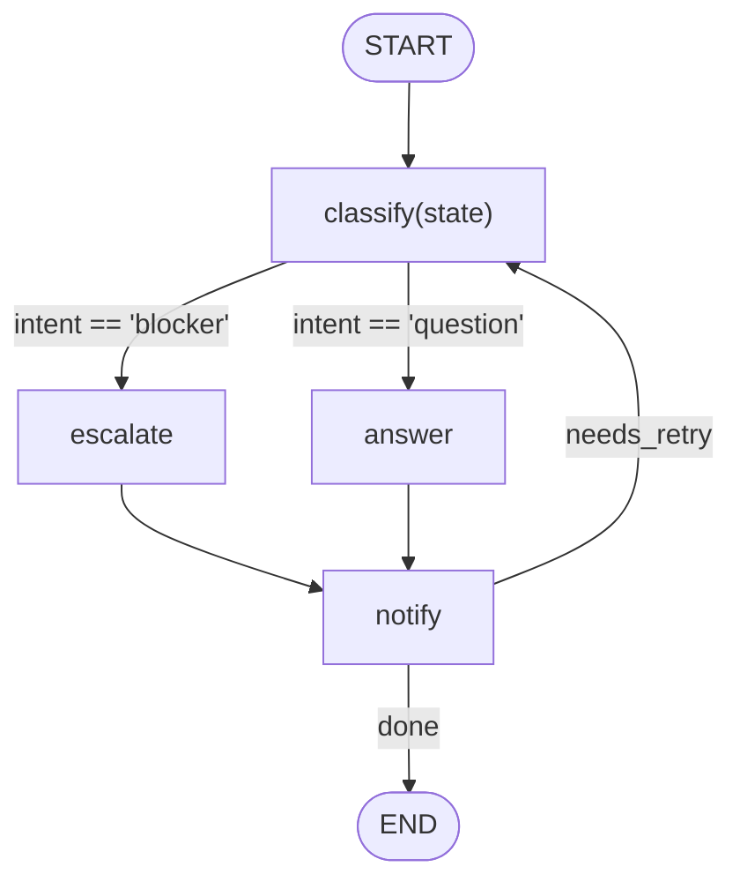
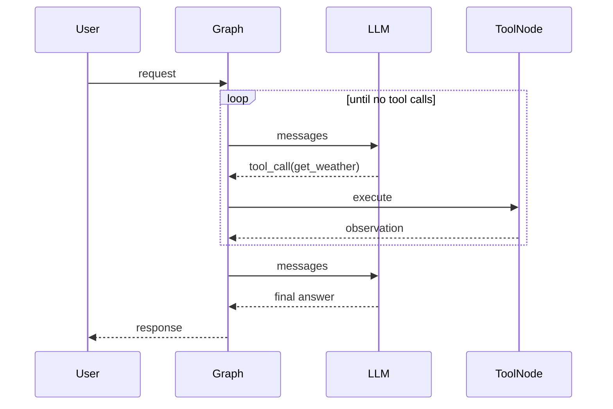
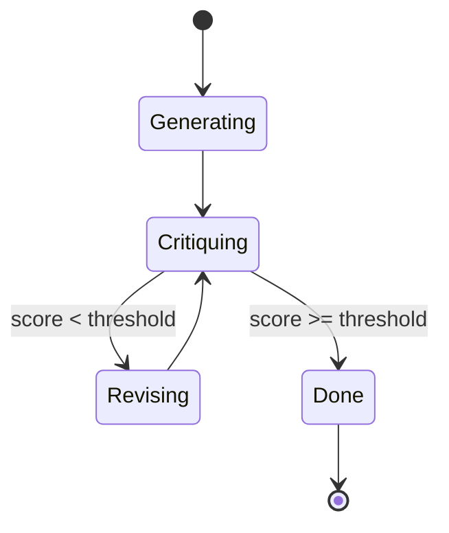

# Diagram Standard (Agent Lab)

Every module README must let a reader **understand the graph at a glance** — its
nodes, edges, conditions, loops, and the flow over time — using Mermaid. This is
the house style. Diagrams must be **faithful to the actual code**: read the
module's script and use the real node names and real branch conditions.

## The three diagram types

Use the ones that fit the module (always the flowchart; add the others when they
clarify). Aim for **2–3 diagrams per module**.

### 1. Graph structure — `flowchart` (ALWAYS)

Shows the compiled LangGraph graph: nodes, edges, **conditional edges labeled
with their condition**, `START`/`END`, and any loops. This is the "understand the
graph" diagram the reader asked for.



Rules:
- Node **id** = the real node name in `add_node(...)`; label in `[...]`.
- **Label every conditional edge** with the condition, quoted:
  `A -->|"score < 0.5"| B`.
- Mark `START([START])` and `END([END])`. Never use `end` as a node id
  (reserved) — use `END`.
- Show self-loops / cycles explicitly (retry, replan, reflection).
- Group related nodes with `subgraph Name ... end` when it aids clarity.

### 2. Flow over time — `sequenceDiagram` (when multi-actor / temporal)

Use when components interact in a sequence: agent loops, tool calls, RAG
(retrieve→augment→generate), multi-agent hand-offs, human-in-the-loop, memory
read/write.



### 3. State machine — `stateDiagram-v2` (when there are modes/loops)

Use for retry/circuit-breaker, reflection (generate→critique→revise), planning
loops, HITL (approve/edit/reject), negotiation rounds.



## Required prose around the diagrams

- A one-line **legend** under the first diagram: *"Diamonds/edge-labels are
  conditions; the loop back to `X` is the retry path."* (adapt to the module).
- **Flow notes:** a short bullet list explaining each branch/condition in words —
  what triggers it and what happens. The reader should be able to map every edge
  label to a sentence.

## Mermaid validity checklist (avoid broken renders)

- Balanced ```` ```mermaid ```` … ```` ``` ```` fences.
- Quote labels containing spaces+punctuation, parentheses, `[]`, `{}`, `:`, `|`,
  or quotes: `A["build_store(): fallback"]`, `A -->|"k == 0"| B`.
- No reserved ids (`end`, `class`, `state`, `graph`). Capitalize (`END`) instead.
- One diagram type per fenced block; declare it on the first line
  (`flowchart TD`, `sequenceDiagram`, `stateDiagram-v2`).
- Keep IDs alphanumeric/underscore; put the pretty text in the label.

## Placement in the README

Put the structural flowchart in the **Architecture** section; the sequence/state
diagrams in **Architecture** or a dedicated **Flow** subsection, each with its
legend + flow notes. Keep all other template sections (see
[MODULE_TEMPLATE.md](./MODULE_TEMPLATE.md)).
