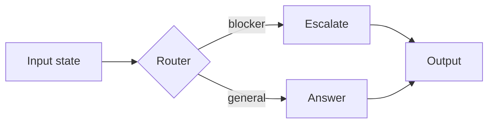

# Module Template (Agent Lab)

Every module `src/NN_name/` follows this anatomy so the curriculum reads as one
coherent book. Copy the structure; keep the tone practical and explain **why**,
not only how.

A module folder contains:

```
src/NN_name/
├── README.md          # the lesson (sections below)
└── <script>.py        # one or more runnable, offline-first examples
```

Its smoke test lives in the track's test file: `tests/test_track<k>_*.py`.

---

## 1. README.md — required sections

1. **Title** — `# NN — Human Readable Title`
2. **Learning Objectives** — 3–5 bullet outcomes ("After this you can …").
3. **Theory** — the concept, concise but real; define terms.
4. **Mental Models** — the analogy/intuition that makes it stick.
5. **Architecture** — how it's built here, with a **Mermaid diagram** (required).
   Add a **sequence diagram** when interactions/time matter (agent loops, HITL).
6. **Runnable Example** — the exact command + expected output.
7. **Challenge** — hands-on exercises extending the example.
8. **Stretch Goals** — harder, open-ended extensions.
9. **Common Mistakes** — what trips people up here.
10. **Best Practices** — what to do in production.
11. **Suggested Improvements** — ideas to evolve the module.
12. **References** — links (LangGraph/LangChain docs, papers, related modules).
13. **What Comes Next** — the module(s) this unlocks.

### Mermaid diagram (required)

Every README includes at least one Mermaid diagram. Example:

````markdown

````

---

## 2. The runnable script — required patterns

### 2.1 Import bootstrap (every script starts with this)

Module folders start with a digit, so they are not importable packages. Prepend
the repo root to `sys.path`, then import the shared library:

```python
"""NN — Title: one-line description of what this example demonstrates."""

from __future__ import annotations

import sys
from pathlib import Path

# Make `src.shared` importable when run as `python src/NN_name/script.py`.
sys.path.insert(0, str(Path(__file__).resolve().parents[2]))

from src.shared import get_chat_model, get_logger  # noqa: E402
```

### 2.2 Offline-first — reuse the shared fakes

Never require a key or a service in the default path. Use the shared factories;
they return real backends when configured and deterministic fakes otherwise:

```python
model = get_chat_model(responses=["a deterministic offline answer"])
# vectors:   from src.shared import InMemoryVectorStore, get_embeddings
# graph:     from src.shared import InMemoryGraphStore
# tools:     from src.shared import DEMO_TOOLS
```

Guidance:

- **Type hints** on functions; production-quality naming.
- Keep the readable `print()` learning style of the existing modules.
- **Never** swallow exceptions silently; log via `get_logger(__name__)`.
- Make output **deterministic** so the smoke test can assert on it.
- Build **manual tool loops** (`ToolNode` + `add_conditional_edges`) — do not use
  the deprecated `create_react_agent`.
- Print a clear final line the test can match (e.g. a recognizable marker).

---

## 3. The smoke test — required

Add a test to the track's file (`tests/test_track<k>_*.py`) mirroring
`tests/test_smoke.py`: run the script via subprocess, assert exit 0 and a stable
substring in stdout.

```python
import subprocess, sys
from pathlib import Path

REPO_ROOT = Path(__file__).resolve().parent.parent

def _run(rel: str):
    return subprocess.run(
        [sys.executable, str(REPO_ROOT / rel)],
        capture_output=True, text=True, check=False,
    )

def test_graph_branching_runs():
    result = _run("src/11_graph_branching/branching.py")
    assert result.returncode == 0
    assert "blocker" in result.stdout
```

---

## 4. Definition of done (per module)

- [ ] README has all 13 sections + at least one Mermaid diagram.
- [ ] Script runs offline (`python src/NN_name/script.py`, exit 0, no keys).
- [ ] Reuses `src.shared` — no duplicated infrastructure.
- [ ] Type-hinted; readable; no silently-swallowed exceptions.
- [ ] Smoke test added to the track test file; **`pytest` from repo root green**.
