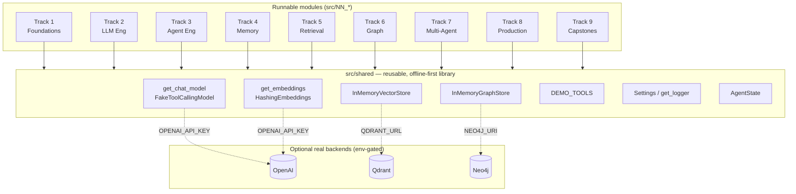
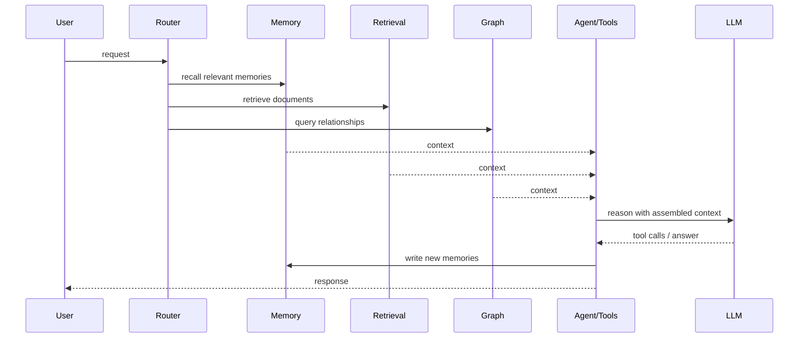

# Agent Architecture — Agent Lab (System Handbook)

> Filename note: this system-level handbook is `agent-architecture.md` because the
> filesystem is case-insensitive and `architecture.md` would collide with the
> existing module-layout doc [`ARCHITECTURE.md`](./ARCHITECTURE.md). Read that one
> for folder/module layout; read this one for how the layers compose into an agent OS.

How the pieces of Agent Lab compose into a coherent path from "state is a dict"
to a production-grade AI Agent Operating System. The topical pages
(`langgraph.md`, `memory.md`, `rag.md`, …) go deep on each layer; each module
README teaches one concept hands-on.

## The big picture

Every module imports from `src.shared`. The shared library returns **deterministic
fakes** by default and **real backends** automatically when the matching
environment variable is present. That single design choice (ADR-0001) is what
lets the whole curriculum `pytest`-pass with no keys and no services, while the
same code runs in production.

## Layers, bottom-up

| Layer | Modules | What it adds |
|-------|---------|--------------|
| **Execution** | 01–02, 11–14 | State, graphs, branching, parallelism, async, error handling — the control flow everything else runs on. |
| **LLM** | 03, 15–20 | Chat models, structured output, function calling, prompting, context budgeting, model routing. |
| **Agents** | 04–05, 21–28 | ReAct, planner/executor, reflection, routing, planning loops, human-in-the-loop, supervision. |
| **Memory** | 06, 29–36 | Conversation/episodic/semantic/procedural memory, write & retrieval pipelines, scoring, consolidation, decay. |
| **Retrieval** | 07, 37–42 | Embeddings, RAG, hybrid search, query rewriting, reranking, Qdrant. |
| **Graph** | 08, 43–47 | Property graphs, Cypher, dependency analysis, root-cause, org graphs. |
| **Multi-agent** | 09, 48–52 | Collaboration, negotiation, decomposition, shared memory, event buses. |
| **Production** | 53–58 | Observability, evaluations, testing, security, cost/multi-tenancy, deployment. |
| **Capstones** | 10, 59–64 | End-to-end systems culminating in the Mini DailyBot Brain. |

## Data flow through a capstone

The capstones (Track 9) wire the layers into one request path:

## Why offline-first (ADR-0001)

Requiring keys/services would make the curriculum slow, costly, flaky, and
un-testable in CI. Instead:

- `get_chat_model()` → `FakeToolCallingModel` offline (supports `bind_tools` and
  `with_structured_output`, so agent loops and structured extraction really run).
- `get_embeddings()` → `HashingEmbeddings` offline (bag-of-words hashing: shared
  words score higher, so retrieval demos return *relevant* results — no numpy).
- `InMemoryVectorStore` / `InMemoryGraphStore` mirror Qdrant / Neo4j.

See [ADR-0001](./adr/0001-offline-first-fakes.md),
[ADR-0002](./adr/0002-shared-library-boundary.md),
[ADR-0003](./adr/0003-module-numbering-and-tracks.md).

## Where to go next

- The learning path and pacing: [roadmap.md](./roadmap.md)
- The vocabulary: [glossary.md](./glossary.md)
- Deep dives: [langgraph.md](./langgraph.md), [langchain.md](./langchain.md),
  [memory.md](./memory.md), [rag.md](./rag.md), [neo4j.md](./neo4j.md),
  [multi-agent.md](./multi-agent.md), [observability.md](./observability.md),
  [testing.md](./testing.md), [agent-security.md](./agent-security.md).
