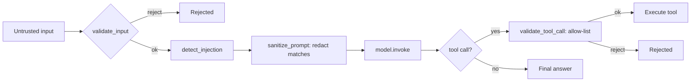

# Agent Security Practices — Agent Lab

> **Naming note:** this repository's dev environment runs on a
> case-insensitive filesystem, where `docs/security.md` and
> `docs/SECURITY.md` resolve to the identical file. To avoid silently
> overwriting the existing repo-wide [`docs/SECURITY.md`](SECURITY.md), this
> **agent-specific** topical page is named `docs/agent-security.md` instead.
> Treat it as the "docs/security.md" this Track 8 task set out to author.

## Scope

This page documents **agent-specific** security practices — prompt-injection
defenses, input validation, and secret handling in agent code — built in
Track 8 (`src/56_security/`). It is **separate** from
[`docs/SECURITY.md`](SECURITY.md), which is the repo-wide credential and
sensitive-data policy (what secrets exist, where they live, what agents must
never do). Read that page first; this page is the pattern library that
implements it inside agent logic.

## Threat Model

Agent Lab exercises accept untrusted free text as input (user messages) and
also treat **tool results** as untrusted (a search result or API response
could itself contain adversarial text). The primary risks demonstrated and
defended against here:

| Risk | Defense | Module |
|------|---------|--------|
| Oversized / empty input | Input validation | `56_security` |
| Prompt injection ("ignore previous instructions…") | Detection + neutralization | `56_security` |
| Unauthorized tool invocation | Allow-list + type validation | `56_security` |
| Secret leakage in logs/output | `redact_secret`, env-only config | `56_security` |
| Tenant data crossover | Namespaced storage | `57_cost_and_multitenancy` |

## Input Validation

Reject before you generate: check emptiness and length (`MAX_INPUT_LENGTH`)
before any model call. This is the cheapest defense and catches whole classes
of bugs (empty prompts, resource-exhaustion payloads) for free. See
`validate_input` in `src/56_security/main.py`.

## Prompt-Injection Defenses

`detect_injection` matches known manipulation phrasings
(`"ignore previous instructions"`, `"reveal your system prompt"`, …);
`sanitize_prompt` **redacts** matches rather than merely flagging them, so an
injected instruction never reaches the model verbatim. This keyword-based
approach is a first layer, not a complete defense — see "Limitations" below.

**Do not** ship an agent that only logs a detected injection and still
executes it. Detection without neutralization provides no protection.

## Tool-Call Validation

Before executing any tool, confirm:

1. The tool name is on an explicit allow-list (`_ALLOWED_TOOLS`).
2. Every argument is a primitive type (`str`, `int`, `float`, `bool`) — never
   pass an unvalidated structure straight into a tool.

This is the agent equivalent of parameterized SQL queries: never let model
output dictate arbitrary code paths.

## Secret Handling

- Read all secrets via `get_settings()` (`src/shared/config.py`), which reads
  only from environment variables. **No module in this repo hardcodes a
  working default secret** — an unset key means "offline mode," never "use
  this placeholder credential."
- Never print a secret in full. Use `redact_secret` (masks to
  `sk-...xxxx`-style) for any debug output.
- Full policy: [`docs/SECURITY.md`](SECURITY.md).

## Limitations (Be Honest About This)

- Substring/keyword matching (`_INJECTION_PATTERNS`) misses paraphrased or
  encoded attacks. Production systems combine this with a classifier, a
  canary-string check, and/or a second model pass that reviews the first
  model's output before it is trusted.
- This module does not implement rate limiting, authentication, or network
  isolation — those are deployment-layer concerns (see
  [`src/58_deployment/`](../src/58_deployment/README.md)).

## Related Modules

- [`src/56_security/`](../src/56_security/README.md) — the reference
  implementation for everything above.
- [`src/57_cost_and_multitenancy/`](../src/57_cost_and_multitenancy/README.md) —
  namespacing as an isolation boundary, not just a cost-accounting device.
- [`src/55_testing_agents/`](../src/55_testing_agents/README.md) — structural
  assertions, the same discipline applied to safety invariants.

## Cross-References

- [`docs/SECURITY.md`](SECURITY.md) — repo-wide credential and sensitive-data
  policy (read first).
- [OWASP Top 10 for LLM Applications — LLM01: Prompt Injection](https://owasp.org/www-project-top-10-for-large-language-model-applications/)
