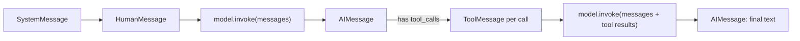
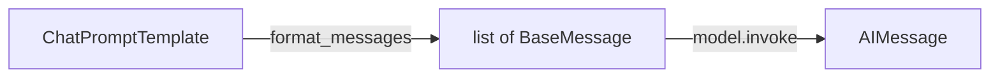
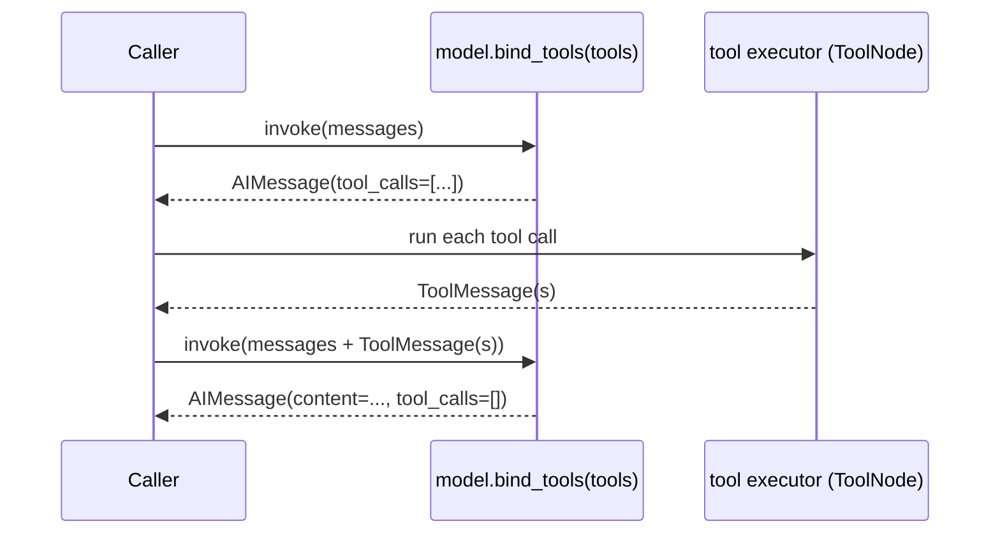
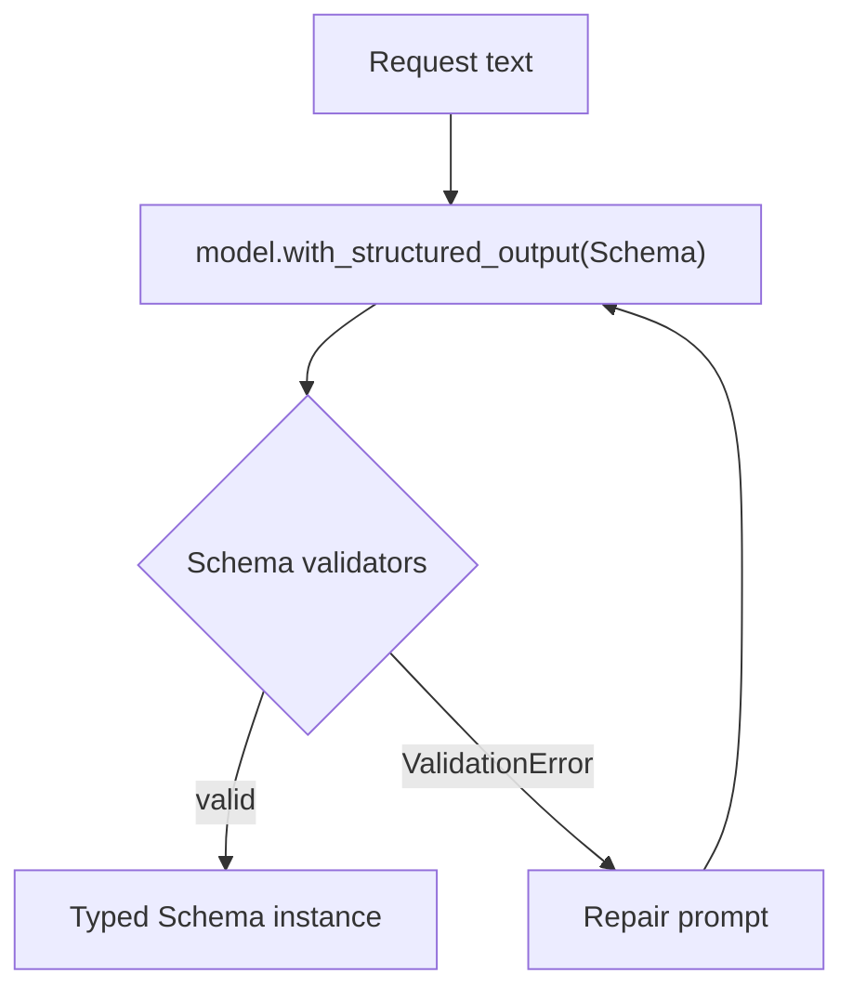

# LangChain Core: Messages, Prompts, Tools, Structured Output

A deep-dive into the `langchain-core` primitives that Track 2 (`15`–`20`)
builds on: typed messages, prompt templates, the runnable (`|` pipe)
interface, tool binding, and structured output. Read this alongside
[`docs/langgraph.md`](langgraph.md) (how a graph *executes* nodes) — this
document is about what a single **model call** looks like, independent of
whether it happens inside a graph node or standalone.

## 1. Messages: the universal chat protocol

Every chat model — real or the offline `FakeToolCallingModel` — speaks the
same typed message protocol from `langchain_core.messages`:

| Type | Role | Carries |
|------|------|---------|
| `SystemMessage` | persona / instructions | usually first in the list |
| `HumanMessage` | the user | free text |
| `AIMessage` | the model | text content and/or `tool_calls` |
| `ToolMessage` | a tool's result | content + `tool_call_id` correlating it to the `AIMessage` call that requested it |

A chat model's `.invoke(messages)` is **stateless**: it takes the whole
transcript and returns one new `AIMessage`. There is no hidden memory —
callers rebuild and resend the growing message list every turn.



See [`15_chat_models`](../src/15_chat_models/README.md) for the full worked
example, and [`03_llm_nodes`](../src/03_llm_nodes/README.md) for the original
single-shot node this deepens.

## 2. Prompts and the runnable (`|` pipe) interface

`ChatPromptTemplate.from_messages([...])` builds a reusable template from
`(role, template_string)` tuples; `.format_messages(**kwargs)` renders it
into the exact `list[BaseMessage]` shape a model expects. Prompt structure —
system persona, few-shot example turns, placement of the real question — is
part of the interface contract with the model, not decoration: the same
question rendered through different templates produces a materially
different message list, and therefore a different completion.

Every LangChain component (prompt, model, output parser) implements the
`Runnable` interface, which is why they compose with the `|` operator into
an LCEL (LangChain Expression Language) chain:

```python
chain = prompt | model | output_parser
result = chain.invoke({"question": "..."})
```

`chain.invoke(x)` calls `prompt.invoke(x)`, feeds its output to
`model.invoke(...)`, and feeds *that* output to `output_parser.invoke(...)`
— a `Runnable` pipeline, not special syntax. Track 2's modules mostly call
`.format_messages(...)` then `model.invoke(...)` explicitly (to keep each
step visible for learning); once comfortable, collapsing them into a `|`
chain is a direct, mechanical refactor.



See [`18_prompt_engineering`](../src/18_prompt_engineering/README.md) for the
naive-vs-engineered comparison.

## 3. Tool binding: `bind_tools`

`model.bind_tools(tools)` returns a copy of the model that *may* respond
with tool calls instead of (or alongside) text — it does not execute
anything. The model's reply is still just an `AIMessage`; check
`.tool_calls` to see whether it requested any tool executions.

Actually running a tool call and feeding the result back is a **manual
loop**: a `ToolNode` (or hand-written executor) runs each requested tool and
appends a `ToolMessage`, then the updated transcript goes back to the model.
`langgraph.prebuilt.create_react_agent` used to package this loop; it is
**deprecated and uninstalled** here — build the loop explicitly.



See [`17_function_calling`](../src/17_function_calling/README.md) for the
full manual loop built with `ToolNode` + `add_conditional_edges`, and
[`05_tools`](../src/05_tools/README.md) for the original single mock tool.

## 4. Structured output

`model.with_structured_output(Schema)` returns a `Runnable` whose `.invoke(...)`
yields a populated instance of `Schema` (a Pydantic `BaseModel`) instead of
free text. Schema field validators (`@field_validator`) enforce business
rules beyond type-checking; a rejected value raises
`pydantic.ValidationError`, which production code should catch and retry
with a repaired prompt inside a **bounded** loop.



See [`16_structured_outputs`](../src/16_structured_outputs/README.md) for the
parse-validate-retry loop in full.

## 5. Context budgeting utilities

`langchain_core.messages.trim_messages` and `count_tokens_approximately`
manage transcript size against a token budget without any external
tokenizer dependency — `token_counter="approximate"` is a pure-Python
estimate (`~4 chars/token`), good enough for budgeting decisions, not for
billing-accurate counts. See
[`19_context_engineering`](../src/19_context_engineering/README.md) for
trimming combined with running summarization.

## Cross-References

| Concept | Module |
|---------|--------|
| Typed messages, provider bridge | [`15_chat_models`](../src/15_chat_models/README.md) |
| Structured output + retry | [`16_structured_outputs`](../src/16_structured_outputs/README.md) |
| Tool binding + manual loop | [`17_function_calling`](../src/17_function_calling/README.md) |
| Prompt templates + few-shot | [`18_prompt_engineering`](../src/18_prompt_engineering/README.md) |
| Trimming + summarization | [`19_context_engineering`](../src/19_context_engineering/README.md) |
| Cost/quality model routing | [`20_model_routing`](../src/20_model_routing/README.md) |
| Original single-shot LLM node | [`03_llm_nodes`](../src/03_llm_nodes/README.md) |
| When the real key activates vs. the offline fake | [`docs/openai.md`](openai.md) |
