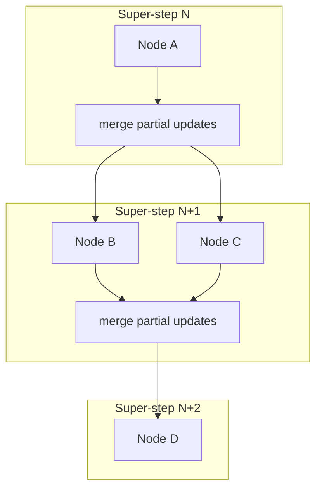
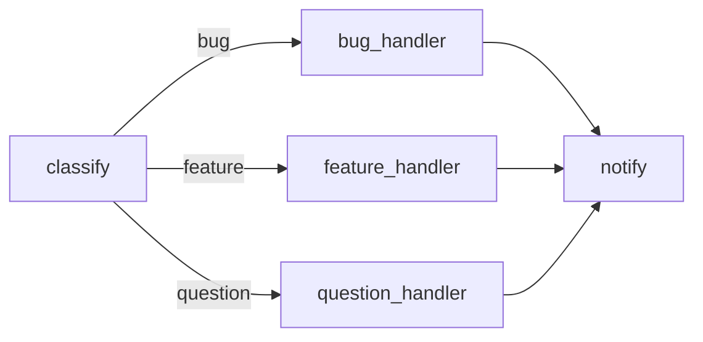
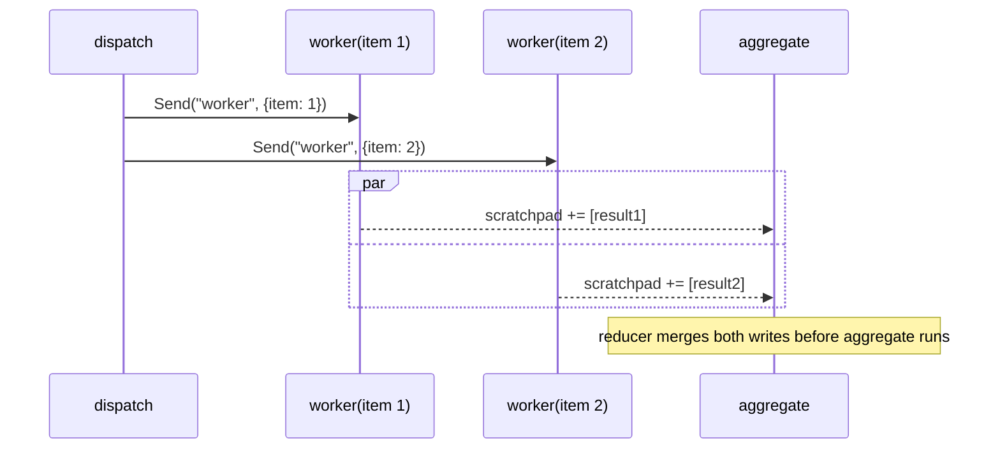
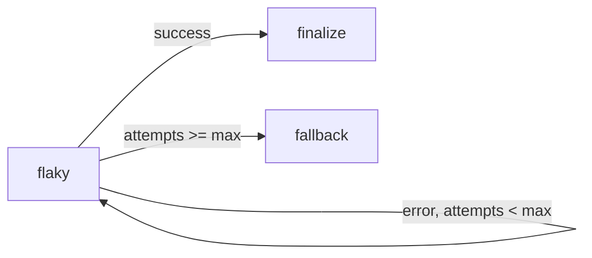

# LangGraph Execution Model

A deep-dive into how LangGraph actually runs a graph — nodes, edges, state,
and the super-step scheduler — and how the Track 1 foundations modules
(`11`–`14`) each exercise one dimension of that model: branching, parallelism,
async concurrency, and error resilience. Read this alongside
[`src/02_langgraph_basics/README.md`](../src/02_langgraph_basics/README.md)
(the linear baseline) before diving into the individual modules.

## 1. Execution Model: Nodes, Edges, State, Super-Steps

A `StateGraph` is defined by three things:

- **State** — a `TypedDict` (or Pydantic model) describing the shape of data
  flowing through the graph. Agent Lab's shared `AgentState`
  (`src/shared/state.py`) is the canonical example: `messages` (chat history),
  `scratchpad` (accumulated notes), `context` (free-form working memory).
- **Nodes** — plain functions `(state) -> partial_state_update`, or
  `async def` coroutines (module 13). A node never returns the *whole* state;
  it returns the fields it changed, and LangGraph merges that partial update
  into the running state.
- **Edges** — connections between nodes. A plain `add_edge(a, b)` always goes
  `a -> b`. A **conditional edge**
  (`add_conditional_edges(a, router, mapping)`) picks the next node(s)
  dynamically by calling `router(state)` (module 11).

Execution proceeds in **super-steps**: in super-step *N*, every node
scheduled to run does so (conceptually in parallel); once all of them finish
and their partial updates are merged into state, super-step *N+1* begins with
whichever nodes the edges/routers now point to. A graph terminates when a
super-step schedules no more nodes (i.e., every active path has reached
`END`).



This model is why fan-out (module 12) is a first-class concept rather than a
special case: scheduling multiple tasks in one super-step is exactly what the
runtime already does every step — `Send` just lets a router *decide* how many
tasks to schedule, instead of always exactly one per outgoing edge.

## 2. Branching

See [`src/11_graph_branching/`](../src/11_graph_branching/README.md) for the
full worked example (a support-ticket triage graph).

`add_conditional_edges(source, router, mapping)` inserts a decision point
after `source`. `router(state) -> str` returns a key; `mapping[key]` resolves
to the next node. Multiple branches can converge back into one downstream
node — the graph doesn't need to stay a tree.



Key rule: keep the router **pure** (read state, return a key — no side
effects). Side effects belong in the node bodies of the branches themselves.

## 3. Parallelism and Reducers

See [`src/12_parallel_execution/`](../src/12_parallel_execution/README.md) for
the full worked example (fan-out document processing).

A router can return `list[Send(node, arg)]` instead of a single key. Each
`Send` schedules an independent invocation of `node` with `arg` as its input,
all within the same super-step — this is the fan-out.

The fan-in problem: if two parallel tasks both write to the same state field,
what happens? Without a **reducer**, LangGraph has no way to combine two
writes to one field in the same super-step — it's undefined which one wins.
A reducer is an aggregation function attached to a field via `Annotated`:

```python
from typing import Annotated
import operator
from langgraph.graph import add_messages

class State(TypedDict, total=False):
    scratchpad: Annotated[list[str], operator.add]   # concatenate lists
    messages: Annotated[list[BaseMessage], add_messages]  # append + de-dupe
```

`operator.add` concatenates lists (or adds numbers); `add_messages` appends
`BaseMessage` objects and de-duplicates by id (so replaying/streaming doesn't
double-count). Any field written by more than one parallel task **must** have
a reducer, or its updates silently collide.



## 4. Async Nodes and Concurrent I/O

See [`src/13_async_nodes/`](../src/13_async_nodes/README.md) for the full
worked example (sync vs. async wall-clock contrast).

Nodes may be `async def`. A graph containing an async-only node must be
invoked with `await app.ainvoke(...)` (calling `.invoke()` raises
`TypeError`). The payoff is concurrency for I/O-bound work: `await
asyncio.sleep(...)` (or a real network call) yields control back to the event
loop, letting other coroutines make progress, whereas a synchronous
`time.sleep(...)` blocks everything.

`asyncio.gather(*(app.ainvoke(...) for _ in range(N)))` runs `N` graph
invocations concurrently. For I/O-bound work, total wall-clock time approaches
the slowest single run rather than the sum of all runs — this matters
enormously once nodes call real LLM APIs, vector stores, or external tools.

Async concurrency (event-loop interleaving) is a different axis from `Send`
fan-out (scheduling multiple tasks in one super-step): combine both — async
`Send`-spawned workers invoked via `ainvoke` — for real concurrent, I/O-bound
fan-out.

## 5. Error Handling

See [`src/14_error_handling/`](../src/14_error_handling/README.md) for the
full worked example (retry/backoff/circuit-breaker graph).

Three resilience patterns compose naturally with conditional edges:

- **Retry with backoff** — a node that can fail transiently catches the
  exception locally, **logs it**, and records the failure as routable state
  (e.g. `context["error"]`) instead of raising. A conditional edge routes
  back to the same node while an attempt budget remains, with an increasing
  delay between attempts.
- **Circuit breaker** — once the attempt budget is exhausted, the router
  stops retrying and routes to a `fallback` node instead, guaranteeing
  termination even against a truly broken dependency.
- **Fallback / graceful degradation** — the `fallback` node returns a clearly
  labeled degraded result rather than letting the whole run crash.



The rule that makes this safe: **never swallow an exception silently**. Catch
it, log it (`get_logger(__name__).warning(...)`), and turn it into state a
conditional edge can act on.

## 6. Checkpoints (Preview)

Every module above runs a graph start-to-finish in a single process. Real
agents often need to **pause and resume** — across a process restart, a
human-in-the-loop approval, or a long-running background job. LangGraph
supports this via a checkpointer attached at compile time:

```python
from langgraph.checkpoint.memory import MemorySaver

checkpointer = MemorySaver()
app = graph.compile(checkpointer=checkpointer)

config = {"configurable": {"thread_id": "ticket-42"}}
app.invoke({"messages": [...]}, config=config)
# ... later, possibly a new process ...
app.invoke({"messages": [...]}, config=config)  # resumes thread "ticket-42"
```

Each super-step's state is persisted under the given `thread_id`, so a new
`invoke`/`ainvoke` call with the same `config` continues from where the last
one left off instead of starting over. This is the foundation for durable
execution, human approval gates, and time-travel debugging — covered in
depth in the persistence-focused module planned as **module 16** (Track 2).
None of modules 11–14 use a checkpointer themselves (they run start-to-finish
by design, to keep the fan-out/async/retry mechanics isolated and easy to
follow) — treat this section as the on-ramp to that later module.

## Cross-References

| Concept | Module |
|---------|--------|
| Linear graph baseline | [`02_langgraph_basics`](../src/02_langgraph_basics/README.md) |
| Conditional branching | [`11_graph_branching`](../src/11_graph_branching/README.md) |
| Fan-out/fan-in + reducers | [`12_parallel_execution`](../src/12_parallel_execution/README.md) |
| Async nodes + concurrency | [`13_async_nodes`](../src/13_async_nodes/README.md) |
| Retries, backoff, circuit breaker | [`14_error_handling`](../src/14_error_handling/README.md) |
| Checkpoints / persistence (preview) | Module 16 (Track 2, upcoming) |
