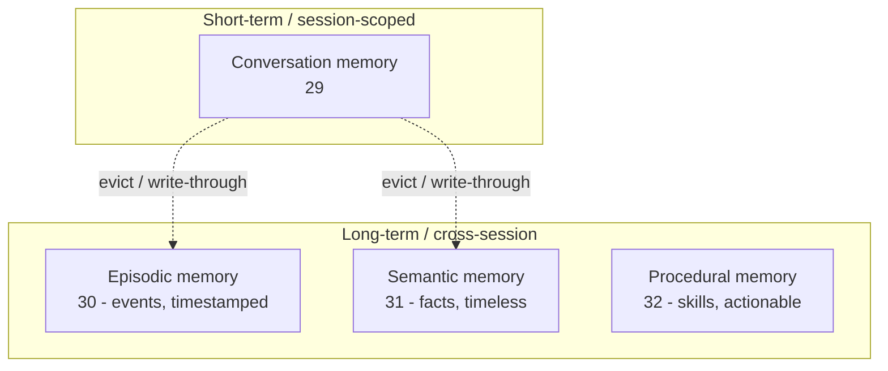
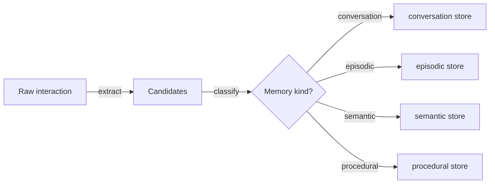
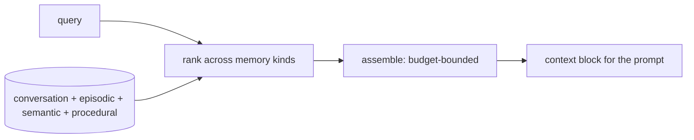
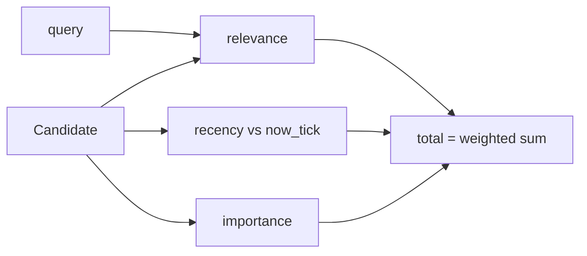
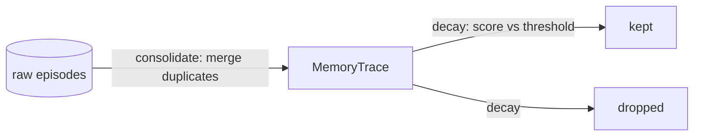
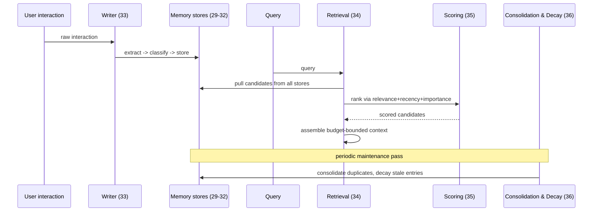

# Agent Memory Systems

A deep-dive into the four memory types and the pipelines that write, retrieve,
score, and forget them — and how Track 4's modules (`06`, `29`–`36`) each
exercise one piece of that system. Read this alongside
[`src/06_memory_basics/README.md`](../src/06_memory_basics/README.md) (the
flat baseline) before diving into the individual modules, and see
[`docs/langgraph.md`](langgraph.md) for how memory nodes fit into a graph's
execution model.

## 1. The Four Memory Types

Agent memory is not one thing. Four distinct types answer four distinct
questions:

| Type | Question it answers | Module | Storage |
|------|---------------------|--------|---------|
| Conversation | "What did we just say to each other?" | [`29_conversation_memory`](../src/29_conversation_memory/README.md) | `AgentState.messages` (buffer/window/summary) |
| Episodic | "What happened, and when?" | [`30_episodic_memory`](../src/30_episodic_memory/README.md) | Timestamped `Episode` records (`FixedClock`) |
| Semantic | "What do we know, generally?" | [`31_semantic_memory`](../src/31_semantic_memory/README.md) | `InMemoryVectorStore` via `get_embeddings` |
| Procedural | "How do we do this?" | [`32_procedural_memory`](../src/32_procedural_memory/README.md) | Named `Procedure` (trigger -> steps) |



Module 06's flat event list is the ancestor of episodic memory: 29–32 give
each memory type its own structure, storage, and retrieval strategy instead
of one undifferentiated log.

## 2. The Write Pipeline: extract -> classify -> store

A single raw interaction almost never belongs to exactly one memory type.
[`33_memory_writer`](../src/33_memory_writer/README.md) is the front door
every memory write goes through:



- **Extract** splits raw text into independent, storable candidate items.
- **Classify** routes each candidate using explainable rules (or, in
  production, an LLM classifier / structured output call — see module 11's
  `classify` pattern, which this pipeline reuses).
- **Store** writes each candidate into the memory type it belongs to.

## 3. The Retrieval Pipeline: query -> rank -> assemble

[`34_memory_retrieval`](../src/34_memory_retrieval/README.md) is the mirror
image: given a query, pull candidates back out of all four memory types, rank
them on one shared scale, and assemble a single, budget-bounded context block
ready to inject into a prompt.



Budget-bounded assembly (a character/token ceiling, not a fixed top-`k`
count) matters because candidates vary wildly in length — a fixed count
either wastes budget on short items or overflows on one long one.

## 4. Scoring: Relevance + Recency + Importance

[`35_memory_scoring`](../src/35_memory_scoring/README.md) formalizes ranking
into one deterministic weighted sum:

```
total = w_relevance * relevance + w_recency * recency + w_importance * importance
```

- **Relevance** — token overlap (or embedding similarity) with the current
  query.
- **Recency** — linear decay from an injected, fixed `now` tick (never
  wall-clock) — `1.0` at `now`, `0.0` at (or beyond) a configured half-life.
- **Importance** — an explicit weight assigned at write time.



Keeping `now` injected and fixed (rather than `datetime.now()`) is what makes
scoring reproducible enough to assert on in tests — a recurring requirement
across modules 30, 35, and 36.

## 5. Consolidation and Decay

[`36_memory_consolidation_decay`](../src/36_memory_consolidation_decay/README.md)
runs two maintenance passes over a raw episode set:



- **Consolidation** merges repeated occurrences of the same underlying memory
  into one trace, bumping its importance each time it recurs (repetition is a
  signal of significance) and refreshing its recency.
- **Decay** scores every trace (a simplified relevance-free version of module
  35's formula: recency + importance) against a fixed `now` and drops traces
  below a threshold.

Consolidation always runs before decay: a memory reinforced by repetition
should survive even if any single occurrence is individually old.

## 6. How It Fits Together



## 7. Related Tracks

- [`src/06_memory_basics/README.md`](../src/06_memory_basics/README.md) — the
  original flat event log this track deepens.
- The RAG track (`37_embeddings` onward) scales semantic memory (module 31)
  into a full retrieval-augmented-generation pipeline with real document
  chunking, hybrid search, and re-ranking.
- [`docs/langgraph.md`](langgraph.md) — the graph execution model these
  memory nodes plug into.
