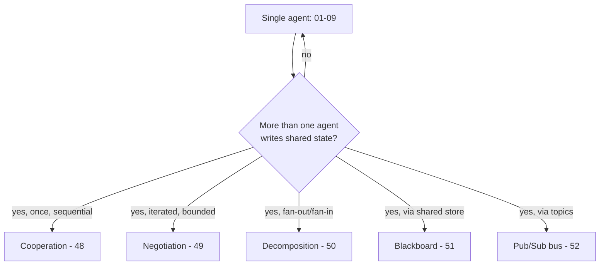
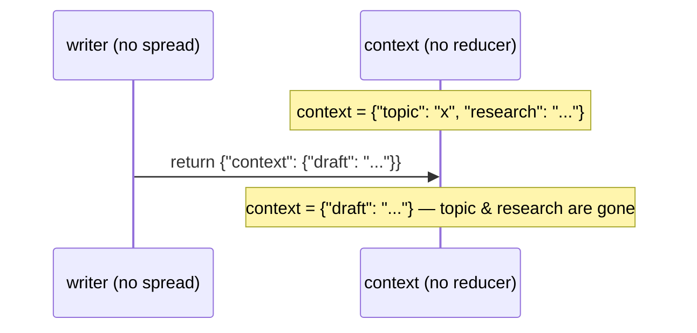
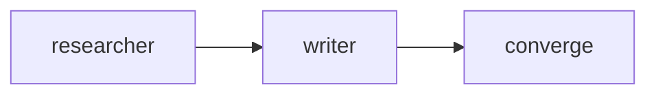
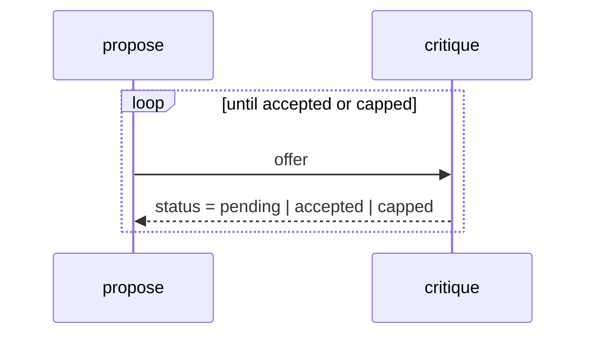
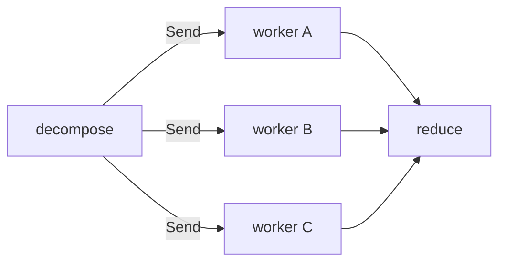
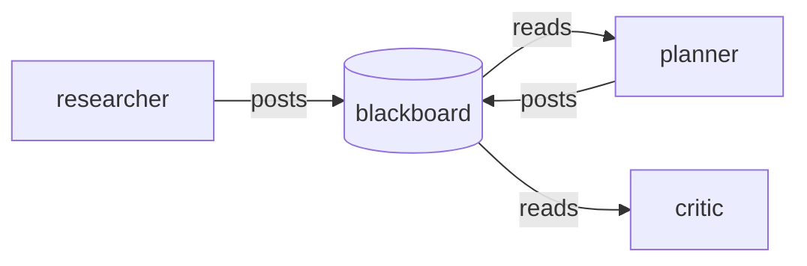
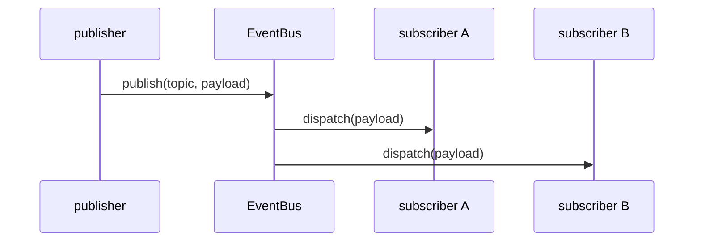

# Multi-Agent Coordination Patterns

A deep-dive into the five coordination patterns Track 7 (`48`-`52`) builds on
top of module `09`'s planner/executor baseline: cooperation, negotiation,
decomposition/assign/reduce, blackboard memory, and pub/sub messaging. Read
this alongside [`docs/langgraph.md`](langgraph.md) (the underlying execution
model — super-steps, reducers, `Send`) before diving into the individual
modules.

## 1. From Single Agent to Multi-Agent

Every module up to `09` runs one agent through one graph. A multi-agent
system is what you get once **more than one logical agent writes to the same
shared state within a single run**. The moment that happens, two questions
become unavoidable:

1. **Who can write which field, and when?** (shared-state reducers and
   conflict avoidance — §2)
2. **How does one agent's output become another agent's input?** (hand-off,
   negotiation, decomposition, blackboard, or pub/sub — §3-§7)

All five Track 7 modules answer question 2 differently while reusing the
same `AgentState` (`src/shared/state.py`) and the same super-step execution
model for question 1.

## 2. Shared-State Reducers and Conflict Avoidance

`AgentState` has three channels with three different sharing rules:

| Channel | Reducer | Safe for concurrent writers? |
|---|---|---|
| `messages: Annotated[list[BaseMessage], add_messages]` | append + de-dupe by id | Yes |
| `scratchpad: Annotated[list[str], operator.add]` | list concatenation | Yes |
| `context: dict[str, Any]` | none (last write wins) | **No** — replaces the whole dict |

Every module in this track that has more than one node write to `context`
(48, 49, 50, 51) follows one rule: **spread the previous context before
adding a key** — `{**state.get("context", {}), "my_key": my_value}`. Skipping
that spread is the single most common multi-agent bug in this codebase: one
agent's "harmless" partial update silently deletes every other agent's
contribution, because `context` has no reducer to merge writes for it.

Module `50` demonstrates the sharper version of this problem: when **two
workers run in the same super-step** (via `Send`, not sequentially), even the
spread convention can't save you — two concurrent writes to the same
non-reducer field are a genuine, undefined conflict. That's why module 50's
workers write only to the reducer-backed `scratchpad`, never to `context`.

**Rule of thumb**: if more than one node writes a field in the same run, it
needs either a reducer (`operator.add`, `add_messages`, or a custom merge
function) or a strict sequential ordering where every writer spreads the
prior value. Reducers are enforced by the framework; the spread convention is
enforced only by discipline — prefer reducers whenever concurrency is
possible.

## 3. Cooperation (Module 48)

See [`src/48_agent_collaboration/`](../src/48_agent_collaboration/README.md).

Two specialist agents (`researcher`, `writer`) run **sequentially**, each
reading the previous agent's namespaced `context` key and adding its own.
`scratchpad` records both agents' activity as an append-only log. This is the
simplest multi-agent shape: one hand-off, no iteration, no branching.

## 4. Negotiation (Module 49)

See [`src/49_negotiation/`](../src/49_negotiation/README.md).

A `propose`/`critique` loop iterates until either the offer lands inside an
acceptance range (**agreement**) or a round budget is exhausted (**cap** —
the negotiation analogue of module 14's circuit breaker). The termination
condition is explicit state (`context["status"]`), not an exception, and the
conditional edge is the only place that decides whether to loop or converge.

## 5. Decomposition / Assign / Reduce (Module 50)

See [`src/50_task_decomposition/`](../src/50_task_decomposition/README.md).

A coordinator (`decompose`, a conditional-edge router) maps a goal to
independent subtasks and **assigns** each one to a `worker` via `Send` — all
scheduled in the same super-step. A `reduce` node folds every worker's
reducer-merged `scratchpad` contribution into one final answer, sorting
first so the output is deterministic regardless of completion order.

## 6. Blackboard / Shared Memory (Module 51)

See [`src/51_shared_memory/`](../src/51_shared_memory/README.md).

Agents post facts to a shared, namespaced store
(`context["blackboard"][agent_name]`) and read each other's posts. Unlike
decomposition (where a coordinator explicitly assigns work), a blackboard
lets agents discover contributions without being handed them directly. The
**read-after-write guarantee** here comes entirely from running the agents in
a strict sequential chain — each node's write is fully merged into state
before the next node runs (the super-step model). Parallel writers would lose
that guarantee.

## 7. Pub/Sub Event Bus (Module 52)

See [`src/52_event_bus/`](../src/52_event_bus/README.md).

A publish/subscribe bus decouples publishers from subscribers: a publisher
emits an event on a topic without knowing who — if anyone — is listening; a
subscriber registers for a topic independently of the publisher's code. This
contrasts directly with module 11's **hard-wired** conditional edges, where
the router's `mapping` must enumerate every destination up front — adding a
subscriber to a bus never requires touching the publisher.

In this repo the whole bus lives inside one graph node for simplicity and to
stay offline; in a distributed system each subscriber would be its own
process/agent listening on a real queue (Kafka, SQS, Redis pub/sub) — the
topic -> handler-list routing logic is identical, only the transport differs.

## 8. Hand-off via Sub-Graphs (Preview)

None of modules 48-52 compile more than one graph — every "agent" is a node
(or a short sequence of nodes) inside a single compiled `StateGraph`. A
further step, not yet covered by a dedicated module, is **agent-to-agent
hand-off via sub-graphs**: compiling each agent as its own graph and invoking
one from within another's node (or via LangGraph's subgraph support). The
same reducer and conflict-avoidance rules from §2 apply at the boundary
between parent and child graphs — a child graph's output still merges into
the parent's state through whatever reducer (or lack of one) the shared field
has.

## 9. Termination Conditions Compared

| Module | Terminates when... | Mechanism |
|---|---|---|
| 48 Cooperation | every agent has run once (fixed length) | linear chain, no loop |
| 49 Negotiation | offer accepted, or round cap hit | conditional edge reads `status` |
| 50 Decomposition | every fanned-out worker has returned | implicit: all `Send` tasks in the super-step complete |
| 51 Blackboard | every agent in the chain has posted (fixed length) | linear chain, no loop |
| 52 Event Bus | every queued event has been published | `for topic, payload in EVENTS` loop, no branching |

Only negotiation (49) has an open-ended, data-dependent termination
condition — every other pattern here terminates by construction (a fixed
chain length or an implicit fan-in). Any pattern with a data-dependent loop
(negotiation, retries per module 14) **must** have an explicit round/attempt
cap to guarantee termination.

## Cross-References

| Concept | Module |
|---|---|
| Planner/executor baseline this track deepens | [`09_multi_agent_systems`](../src/09_multi_agent_systems/README.md) |
| Sequential cooperation over shared state | [`48_agent_collaboration`](../src/48_agent_collaboration/README.md) |
| Bounded iterative negotiation | [`49_negotiation`](../src/49_negotiation/README.md) |
| Fan-out/fan-in coordinator | [`50_task_decomposition`](../src/50_task_decomposition/README.md) |
| Shared blackboard memory | [`51_shared_memory`](../src/51_shared_memory/README.md) |
| Decoupled pub/sub routing | [`52_event_bus`](../src/52_event_bus/README.md) |
| Super-steps, reducers, `Send` mechanics | [`langgraph.md`](langgraph.md) |
