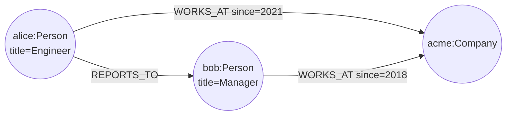
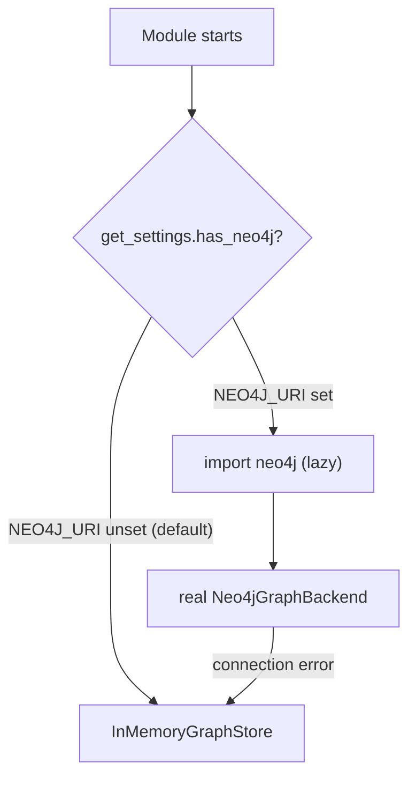
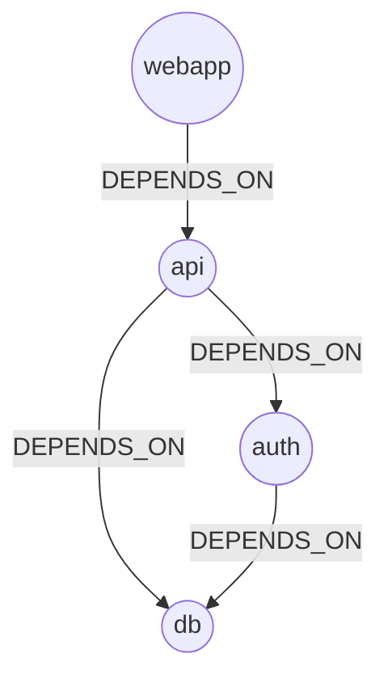
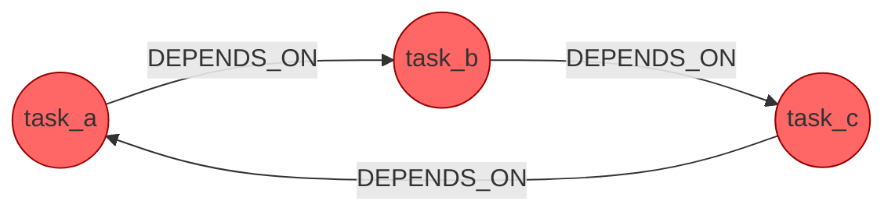
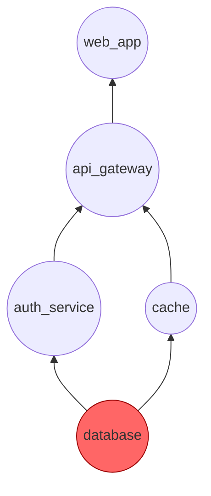

# Graph Intelligence: Property Graphs, Cypher, and Graph Algorithms

A deep-dive into graph-native reasoning — the property-graph data model, the
offline/online backend-selection pattern used throughout the codebase, and
the graph algorithms (pattern matching, traversal, cycle detection,
root-cause ranking, multi-hop queries) that Track 6 (`43`–`47`) exercises.
Read this alongside
[`src/08_graph_memory_neo4j/README.md`](../src/08_graph_memory_neo4j/README.md)
(the original placeholder this track replaces with working exercises) and
[`src/shared/graphstore.py`](../src/shared/README.md) (the underlying
`InMemoryGraphStore` implementation).

## 1. The Property-Graph Model

A property graph has two kinds of citizens:

- **Nodes** — carry a **label** (a type tag: `Person`, `Project`, `Service`)
  and a bag of **properties** (arbitrary key/value data: `name`, `status`,
  `since`).
- **Relationships** — **typed** (`OWNS`, `DEPENDS_ON`, `REPORTS_TO`) and
  **directed** (`a -[:OWNS]-> b` is distinct from `b -[:OWNS]-> a`), and may
  themselves carry properties.



Unlike a relational schema, adding a new relationship type requires no
migration — just new edges. This is why property graphs fit domains with
evolving, variable-depth relationships: dependency chains, org charts,
knowledge graphs, and agent memory.

`src/shared/graphstore.py`'s `Node` and `Relationship` dataclasses, plus
`InMemoryGraphStore`, are the offline implementation of this model used
across every module in this track.

## 2. Backend Selection: `InMemoryGraphStore` vs. the Real Driver

The `neo4j` Python package is **not installed** in this environment. Every
module that talks to a graph store follows one gating rule, first
established in [`43_neo4j_basics`](../src/43_neo4j_basics/README.md):

```python
from src.shared import get_settings

settings = get_settings()
if settings.has_neo4j():          # True only when NEO4J_URI (+ password) is set
    from neo4j import GraphDatabase   # imported lazily, inside the guard
    driver = GraphDatabase.driver(settings.neo4j_uri, auth=(...))
else:
    store = InMemoryGraphStore()      # offline fallback — always available
```



Two rules make this safe regardless of whether the driver is installed:

1. **Never import `neo4j` at module top level.** A top-level `import neo4j`
   would raise `ModuleNotFoundError` for every learner running offline,
   even though they never reach the real-backend code path. Import it
   inside the `has_neo4j()` branch (or the constructor gated by it), so the
   module always loads.
2. **Keep the offline fallback fully functional**, not a stub. `44`–`47`
   never touch the real driver at all — they exercise pure graph algorithms
   against `InMemoryGraphStore` — so the entire track (and its smoke tests)
   runs green with zero services configured. Set `NEO4J_URI` (and
   `NEO4J_PASSWORD`) plus `pip install neo4j` to exercise the real path in
   module 43; that path is intentionally not covered by the offline smoke
   test (see `tests/test_track6_graph.py`).

## 3. Cypher-Style Querying

Cypher pattern-matches nodes and relationships in one expression:

```cypher
MATCH (p:Person)-[:OWNS]->(pr:Project {status: 'active'})
RETURN p, pr
```

[`44_graph_modeling_cypher`](../src/44_graph_modeling_cypher/README.md)
implements the same pattern as a plain Python function over
`InMemoryGraphStore`:

```python
def match(store, start_label, rel_type, end_label=None, **end_filters):
    for start in store.find(label=start_label):
        for rel in store.relationships:
            if rel.source == start.id and rel.type == rel_type:
                end = ...  # look up rel.target, filter by end_label/end_filters
                yield start, rel, end
```

The mapping between the two is direct: `start_label` / `rel_type` /
`end_label` are the pattern's node labels and relationship type;
`**end_filters` are the `WHERE`/inline-property clause; the returned triples
are the `RETURN` clause. Reasoning about "what am I matching, what am I
filtering, what do I return" transfers unchanged once a real Cypher driver
is available.

**Relational contrast:** the same query against a normalized schema needs a
`person` table, a `project` table, and an `owns` join table, joined with two
`JOIN ... ON` clauses. In the graph model the relationship *is* the join —
already stored, walked directly, no query-planner join computation needed.

## 4. Graph Algorithms

### 4.1 Traversal, DAGs, and Topological Sort

[`45_dependency_analysis`](../src/45_dependency_analysis/README.md) models
dependency graphs (`a DEPENDS_ON b` — `a` requires `b` first) and implements
**Kahn's algorithm**: repeatedly remove nodes with zero unresolved
dependencies, appending them to the order, until every node is placed — or,
if some remain unplaceable, the graph has a cycle.



Topological order: `['db', 'auth', 'api', 'webapp']`.

### 4.2 Cycle Detection

A dependency graph with a cycle (`task_a -> task_b -> task_c -> task_a`) has
no valid topological order. DFS with white/gray/black node coloring finds
the exact cycle: revisiting a **gray** node (one still on the current
recursion path) means the path just closed a loop.



### 4.3 Root Cause Analysis: Upstream Traversal + Blast Radius

[`46_root_cause_analysis`](../src/46_root_cause_analysis/README.md) walks
the same `DEPENDS_ON` shape in two directions:

- **Upstream** (forward along `DEPENDS_ON`, from a failing node) — collects
  every node that could have caused the failure.
- **Blast radius** (backward along `DEPENDS_ON`, from a candidate) — counts
  how many nodes transitively depend on it, i.e. how much would break if it
  failed.

Ranking upstream candidates by blast radius surfaces the most central,
most-likely-true root cause first — the shared `database` a whole service
tree depends on outranks a leaf service with nothing downstream of it.



### 4.4 Multi-Hop Relationship Queries

[`47_organizational_graph`](../src/47_organizational_graph/README.md)
composes one-hop reverse-neighbor lookups into multi-hop queries over a
people/teams/projects graph: "which team touches project Z" is `WORKS_ON`
reversed (people working on Z) then `MEMBER_OF` forward (their teams) — two
hops, zero join tables, fully composable with more hops as the org model
grows.

## 5. Cross-References

| Concept | Module |
|---------|--------|
| Property-graph model, backend gating | [`43_neo4j_basics`](../src/43_neo4j_basics/README.md) |
| Cypher-style pattern matching | [`44_graph_modeling_cypher`](../src/44_graph_modeling_cypher/README.md) |
| DAGs, topological sort, cycle detection | [`45_dependency_analysis`](../src/45_dependency_analysis/README.md) |
| Root cause analysis, blast radius | [`46_root_cause_analysis`](../src/46_root_cause_analysis/README.md) |
| Multi-hop org queries | [`47_organizational_graph`](../src/47_organizational_graph/README.md) |
| Original graph-memory placeholder | [`08_graph_memory_neo4j`](../src/08_graph_memory_neo4j/README.md) |
| Shared graph store implementation | [`src/shared`](../src/shared/README.md) |
