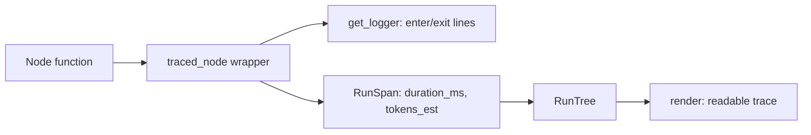

# Observability — Agent Lab

## Scope

This page documents the logging, metrics, run-tree, and tracing conventions
used across Track 8 (`53_observability`) and reused elsewhere in the
curriculum. Everything here is offline-first: no tracing backend, API key,
or network call is required to produce a trace.

## Logging

- Use `get_logger(__name__)` from `src.shared` for every reusable/library
  code path. It configures a single, idempotent stream handler
  (`logging.basicConfig`) so behavior is uniform across modules.
- Format: `%(asctime)s | %(levelname)-7s | %(name)s | %(message)s`, level
  controlled by the `LOG_LEVEL` environment variable (default `INFO`).
- Exercise scripts keep `print()` for the readable "learning output" the
  curriculum is built around; `get_logger` is for structured, filterable
  diagnostic lines (node enter/exit, warnings, errors) alongside it.
- **Never** swallow an exception silently — log via `logger.exception(...)`
  (captures the traceback) and re-raise, exactly as
  `src/53_observability/observability.py`'s `traced_node` wrapper does.

## Metrics

Three metrics recur across the curriculum and are cheap enough to compute on
every run:

| Metric | How it's computed | Where |
|--------|--------------------|-------|
| Latency | `time.perf_counter()` around a node/run | `53_observability`, `58_deployment` |
| Node count | `len(run_tree.spans)` | `53_observability` |
| Token estimate | `len(text) // 4` (character heuristic) | `53_observability`, `57_cost_and_multitenancy` |
| Cost estimate | `tokens / 1000 * price_per_1k` | `57_cost_and_multitenancy` |

These are deliberately simple heuristics, not a real tokenizer — swap in a
provider's tokenizer (e.g. `tiktoken`) when precision matters; the shape of
"measure → aggregate → report" does not change.

## Run Trees

A **run tree** is the ordered record of which nodes executed, with what
duration and estimated token cost — a minimal, offline stand-in for what a
real tracer (LangSmith, OpenTelemetry) captures as a span tree. See
`src/53_observability/observability.py`'s `RunTree` / `RunSpan` for the
reference implementation: a decorator (`traced_node`) records a `RunSpan` per
node call without the node itself knowing it is observed.

## Tracing in Production

This repo's `RunTree` is intentionally the smallest thing that demonstrates
the idea. In a real deployment:

- Replace `RunTree.render()` with export to a real tracer (LangSmith,
  OpenTelemetry spans, or a structured-log sink).
- Keep the **separation of concerns**: node bodies do work; a wrapper
  captures timing/metadata. Do not inline instrumentation into every node.
- Correlate a run's trace with its tenant (see
  [57_cost_and_multitenancy](../src/57_cost_and_multitenancy/README.md)) by
  including `tenant_id` in every log line and span.

## Related Modules

- [`src/53_observability/`](../src/53_observability/README.md) — structured
  logging, metrics, and the run tree, in depth.
- [`src/54_evaluations/`](../src/54_evaluations/README.md) — scoring
  correctness; complements observability's "what happened" with "was it
  right."
- [`src/57_cost_and_multitenancy/`](../src/57_cost_and_multitenancy/README.md) —
  reuses the token-estimate heuristic for per-tenant cost accounting.
- [`src/58_deployment/`](../src/58_deployment/README.md) — where traces and
  metrics would ship to in a deployed pipeline.

## Cross-References

- [`docs/PERFORMANCE.md`](PERFORMANCE.md) — performance budgets this
  observability layer helps measure against.
- [`docs/testing.md`](testing.md) — asserting on structural output rather
  than exact trace text.
