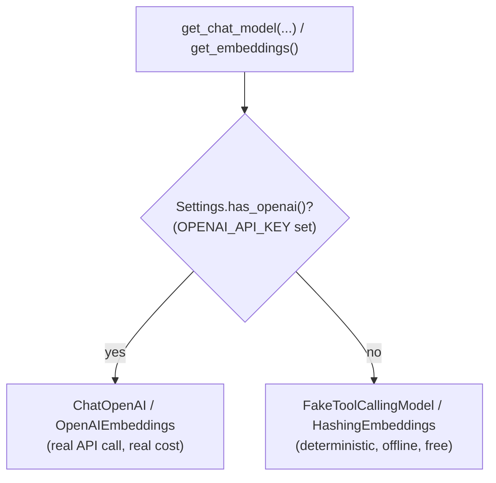
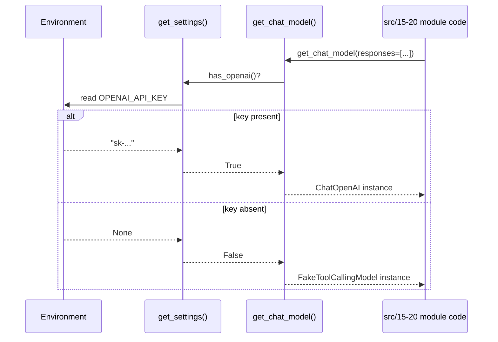

# OpenAI Integration: Chat, Embeddings, Tokens, Cost

How Agent Lab talks to OpenAI, and — critically — how every exercise still
runs with **zero API key** via deterministic offline fakes. Read this
alongside [`docs/langchain.md`](langchain.md) (the message/prompt/tool
primitives) and [`docs/SECURITY.md`](SECURITY.md) (key handling rules).

## 1. Chat models vs. embedding models

OpenAI (and most providers) expose two distinct model families used very
differently in this codebase:

| | Chat models | Embedding models |
|---|---|---|
| Input → Output | messages → a message (text/tool calls) | text → a fixed-size numeric vector |
| Used for | conversation, reasoning, tool use, structured output | similarity search, RAG retrieval (`07_qdrant_integration`, Track 5) |
| Factory here | `get_chat_model()` (`src/shared/llm.py`) | `get_embeddings()` (`src/shared/embeddings.py`) |
| Offline fallback | `FakeToolCallingModel` | `HashingEmbeddings` |

Both factories follow the same rule: **check `Settings.has_openai()`; return
the real client if a key is configured, otherwise return a deterministic
offline implementation.** No exercise imports `ChatOpenAI` or
`OpenAIEmbeddings` directly — always go through the factory.



## 2. When the real key is used vs. the offline fake

`Settings.has_openai()` (`src/shared/config.py`) is `True` exactly when the
`OPENAI_API_KEY` environment variable is non-empty at call time (settings
are read lazily per call, not cached at import time — so tests can toggle
the environment). Nothing else gates it: no config file, no explicit
"offline mode" flag to set.

- **Unset / empty `OPENAI_API_KEY`** → every `get_chat_model()` call across
  every module (`15`–`20` included) returns `FakeToolCallingModel`. This is
  the default, hard-gated path: `pytest` and every `python src/NN_*/*.py`
  command must succeed this way with **no network access**.
- **`OPENAI_API_KEY` set** → the exact same call sites construct a real
  `ChatOpenAI(model=settings.openai_model, ...)` and make real, billed API
  calls. Module [`03_llm_nodes`](../src/03_llm_nodes/README.md) is the one
  exercise that *requires* this (it constructs `ChatOpenAI` directly rather
  than through the shared factory, by design, to show the "no fallback"
  failure mode — see its smoke test `test_llm_nodes_requires_api_key`).

Because the factory is the only construction point, switching between real
and offline is a pure environment change — no code in `15`–`20` needs to
know or care which backend it's talking to.



## 3. Tokens and cost

Real chat models are billed per token, split between input (prompt) and
output (completion) tokens, typically at different rates. Every technique in
Track 2 has a direct cost implication:

- **Context engineering** ([`19_context_engineering`](../src/19_context_engineering/README.md))
  directly controls the input-token bill: trimming and summarization both
  reduce how many tokens get re-sent on every turn.
- **Model routing** ([`20_model_routing`](../src/20_model_routing/README.md))
  controls *which* per-token rate applies, by sending simple requests to a
  cheaper model and reserving an expensive, capable model for requests that
  need it.
- **Structured output retries** ([`16_structured_outputs`](../src/16_structured_outputs/README.md))
  and **tool-call loops** ([`17_function_calling`](../src/17_function_calling/README.md))
  both multiply the number of model calls per user request — every retry or
  loop iteration is a full billable call, which is exactly why both are
  built with **bounded** attempt/iteration budgets.

Offline, `count_tokens_approximately` (from `langchain_core.messages`, used
in module 19) gives a fast, dependency-free approximation
(`~4 chars/token`) suitable for budgeting decisions — it is not a
billing-accurate tokenizer. Once running against a real `ChatOpenAI`, prefer
`AIMessage.usage_metadata` (populated by the provider) for exact token
counts and cost reconciliation.

## 4. Running exercises against the real API (optional)

```bash
export OPENAI_API_KEY=sk-your-key
python src/15_chat_models/chat_turn.py     # now calls real ChatOpenAI
```

Every Track 2 script accepts this transparently — none of them special-case
"real vs. fake" in their own code. Never commit a real key; see
[`docs/SECURITY.md`](SECURITY.md).

## Cross-References

| Concept | Location |
|---------|----------|
| Chat model factory + offline fake | `src/shared/llm.py` (`get_chat_model`, `FakeToolCallingModel`) |
| Embeddings factory + offline fake | `src/shared/embeddings.py` (`get_embeddings`, `HashingEmbeddings`) |
| Settings / key detection | `src/shared/config.py` (`Settings.has_openai`) |
| Chat turn built from typed messages | [`15_chat_models`](../src/15_chat_models/README.md) |
| Structured output + bounded retries | [`16_structured_outputs`](../src/16_structured_outputs/README.md) |
| Manual tool-call loop | [`17_function_calling`](../src/17_function_calling/README.md) |
| Prompt structure and cost/format trade-offs | [`18_prompt_engineering`](../src/18_prompt_engineering/README.md) |
| Token/context budgeting | [`19_context_engineering`](../src/19_context_engineering/README.md) |
| Cost-aware routing | [`20_model_routing`](../src/20_model_routing/README.md) |
| Original real-key-only exercise | [`03_llm_nodes`](../src/03_llm_nodes/README.md) |
| Key handling rules | [`docs/SECURITY.md`](SECURITY.md) |
