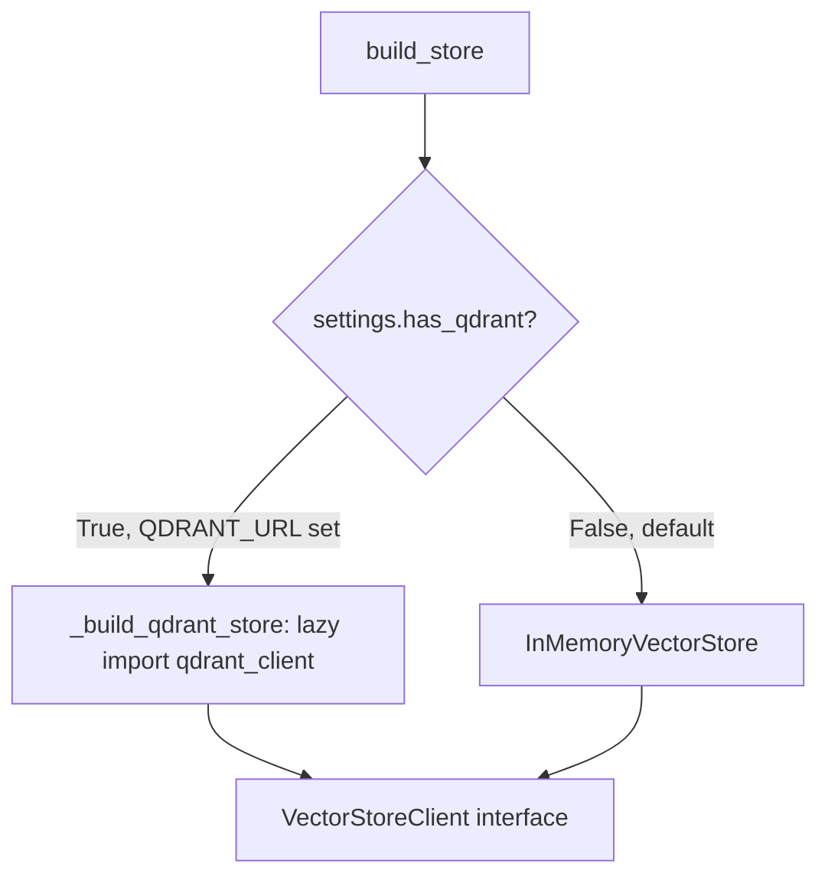
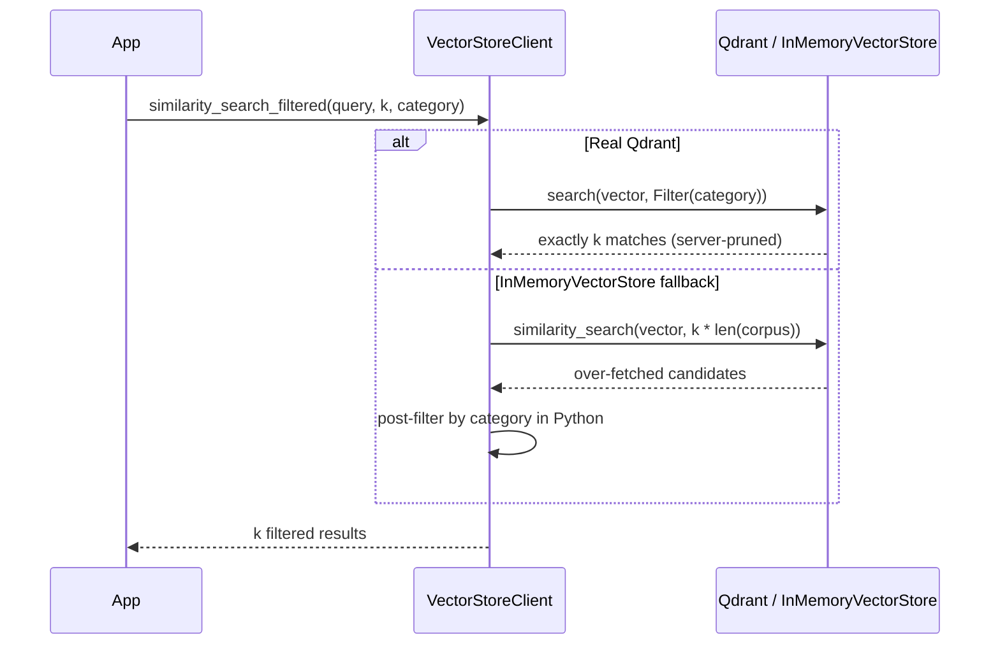

# Qdrant: The Production Vector-Store Path

A deep-dive into moving from `InMemoryVectorStore` (the teaching prototype
used across modules 37-41) to Qdrant, a real vector database — and how
[`src/42_qdrant_production/`](../src/42_qdrant_production/README.md) gates
the real client behind an environment variable so the whole repository stays
offline-first. Read alongside [`docs/rag.md`](rag.md) (the retrieval theory
this backs) and [`src/07_qdrant_integration/README.md`](../src/07_qdrant_integration/README.md)
(on-ramp introduction in module `07`; module `42` deepens production patterns).

## 1. Prototype vs. Production

| | `InMemoryVectorStore` | Qdrant |
|---|---|---|
| Storage | Python dict, process memory | Persisted to disk, survives restarts |
| Scale | Fine for demos (hundreds of docs) | Millions+ vectors, approximate nearest-neighbor index |
| Search | Linear scan, cosine similarity | Indexed search (HNSW), sub-linear |
| Filtering | Post-filter in Python | Server-side, pushed into the index |
| Dependency | None (pure Python) | `qdrant-client` + a running Qdrant service |

Both share the same mental model — a collection of (vector, payload) pairs
you can similarity-search — which is why code written against
`InMemoryVectorStore` ports to Qdrant with the same call shapes.

## 2. `QDRANT_URL` Gating

`src/shared/config.py`'s `Settings.has_qdrant()` returns `True` only when the
`QDRANT_URL` environment variable is set. Module 42's `build_store()` uses
that to choose a backend:



**Critical detail:** `qdrant-client` is not installed in this environment.
`from qdrant_client import QdrantClient` lives *inside* `_build_qdrant_store`
— never at module top level — so importing or running
`src/42_qdrant_production/main.py` never touches that import
unless `QDRANT_URL` is actually set. This is the same lazy-import pattern
`src/shared/llm.py` (`ChatOpenAI`) and `src/shared/embeddings.py`
(`OpenAIEmbeddings`) already use for `langchain_openai`. The offline fallback
is therefore not a degraded demo mode — it's the default, fully-supported
path, and the one every smoke test exercises.

## 3. Collections

A **collection** is a named set of vectors sharing one dimensionality and
distance metric. Module 42 uses a single `COLLECTION_NAME` for its demo
corpus; a real deployment typically has one collection per document type or
tenant, each sized to its embedding model's output dimensionality
(`len(embeddings.embed_query("probe"))` in the code — computed once, not
hardcoded, so swapping embedding models doesn't silently corrupt an existing
collection).

## 4. Payloads

A **payload** is arbitrary JSON-like metadata attached to each vector —
`InMemoryVectorStore`'s `Document.metadata` and a Qdrant point's `payload`
serve the same purpose. Module 42 stores `{"text": ..., "category": ...}` so
retrieved hits carry both the human-readable source text and a filterable
field. Always store enough payload to reconstruct a citation (module 38)
without a second lookup.

## 5. Filtered Search

Restricting similarity search to vectors whose payload matches a condition
(`category == "policy"`) is **filtered search**. Qdrant pushes this
server-side via `Filter`/`FieldCondition`, pruning the search space before
scoring — efficient at scale. The in-memory fallback has no server to push
the filter to, so `similarity_search_filtered()` over-fetches (`k *
len(corpus)`) and post-filters in Python:



Same correctness, different cost profile — exactly the tradeoff that
justifies a real vector database once payload filtering matters at scale.

## 6. Running Against a Real Qdrant Instance

Not exercised by the offline smoke test (`qdrant-client` is not installed
here), but the code path is ready for it:

```bash
# Requires: pip install qdrant-client, and a running Qdrant service.
docker run -p 6333:6333 qdrant/qdrant
QDRANT_URL=http://localhost:6333 python src/42_qdrant_production/main.py
# collection=agent_lab_docs backend=QdrantAdapter docs=4
```

## References

- Qdrant collections: https://qdrant.tech/documentation/concepts/collections/
- Qdrant payloads: https://qdrant.tech/documentation/concepts/payload/
- Qdrant filtering: https://qdrant.tech/documentation/concepts/filtering/
- [`docs/rag.md`](rag.md) — the retrieval theory this vector store backs.
- [`src/42_qdrant_production/`](../src/42_qdrant_production/README.md) — the
  module this document expands on.
