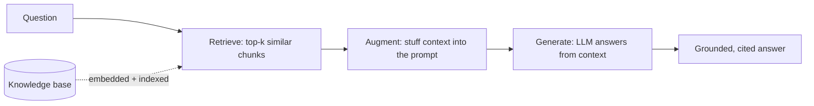
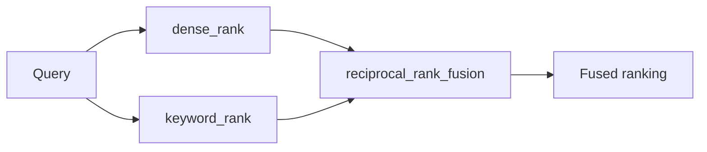
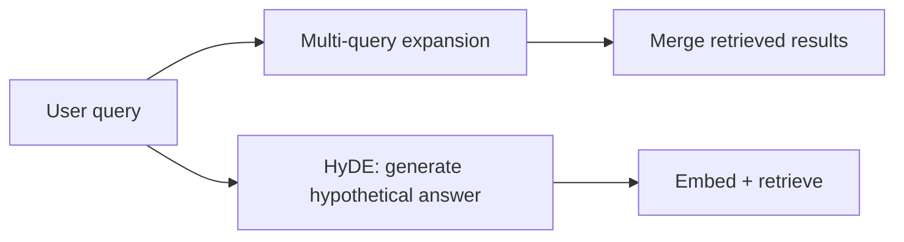
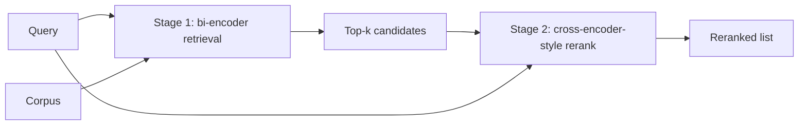

# Retrieval-Augmented Generation (RAG)

A deep-dive into the retrieval stack Track 5 builds — from raw embeddings up
through a full RAG loop, hybrid search, query rewriting, reranking, and a
production vector-store path. Read this alongside
[`src/37_embeddings/README.md`](../src/37_embeddings/README.md) (the
foundation) before diving into the individual modules. Everything here runs
offline: `HashingEmbeddings` (deterministic, pure-Python) stands in for a real
embedding model, and `FakeToolCallingModel` (behind `get_chat_model`) stands
in for a real LLM. Both degrade gracefully to the real thing once
`OPENAI_API_KEY` is configured.

## 1. The RAG Loop

Retrieval-Augmented Generation grounds an LLM's answer in specific documents
instead of relying purely on what the model memorized during training:



- **Retrieve** — embed the question, search a vector store for the most
  similar chunks. See [`src/37_embeddings/`](../src/37_embeddings/README.md)
  (embeddings + cosine similarity) and
  [`src/38_rag_fundamentals/`](../src/38_rag_fundamentals/README.md) (the
  loop wired to `InMemoryVectorStore`).
- **Augment** — build a prompt that includes the retrieved chunks as context
  and instructs the model to answer *only* from them, with citations.
- **Generate** — call the LLM (`get_chat_model`) with the augmented prompt.

The loop's quality ceiling is set by retrieval: a perfect LLM given the wrong
context still gives a wrong (or unfounded) answer. Tracks 37-41 exist because
retrieval, not generation, is usually where a RAG system needs the most
engineering.

## 2. Chunking

Documents are split into chunks before embedding because (a) embeddings and
context windows have finite size, and (b) a chunk mixing several topics
dilutes the vector for any single one. See
[`src/37_embeddings/embeddings.py`](../src/37_embeddings/embeddings.py) for a
worked example: sentence-sized chunks isolate a relevant sentence and score
higher against a focused query; one giant chunk dilutes the same signal with
unrelated topics and scores lower. Chunk size is a knob, not a constant —
tune it per corpus and query style.

## 3. Hybrid Search

Dense (embedding) retrieval and keyword/BM25-style retrieval fail
differently: dense retrieval misses exact terminology it has no vocabulary
overlap with; keyword retrieval misses paraphrases with zero shared tokens.
[`src/39_hybrid_search/`](../src/39_hybrid_search/README.md) fuses both
rankings with **Reciprocal Rank Fusion (RRF)**:



```
score(doc) = sum over each ranking r of  1 / (k + rank_r(doc))
```

RRF only needs rank *position*, not raw score — sidestepping the problem of
cosine similarity and a keyword overlap ratio living on incomparable scales.

## 4. Query Rewriting

Users ask short questions; knowledge bases are written in longer,
answer-shaped prose. [`src/40_query_rewriting/`](../src/40_query_rewriting/README.md)
closes that gap two ways:

- **Multi-query expansion** — ask the model for several alternate phrasings,
  retrieve for each, merge results (keep each document's best score).
- **HyDE** (Hypothetical Document Embeddings) — ask the model to sketch a
  *hypothetical answer*, embed that instead of the bare question, and
  retrieve with it. An answer-shaped embedding often lands closer to a real
  answer-shaped document than a terse question does.



Rewriting helps when there's real vocabulary mismatch between question and
answer phrasing. It can hurt when the original question already retrieves
well (added latency/cost for nothing) or when a rewrite drifts off-topic
(especially a bad HyDE hypothetical, which can pull retrieval toward the
wrong part of the corpus). Always compare against the no-rewrite baseline.

## 5. Reranking

First-stage retrieval is a cheap **bi-encoder**: query and candidates are
embedded independently and compared by cosine similarity — this scales, but
can't capture interactions that only make sense pairwise (phrase order,
concept coverage, length fit). A **cross-encoder** scores `[query,
candidate]` jointly — far more accurate, but too slow to run over an entire
corpus. [`src/41_reranking/`](../src/41_reranking/README.md) implements the
standard **two-stage retrieve-then-rerank** pattern: retrieval optimizes for
recall, reranking (a deterministic offline heuristic standing in for a real
cross-encoder) optimizes for precision over the small candidate set:



## 6. Evaluation

None of the above is worth shipping without measuring it. Practical RAG
evaluation checks, at minimum:

- **Retrieval quality** — recall@k / precision@k against a labeled set of
  (query, expected document id) pairs. Every module in this track prints a
  concrete before/after comparison (chunk size, hybrid vs. single-signal,
  rewritten vs. baseline query, reranked vs. first-stage order) — that's the
  same shape of evidence a real eval harness collects at scale.
- **Citation faithfulness** — does the generated answer's citation actually
  support the claim it's attached to? (See
  [`38_rag_fundamentals`](../src/38_rag_fundamentals/README.md).)
- **Groundedness** — does the answer only state what the retrieved context
  supports, or does it add unsupported claims?

Build these checks before tuning any single retrieval technique — otherwise
"hybrid search helped" or "reranking helped" is a guess, not a measurement.

## 7. How the Modules Fit Together

| Module | Adds |
|--------|------|
| [`07_qdrant_integration`](../src/07_qdrant_integration/README.md) | Original placeholder — superseded in depth by module 42 |
| [`37_embeddings`](../src/37_embeddings/README.md) | Vectors, cosine similarity, chunking |
| [`38_rag_fundamentals`](../src/38_rag_fundamentals/README.md) | The full retrieve -> augment -> generate loop |
| [`39_hybrid_search`](../src/39_hybrid_search/README.md) | Dense + keyword fusion (RRF) |
| [`40_query_rewriting`](../src/40_query_rewriting/README.md) | Multi-query expansion, HyDE |
| [`41_reranking`](../src/41_reranking/README.md) | Two-stage retrieve-then-rerank |
| [`42_qdrant_production`](../src/42_qdrant_production/README.md) | Production vector-store path — see [`docs/qdrant.md`](qdrant.md) |

Retrieval also underpins agent **memory**: a long-term memory store is,
mechanically, a RAG corpus of past events or facts. The Memory track builds
directly on `InMemoryVectorStore` and the patterns in this document to give
agents recall across sessions.

## References

- Retrieval-Augmented Generation paper (Lewis et al., 2020):
  https://arxiv.org/abs/2005.11401
- Reciprocal Rank Fusion (Cormack et al., 2009):
  https://plg.uwaterloo.ca/~gvcormac/cormacksigir09-rrf.pdf
- HyDE paper (Gao et al., 2022): https://arxiv.org/abs/2212.10496
- [`docs/qdrant.md`](qdrant.md) — the production vector-store path in depth.
