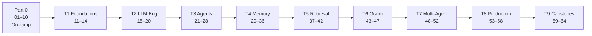
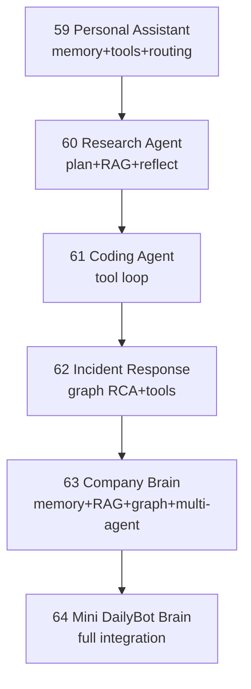

# Roadmap — the Agent Lab learning path

A guided route from fundamentals to a production-grade agent OS. Work top to
bottom; each track assumes the previous ones. Everything runs offline
(`pytest` green, no keys) — add real backends via `.env` when you want them.

## The tracks

| Track | Modules | You learn to… | Unlocks |
|-------|---------|---------------|---------|
| **0 — On-ramp** | 01–10 | Think in state, graphs, nodes, tools, memory | The whole path |
| **1 — Foundations** | 11–14 | Branch, parallelize, go async, handle errors | Reliable graphs |
| **2 — LLM Engineering** | 15–20 | Chat, structured output, tools, prompting, context, routing | Trustworthy model calls |
| **3 — Agent Engineering** | 21–28 | ReAct, plan/execute, reflect, route, replan, HITL, supervise | Autonomous agents |
| **4 — Memory** | 29–36 | Store & recall conversation/episodic/semantic/procedural memory | Agents that remember |
| **5 — Retrieval** | 37–42 | Embeddings, RAG, hybrid, rewriting, reranking, Qdrant | Grounded answers |
| **6 — Graph Intelligence** | 43–47 | Model, query, and reason over graphs | Relationship reasoning |
| **7 — Multi-Agent** | 48–52 | Collaborate, negotiate, decompose, share memory, event-bus | Teams of agents |
| **8 — Production** | 53–58 | Observe, evaluate, test, secure, budget, deploy | Ship it safely |
| **9 — Capstones** | 59–64 | Integrate everything end-to-end | A Mini DailyBot Brain |

## Suggested pacing

- **Week 1:** Tracks 0–1 (execution model). Run every script; read `langgraph.md`.
- **Week 2:** Track 2–3 (LLM + agents). Read `langchain.md`, `openai.md`, `tools.md`.
- **Week 3:** Tracks 4–5 (memory + retrieval). Read `memory.md`, `rag.md`, `qdrant.md`.
- **Week 4:** Tracks 6–7 (graph + multi-agent). Read `neo4j.md`, `multi-agent.md`.
- **Week 5:** Track 8 (production). Read `observability.md`, `testing.md`, `agent-security.md`.
- **Week 6:** Track 9 capstones — build up to `64_mini_dailybot_brain`.

## Capstone progression (Track 9)

## When you finish

You can design and implement a production-grade AI Agent Operating System —
choosing memory strategy, retrieval design, graph model, multi-agent topology,
and the observability/eval/security posture to run it safely — and explain the
trade-off behind each choice. Next steps live in each capstone's "Stretch Goals"
and in the Executive Report (`.dwp/plans/.../analysis_results/EXECUTIVE_REPORT.md`).
