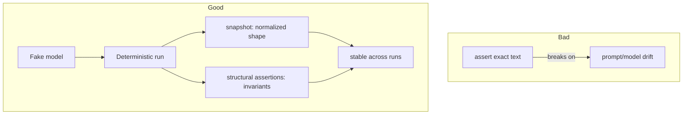

# Testing Nondeterministic Agents — Agent Lab

## Scope

This page documents how to test agents whose core component (an LLM) can be
nondeterministic, built in Track 8 (`src/55_testing_agents/`) and reused by
the eval harness in `src/54_evaluations/`. The short version: swap in a
deterministic fake, assert on structure instead of exact text, and reserve
scoring against a golden set for correctness questions a structural check
cannot answer.

## Why Exact-Text Assertions Fail

`assert result == "The weather in Paris is 21C and sunny."` is brittle: it
breaks the moment a prompt, model version, or temperature changes — even
when the agent's *behavior* is still correct. Agent tests need a different
contract with the code under test.

## Pattern 1: Fakes and Stubs

`get_chat_model()` already returns a deterministic `FakeToolCallingModel`
whenever no API key is configured — this is not a throwaway test double, it
supports `bind_tools` (real tool-call emission) and
`with_structured_output` (populated Pydantic objects), so the exact same
graph code runs identically against the fake and a real `ChatOpenAI`. Always
test agent logic through this same factory rather than hand-rolling a
separate stub — see `src/shared/llm.py`.

## Pattern 2: Snapshotting

A **snapshot** reduces a run's output to a normalized, comparable shape:
message roles in order, tool-call names invoked, message count — explicitly
excluding anything nondeterministic (ids, timestamps). Two runs of the same
deterministic input should produce **identical snapshots**; that equality
check is what should live in a test, not a comparison of raw text. See
`snapshot()` in `src/55_testing_agents/testing_agents.py`.

## Pattern 3: Structural Assertions

Assert invariants that must hold regardless of exact wording:

- The final message is an `AIMessage` with no pending tool calls.
- Every tool call carries an `id`.
- The tool-call count stays within budget (no infinite loop).

These catch real bugs (malformed messages, runaway loops) without caring what
the model actually said. See `structural_checks()` in
`src/55_testing_agents/testing_agents.py`.

## Pattern 4: Golden Sets and Scorers

When "did it do the right thing" genuinely requires judging correctness (not
just shape), use an eval harness: a **golden set** of (input, expected)
pairs plus one or more **scorers** that grade each case, aggregated into a
**pass rate**. See [`src/54_evaluations/`](../src/54_evaluations/README.md)
— including why golden sets should deliberately include known-hard cases
(sarcasm, edge cases) rather than only easy ones.

| Question | Pattern | Module |
|----------|---------|--------|
| "Did the shape hold?" | Structural assertions | `55_testing_agents` |
| "Is this run comparable to that run?" | Snapshotting | `55_testing_agents` |
| "Is the agent still correct against known cases?" | Golden set + scorers | `54_evaluations` |
| "What actually happened during the run?" | Run tree / tracing | `53_observability` |

## Related Modules

- [`src/55_testing_agents/`](../src/55_testing_agents/README.md) — fakes,
  snapshotting, and structural assertions, in depth.
- [`src/54_evaluations/`](../src/54_evaluations/README.md) — golden sets and
  scorers for correctness questions.
- [`src/53_observability/`](../src/53_observability/README.md) — run trees
  that help debug *why* a structural check or eval case failed.

## Cross-References

- [`docs/TESTING_GUIDE.md`](TESTING_GUIDE.md) — how to run the repo's pytest
  smoke suite and validate exercises manually.
- [`docs/agent-security.md`](agent-security.md) — the same "assert the
  invariant" discipline applied to safety checks (input validation, tool-call
  allow-lists).
