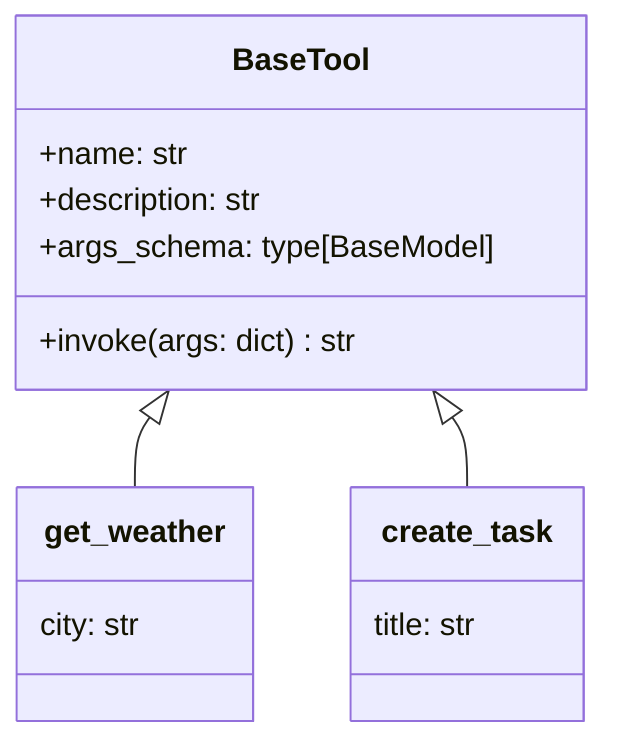
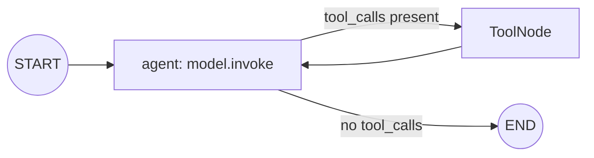
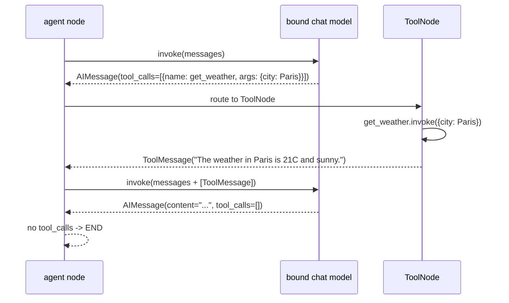
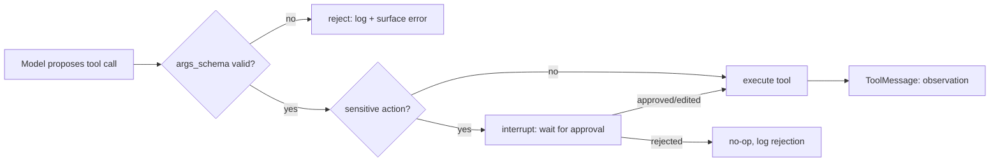

# Tool Design in Agent Lab

How `@tool`-decorated functions, argument schemas, the manual tool-execution
loop, and the shared `DEMO_TOOLS` registry fit together — and the safety
rules every tool in this repository follows. Read alongside
[`docs/langgraph.md`](langgraph.md) (execution model) before diving into the
agent modules that call tools (`05`, `17`, `21`–`28`).

## 1. Why Tools Exist

A chat model only produces text. A **tool** is how an agent affects (or
reads from) the world beyond that text: looking up a fact, creating a
tracker item, sending a message. The model itself never runs a tool — it
only ever *proposes* a call (a name and arguments); the surrounding code
decides whether, and how, to actually execute it. That boundary is the
entire basis for tool safety (§5).

## 2. The `@tool` Decorator and Argument Schemas

`src/shared/tools.py` defines every demo tool with LangChain's `@tool`
decorator:

```python
from langchain_core.tools import tool

@tool
def get_weather(city: str) -> str:
    """Return a short weather report for a city."""
    return f"The weather in {city} is 21C and sunny."
```

`@tool` does three things:

- Wraps the function as a `BaseTool` with a stable `.name` (the function
  name) and `.description` (the docstring) — this is what the model sees
  when tools are bound.
- Derives an **argument schema** from the function's type hints (here,
  `{"city": str}`) — a Pydantic model the tool call's arguments must match.
- Gives the tool a uniform `.invoke(args: dict) -> str` interface, whether
  it's called directly (module 23) or through a `ToolNode` (module 21).

The schema is the contract: it's what lets a model's tool call
(`{"name": "get_weather", "args": {"city": "Paris"}}`) be validated and
routed to the right Python function with the right argument names — instead
of parsing free text.



## 3. The Manual Tool-Execution Loop

`langgraph.prebuilt.create_react_agent` is **deprecated** (and uninstalled
in this environment). Every agent module in this repository builds the loop
explicitly instead, with two pieces:

- `model.bind_tools(DEMO_TOOLS)` — lets the model's replies carry
  `tool_calls` (a list of `{name, args, id}`).
- `ToolNode(DEMO_TOOLS)` — a prebuilt LangGraph node that reads the last
  message's `tool_calls`, invokes each matching tool, and appends one
  `ToolMessage` (the observation) per call.

A conditional edge checks whether the model's last reply carries
`tool_calls`: if so, route to the tool node; once the model replies with
plain content and no tool calls, the loop ends.





This exact loop is spelled out in modules
[`17_function_calling`](../src/17_function_calling/README.md) and, framed
as the ReAct reason/act/observe cycle, in
[`21_react_agent`](../src/21_react_agent/README.md).

## 4. The `DEMO_TOOLS` Registry

`src/shared/tools.py` exports `DEMO_TOOLS`, a fixed list of five
deterministic, offline, side-effect-free tools:

| Tool | Argument(s) | Returns |
|------|-------------|---------|
| `get_weather` | `city: str` | a canned weather report |
| `search_knowledge_base` | `query: str` | a canned KB article, or "no match" |
| `create_task` | `title: str` | a stable, hash-derived task id |
| `add_numbers` | `a: int, b: int` | their sum |
| `send_slack` | `message: str` | an acknowledgement string |

Every module that needs tools imports this list rather than redefining
tools locally — `from src.shared import DEMO_TOOLS`. Each tool is
deterministic (same input -> same output, every run) so agent transcripts
built on them are exactly reproducible, which is what lets the smoke tests
assert on stdout substrings with no network or API key involved.

## 5. Tool Safety

Because a tool call originates from a model's *guess* at what to do, never
from a human directly, three rules apply everywhere tools are used in this
repository:

1. **Validate arguments — never trust model output blindly.** The
   `args_schema` derived from type hints is the first gate: a call with the
   wrong shape fails validation before the function body ever runs. Module
   [`23_executor_agent`](../src/23_executor_agent/README.md) goes further,
   validating the *plan* referencing tool names before any tool runs at
   all.
2. **Keep tools side-effect-bounded and idempotent where possible.** Every
   `DEMO_TOOLS` entry is a pure function of its arguments — no shared
   mutable state, no reliance on call order. A real `send_slack` or
   `create_task` integration should be built the same way: safe to retry,
   and clearly logged when it isn't idempotent.
3. **Gate genuinely sensitive actions behind human approval.** Not every
   tool call should execute unsupervised. Module
   [`27_human_in_the_loop`](../src/27_human_in_the_loop/README.md) shows
   the pattern: `interrupt()` pauses before a proposed action executes, and
   only an explicit approve/edit/reject resume lets it proceed.



Never swallow a tool failure silently: catch it, log it
(`get_logger(__name__)`), and turn it into routable state — exactly the
pattern module [`14_error_handling`](../src/14_error_handling/README.md)
established and modules [`23`](../src/23_executor_agent/README.md) and
[`26`](../src/26_planning_loops/README.md) reuse for failed plan steps.

## Cross-References

| Concept | Module |
|---------|--------|
| Tool invocation baseline | [`05_tools`](../src/05_tools/README.md) |
| `bind_tools` + manual loop | [`17_function_calling`](../src/17_function_calling/README.md) |
| ReAct reason/act/observe | [`21_react_agent`](../src/21_react_agent/README.md) |
| Structured plans referencing tools | [`22_planner_agent`](../src/22_planner_agent/README.md) |
| Executing a plan's tool steps | [`23_executor_agent`](../src/23_executor_agent/README.md) |
| Reflection (no tools, quality loop) | [`24_reflection`](../src/24_reflection/README.md) |
| Routing to per-intent tool sub-graphs | [`25_router_agent`](../src/25_router_agent/README.md) |
| Replanning around a failed tool step | [`26_planning_loops`](../src/26_planning_loops/README.md) |
| Approval gate before a tool executes | [`27_human_in_the_loop`](../src/27_human_in_the_loop/README.md) |
| Supervisor dispatching tool-calling workers | [`28_supervisor`](../src/28_supervisor/README.md) |
