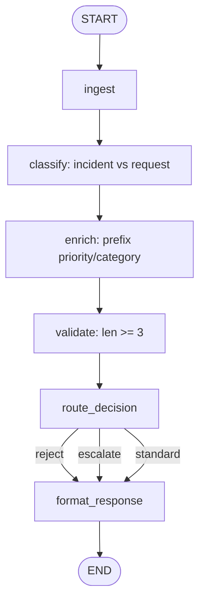

# 01 — State Basics

## Learning Objectives

After this module you can:

- Explain state as data that flows through a pipeline of transformations.
- Implement **branching decisions** without LangGraph (explicit `route` field).
- Maintain an **audit trail** (`audit: list[str]`) so every step is replayable.
- Predict final state by reading the pipeline functions in order.
- Recognize this as the foundation for LangGraph nodes (module `02`).

## Theory

Every agent is a sequence of `state -> state` functions. This module uses a
six-stage **incident triage pipeline**:

`ingest → classify → enrich → validate → route_decision → format_response`

Routing is explicit Python: invalid messages → `reject`, incidents → `escalate`,
everything else → `standard`. No framework — only TypedDict state and pure steps.

## Mental Models

State is a **relay baton** with a lap counter (`audit`): each function signs the
baton before passing it on. Module `02` replaces the manual chain with a graph engine.

## Architecture



Legend: conditional routing is plain `if/elif` inside `route_decision`, not LangGraph yet.

## Runnable Example

```bash
python src/01_state_basics/main.py
```

## Expected output

```
message='hello team' route=standard response='accepted: [normal/request] hello team' audit=[...]
message='we are blocked on the deploy' route=escalate response='escalated: ...' audit=[...]
=== MODULE 01: STATE BASICS COMPLETE ===
```

## Challenge

1. Add a `priority=urgent` fast-path when the message contains `"p0"`.
2. Return **new dicts** from each step instead of mutating in place.
3. Refactor the pipeline as `functools.reduce` over `(name, fn)` pairs.

## Stretch Goals

- Add `history: list[str]` with human-readable step summaries.
- Port the same pipeline to LangGraph in module `02` and diff the outputs.

## Common Mistakes

- **Forgetting to return state** from a step — next step receives `None`.
- **Silent dict typos** — `state["mesage"]` creates a new key on plain dicts.
- **Mixing routing and side effects** — keep `classify` separate from `format_response`.

## Best Practices

- Use stable key names (`message`, `route`, `audit`).
- Log at decision points (`logger.info` on classify/route).
- Keep each function focused on one transformation.

## References

- [`docs/ARCHITECTURE.md`](../../docs/ARCHITECTURE.md) — learning path.
- Module [`02_langgraph_basics`](../02_langgraph_basics/README.md) — same flow as a graph.

## What Comes Next

Module `02` re-expresses this pipeline as a compiled `StateGraph` with conditional edges.

## Automated test

`test_state_basics_runs` in `tests/test_smoke.py`.
