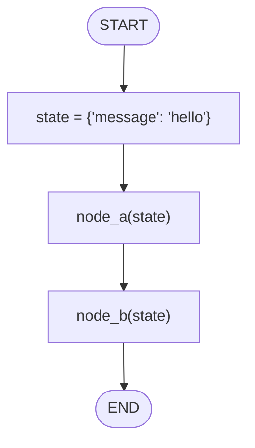

# 01 — State Basics

## Learning Objectives

After this module you can:

- Explain what "state" means in the context of an agent pipeline.
- Describe an agent step as a pure(ish) function `state -> state`.
- Chain multiple state-transforming functions into a pipeline.
- Predict the final state of a chain by reading the functions in order.
- Recognize this pattern as the mental foundation for LangGraph nodes (module 02).

## Theory

Every agent — no matter how sophisticated — is built on one idea: **state flows
through a sequence of transformations**. State is just data (here, a `dict`)
that represents "everything the agent currently knows." A **node** (or, at this
stage, a plain function) receives the current state, does something with it,
and returns the updated state. Chaining nodes together is how an agent's
"thinking" progresses from input to output.

This module strips away every framework (no LangGraph, no LLM, no tools) so the
core idea is visible on its own: state in, state out, next function.

## Mental Models

Think of state like a **relay baton**: each runner (function) receives the
baton (state), makes their mark on it, and hands it to the next runner. No
runner needs to know what happened before the baton reached them or what will
happen after they pass it along — they only need the baton itself. This is
exactly how LangGraph nodes will behave starting in module 02, except the
"track" (the graph) will decide who runs next.

## Architecture

`hello_world.py` defines a minimal `State(dict)` type and two functions,
`node_a` and `node_b`, each mutating the `message` key and returning the state.
They are called back-to-back — no graph engine is involved yet, just direct
Python function calls in sequence.



Legend: every arrow is an unconditional transition — there are no branches or
loops in this module; each box is a function call that returns the mutated
state to the next call.

Flow notes:
- `init` sets the starting state to `{"message": "hello"}`.
- `node_a` appends `" | A"` to `state["message"]` and returns the state.
- `node_b` appends `" | B"` to `state["message"]` and returns the state.
- The chain is linear and unconditional — there is no router or loop here;
  that complexity is introduced in modules 02 and 04.

## Runnable Example

From the repository root:

```bash
python src/01_state_basics/hello_world.py
```

### Expected output

```
{'message': 'hello | A | B'}
```

## Challenge

1. Add a `node_c` that appends `" | C"` and wire it in after `node_b`.
2. Change the initial state to include a `count: int` key, and have each node
   increment it in addition to mutating `message`.
3. Refactor `node_a` and `node_b` to *not* mutate the input dict in place —
   instead return a new dict — and confirm the final output is identical.

## Stretch Goals

- Rewrite the pipeline as a single `reduce()` call over a list of functions.
- Add a `history: list[str]` key that records the name of every node that ran,
  so the final state is self-documenting.
- Make the pipeline data-driven: accept a list of `(name, fn)` pairs and run
  them in order, printing the state after each step.

## Common Mistakes

- **Forgetting to return the state.** If a node mutates `state` in place but
  forgets `return state`, the next call still works here only because the dict
  is mutated in place — but this hides a real bug: in LangGraph (module 02),
  nodes must return the (partial) state, not rely on mutation.
- **Assuming state is immutable.** This module's `State(dict)` is mutated
  directly for simplicity. Production agent state is usually treated as
  immutable to make debugging and replay easier — see Best Practices below.
- **Losing track of key names.** A typo like `state["mesage"]` silently creates
  a new key instead of raising an error, because this is a plain `dict`.

## Best Practices

- Prefer returning new state objects (or partial updates) over in-place
  mutation once you move past this toy example — this is what LangGraph nodes
  do (module 02).
- Give state keys clear, stable names (`message`, not `msg` in one node and
  `message` in another).
- Keep each function focused on one transformation — this is what makes a
  chain of nodes easy to reason about and to test in isolation.

## Suggested Improvements

- Add type hints (`State = dict[str, str]`) and a `TypedDict` for `message` to
  make the contract explicit, foreshadowing module 02's `TypedDict` state.
- Add a small unit test per node (`node_a({"message": "x"}) == {"message": "x | A"}`)
  independent of the smoke test that runs the whole script.

## References

- [docs/ARCHITECTURE.md](../../docs/ARCHITECTURE.md) — module layout and learning path.
- [docs/STANDARDS.md](../../docs/STANDARDS.md) — coding conventions used across modules.
- [src/02_langgraph_basics/README.md](../02_langgraph_basics/README.md) — the same
  pattern, expressed as a compiled LangGraph graph.

## What Comes Next

[Module 02 — LangGraph Basics](../02_langgraph_basics/README.md) takes this
same "state in, state out" idea and formalizes it with `StateGraph`: nodes
become graph nodes, and transitions become edges that a compiled graph engine
executes for you.

## Automated test

Covered by `pytest` — `test_state_basics_runs` in `tests/test_smoke.py`.
