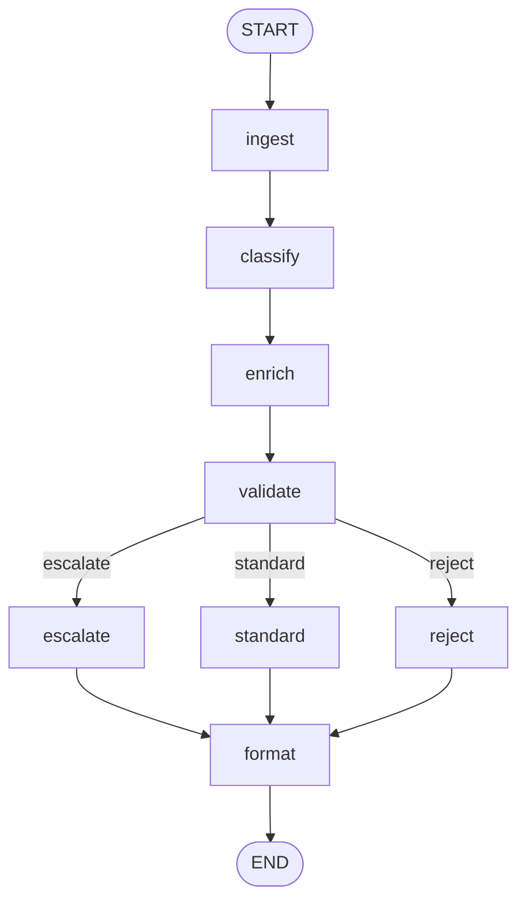

# 02 — LangGraph Basics

## Learning Objectives

After this module you can:

- Compile the module-01 pipeline as a `StateGraph` with **eight nodes**.
- Route after `validate` with `add_conditional_edges` (`escalate` / `standard` / `reject`).
- Converge all branches into a single `format` node before `END`.
- Invoke a graph with `app.invoke(initial_state)` and read final state fields.

## Theory

LangGraph formalizes the module-01 pattern: nodes return partial updates, the engine
merges state, and `add_conditional_edges` picks the next node from a router function.

## Architecture



## Runnable Example

```bash
python src/02_langgraph_basics/main.py
```

## Expected output

```
message=start response='accepted: [normal/request] start the morning standup' audit=[...]
message=blocked route=escalate response='escalated: ...'
=== MODULE 02: LANGGRAPH BASICS COMPLETE ===
```

## Challenge

1. Add a `log` node after `format` that appends the final `response` to an audit list.
2. Loop `validate → enrich` once when `valid` is false (max one retry).
3. Compare node count and readability vs. module `01`'s plain pipeline.

## References

- Module [`01_state_basics`](../01_state_basics/README.md) — plain-Python version.
- Module [`11_graph_branching`](../11_graph_branching/README.md) — multi-way routing.

## Automated test

`test_langgraph_basics_runs` in `tests/test_smoke.py`.
