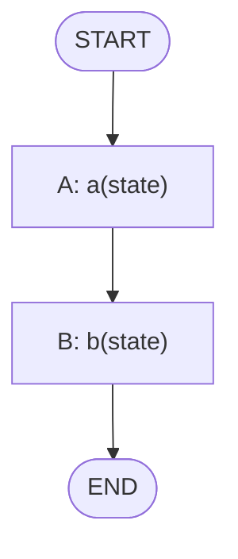
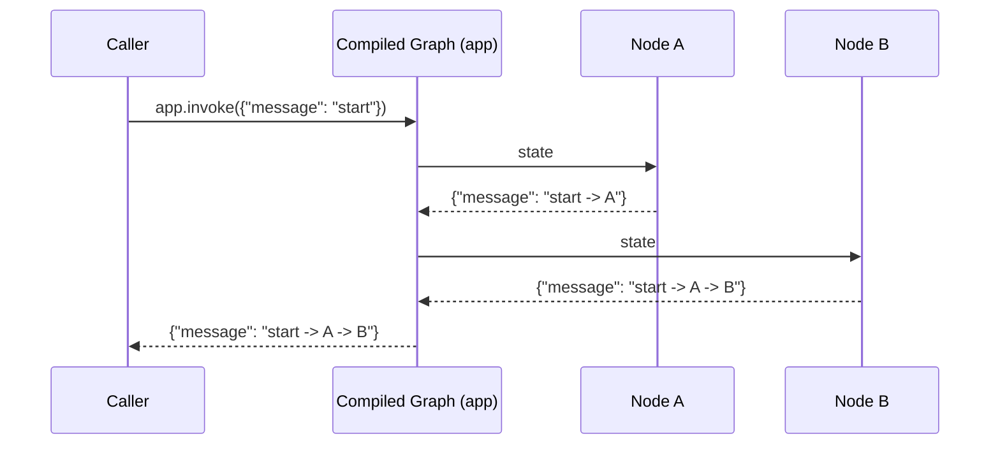

# 02 — LangGraph Basics

## Learning Objectives

After this module you can:

- Explain the core building blocks of LangGraph: `StateGraph`, nodes, edges,
  entry point, finish point, and `compile()`.
- Build a two-node graph and run it with `.invoke()`.
- Read a compiled graph's structure and predict the order nodes execute in.
- Explain why a `TypedDict` state schema is preferable to a raw `dict`.

## Theory

LangGraph models an agent as a **state machine**: a `StateGraph` is a directed
graph whose nodes are functions `state -> partial_state_update`, and whose
edges define which node runs next. You declare the graph (nodes + edges +
entry/finish points), then `compile()` it into a runnable `app`. Calling
`app.invoke(initial_state)` runs the graph from the entry point to the finish
point (or `END`), merging each node's return value into the state.

This module builds the smallest possible graph — two nodes, one edge — to
make the mechanics concrete before adding branching (module 04), tools
(module 05), or LLM calls (module 03).

## Mental Models

If module 01 was a relay race with runners handing off a baton directly,
LangGraph is the **race organizer**: you declare the course (nodes and edges)
once, and the organizer (the compiled graph) is responsible for actually
running each leg in the right order and handing the baton along. You no longer
call `node_a` then `node_b` yourself — you describe the course, and
`app.invoke(...)` runs it.

## Architecture

`basic_graph.py` defines a `State(TypedDict)` with one key, `message`. Two
node functions, `a` and `b`, each return a dict with `message` extended by a
suffix. The graph wires `A` as the entry point, an edge from `A` to `B`, and
`B` as the finish point.



Legend: every edge here is unconditional (`add_edge`, not
`add_conditional_edges`) — there is exactly one path through the graph.



Flow notes:
- `set_entry_point("A")` means the graph always starts by running node `A`.
- `add_edge("A", "B")` is unconditional — there is no condition to evaluate,
  node `B` always runs right after node `A`.
- `set_finish_point("B")` means the graph reaches `END` immediately after `B`
  returns — there is no loop and no branch to choose from.

## Runnable Example

From the repository root:

```bash
python src/02_langgraph_basics/basic_graph.py
```

### Expected output

```
{'message': 'start -> A -> B'}
```

## Challenge

1. Add a third node `C` that appends `" -> C"`, insert it between `A` and `B`,
   and update `set_finish_point` accordingly.
2. Change `State` to add a second key, `visited: list[str]`, and have each
   node append its own name to it.
3. Print the graph structure with `app.get_graph().print_ascii()` (or
   `.draw_mermaid()`) and compare it to the diagram above.

## Stretch Goals

- Replace `set_entry_point`/`set_finish_point` with the newer
  `add_edge(START, "A")` / `add_edge("B", END)` style and confirm behavior is
  identical.
- Turn `a` and `b` into no-op passthrough nodes and time how long
  `app.invoke()` takes for a trivial two-node graph versus calling the
  functions directly (module 01's approach) — this quantifies the framework's
  overhead for a task this small.

## Common Mistakes

- **Confusing entry/finish points with edges.** `set_entry_point("A")` says
  where execution *starts*; it does not create an edge. You still need
  `add_edge("A", "B")` to connect nodes.
- **Returning the full state instead of a partial update.** LangGraph merges
  whatever a node returns into the state — returning `{"message": ...}` is
  correct here because `message` is the only key, but with more keys you
  usually only return the keys you changed.
- **Forgetting to `compile()`.** `StateGraph` objects are not runnable; only
  the object returned by `.compile()` has `.invoke()`.

## Best Practices

- Always type your state with `TypedDict` (or a `pydantic` model) instead of a
  raw `dict` — this gives you autocomplete and catches typos in key names.
- Name nodes after what they *do*, not generic letters — `"A"`/`"B"` are used
  here only for pedagogical minimalism; production graphs should use names
  like `"classify_intent"` (see module 04).
- Keep node functions small and side-effect-free where possible; this makes
  graphs easy to test node-by-node, the same way module 01's plain functions
  were testable in isolation.

## Suggested Improvements

- Visualize the compiled graph automatically in the script
  (`app.get_graph().draw_mermaid()`) so the printed diagram always matches the
  code.
- Add a smoke test variant that asserts on the graph structure itself (node
  names, edges) rather than only the final invoked output.

## References

- [LangGraph documentation](https://langchain-ai.github.io/langgraph/) —
  official `StateGraph` API reference.
- [docs/ARCHITECTURE.md](../../docs/ARCHITECTURE.md) — module layout and learning path.
- [src/01_state_basics/README.md](../01_state_basics/README.md) — the same
  two-step pipeline, without a graph engine.

## What Comes Next

[Module 03 — LLM Nodes](../03_llm_nodes/README.md) replaces a plain Python
function with a real LLM call inside a node — your first "intelligent" node.

## Automated test

Covered by `pytest` — `test_langgraph_basics_runs` in `tests/test_smoke.py`.
