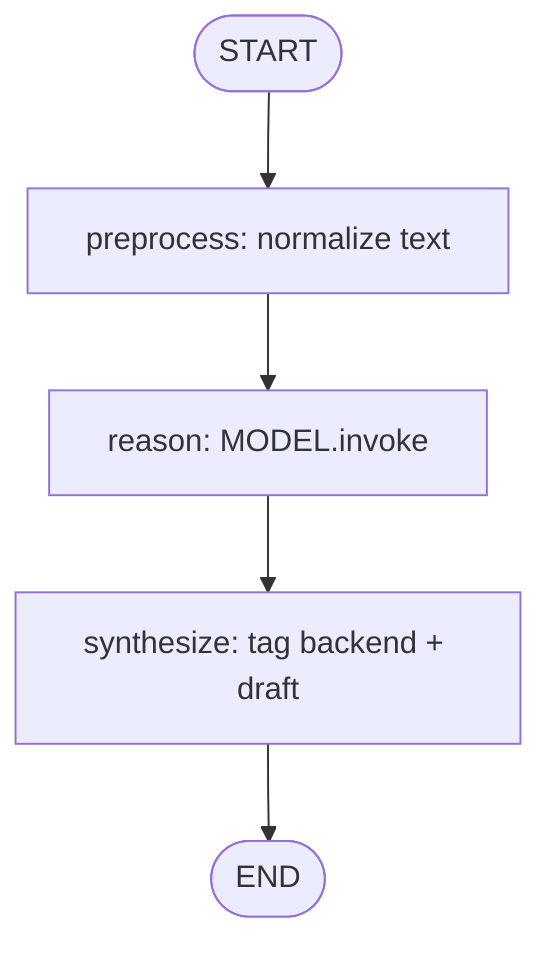

# 03 — LLM Nodes

## Learning Objectives

After this module you can:

- Place an LLM call inside a **three-node graph**: preprocess → reason → synthesize.
- Use `get_chat_model()` for offline-first runs (`FakeToolCallingModel`) and real
  `ChatOpenAI` when `OPENAI_API_KEY` is set.
- Pass normalized text through `context` instead of mutating messages in place.
- Report which backend answered (`offline-fake` vs `openai`).

## Theory

LLM calls should be one node in a larger graph, not a standalone script. Preprocessing
cleans input; synthesis wraps the model output with metadata for downstream nodes.

## Architecture



## Runnable Example

```bash
python src/03_llm_nodes/main.py
# Optional: export OPENAI_API_KEY=sk-... for real ChatOpenAI
```

## Expected output

```
response='[offline-fake] Summarized: the user greeted ...'
=== MODULE 03: LLM NODES COMPLETE ===
```

## Challenge

1. Add a `guard` node that rejects empty messages before `reason`.
2. Bind `responses=[...]` on the fake model for deterministic demo output.
3. Append the final `response` as an `AIMessage` in state.

## References

- [`src/shared/llm.py`](../../shared/llm.py) — fake vs real model factory.
- Module [`15_chat_models`](../15_chat_models/README.md) — message types.

## Automated test

`test_llm_nodes_runs_offline` in `tests/test_smoke.py`.
