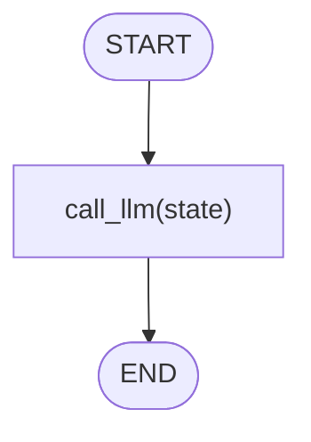
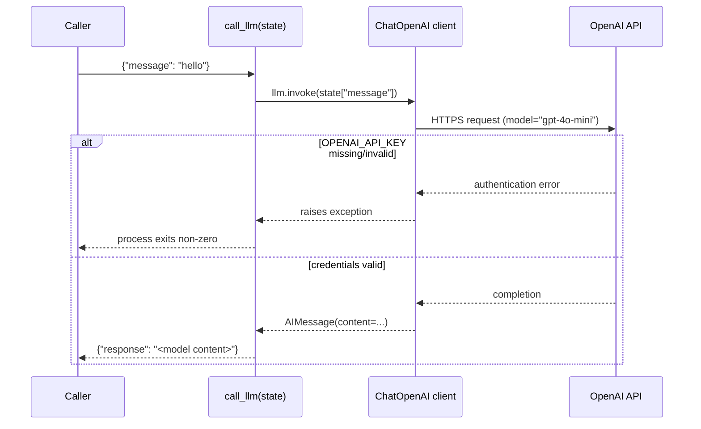

# 03 — LLM Nodes

## Learning Objectives

After this module you can:

- Wrap a call to an LLM (`ChatOpenAI`) inside a plain function, using the same
  "state in, state out" contract from modules 01–02.
- Explain the temporal flow of an LLM call: your process sends a request over
  the network and waits for a completion.
- Describe why LLM-dependent exercises fail fast and loudly without an API
  key, instead of silently returning garbage.
- Locate where secrets like `OPENAI_API_KEY` should (and should not) live.

## Theory

An LLM node is a node like any other: it receives state, does work, and
returns updated state. The only difference is *what* the work is — instead of
string concatenation (module 01) or a pure Python `if`/`else` (module 04), the
node delegates the "thinking" to a hosted language model over the network.
This means LLM nodes are:

- **Non-deterministic** (the same input can produce different output).
- **Slow relative to local code** (network round-trip + model inference).
- **Fallible** (the call can fail: bad credentials, rate limits, network
  errors) — so the calling code, or the graph around it, must be prepared to
  handle failure.

This module intentionally has no branching or retries yet (see module 04 for
routing, and later modules for tool loops); it isolates the single new
concept — *the node body performs an LLM call* — from everything else.

## Mental Models

Think of an LLM node as **outsourcing one step of the relay race to a expert
consultant who works remotely**: you send them the baton's current state over
the phone (the API request), they think about it, and phone back their answer
(the completion). Everything before and after this node still behaves like
modules 01 and 02 — the outsourcing is invisible to the rest of the pipeline,
except that this one step can now take longer and can fail.

## Architecture

`llm_node.py` constructs a `ChatOpenAI` client once (`model="gpt-4o-mini"`)
and defines a single function, `call_llm(state)`, that invokes the model with
`state["message"]` and returns `{"response": <content>}`. There is no
`StateGraph` here yet — the function is called directly, exactly like
module 01's `node_a`/`node_b` — the point of this module is the LLM call
itself, not graph wiring.



Legend: a single node performs the LLM call; there is no condition or loop —
the "intelligence" lives inside the node's implementation, not in the graph
shape.



Flow notes:
- The **happy path** sends `state["message"]` to the model and returns
  `{"response": llm.invoke(...).content}`.
- The **missing-credentials path** is not caught anywhere in the script —
  `ChatOpenAI` raises when it tries to authenticate, and the process exits
  with a non-zero status and an error on stderr. This is intentional: an LLM
  node should never silently pretend to succeed.

## Runnable Example

### Prerequisites

Set your OpenAI API key (never commit this value):

```bash
export OPENAI_API_KEY=sk-your-key
```

See [docs/SECURITY.md](../../docs/SECURITY.md) for safe handling.

### Run

From the repository root:

```bash
export OPENAI_API_KEY=sk-your-key
python src/03_llm_nodes/llm_node.py
```

### Expected output

A dict with an LLM-generated response (exact text varies per call):

```
{'response': 'Hello! How can I assist you today?'}
```

### Without an API key

The script exits with an OpenAI credentials error. This is expected — `pytest`
validates this behavior via `test_llm_nodes_requires_api_key`.

## Challenge

1. Change `state["message"]` to a longer prompt (e.g. "Explain LangGraph in
   one sentence.") and observe how the response changes.
2. Wrap the `llm.invoke(...)` call in a `try/except` that logs a friendly
   error via `get_logger(__name__)` (see `src/shared/`) instead of letting the
   raw exception propagate, and compare the developer experience.
3. Parametrize the model name (`gpt-4o-mini` → an environment variable) so the
   script can be run against different models without editing code.

## Stretch Goals

- Turn `call_llm` into an actual LangGraph node (`StateGraph` with one node,
  `add_edge(START, "call_llm")`, `add_edge("call_llm", END)`) so it matches
  module 02's shape exactly, then confirm the output is unchanged.
- Add a retry with exponential backoff around the API call to handle
  transient rate-limit errors, and log each retry attempt.
- Use `src.shared.get_chat_model(...)` (the offline-first factory described in
  `docs/STANDARDS.md`) so the exercise can also run deterministically without
  a real API key, then compare both code paths.

## Common Mistakes

- **Committing the API key.** Never hardcode `OPENAI_API_KEY` in the script
  or commit a `.env` file — see [docs/SECURITY.md](../../docs/SECURITY.md).
- **Assuming determinism.** Unlike modules 01–02 and 04, the exact response
  text is not stable across runs; do not assert on exact LLM output in tests
  (the smoke test only checks the failure path, not a live call).
- **Ignoring the credential-failure path.** Because the script does not catch
  exceptions, a missing or invalid key surfaces as a stack trace. That is the
  correct behavior for a learning exercise, but production code should catch
  this class of error explicitly and react (see Best Practices).

## Best Practices

- Never swallow exceptions from LLM calls silently — log them via
  `get_logger(__name__)` and decide explicitly whether to retry, fall back, or
  fail the request.
- Keep model configuration (name, temperature, max tokens) out of node logic
  where possible, so it can be swapped without touching business logic.
- Treat LLM calls as I/O: budget for latency and failure the same way you
  would for a database or an external HTTP API.

## References

- [LangChain `ChatOpenAI` reference](https://python.langchain.com/docs/integrations/chat/openai/)
- [docs/SECURITY.md](../../docs/SECURITY.md) — API keys, secrets, and sensitive data.
- [src/02_langgraph_basics/README.md](../02_langgraph_basics/README.md) — the
  graph shape this node will eventually be wired into.

## What Comes Next

[Module 04 — Routing & Branching](../04_routing_and_branches/README.md)
introduces conditional flows — deciding *which* node runs next based on state
— which combines naturally with LLM nodes (e.g. routing based on an LLM's
classification) in later modules.

## Automated test

`test_llm_nodes_requires_api_key` confirms the script fails cleanly when
`OPENAI_API_KEY` is unset. Live API validation is manual.
