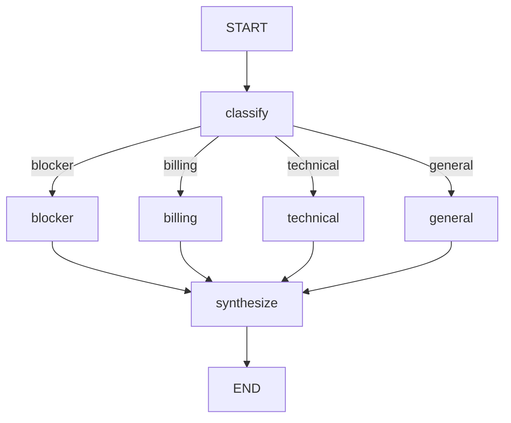

# 04 — Routing and Branches

## Learning Objectives

After this module you can:

- Build a **four-way intent router** (`blocker`, `billing`, `technical`, `general`).
- Use `add_conditional_edges` with a dedicated `route_intent` function.
- Converge all branches at a `synthesize` node that emits an `AIMessage`.
- Run multiple requests in one script to prove each branch fires.

## Theory

Routing classifies **intent** from the latest human message. Side effects live in
branch handlers; the router only returns a key. All branches merge before `END`.

## Architecture



## Runnable Example

```bash
python src/04_routing_and_branches/main.py
```

## Expected output

```
intent=blocker action=[blocker] paged on-call and opened incident
intent=billing action=[billing] routed to finance queue
...
=== MODULE 04: ROUTING AND BRANCHES COMPLETE ===
```

## Challenge

1. Add a fifth branch `security` for messages mentioning `"cve"` or `"vulnerability"`.
2. Record routed intent in `scratchpad` and print it in `synthesize`.
3. Compare with module `25_router_agent` (sub-graph routing).

## References

- Module [`11_graph_branching`](../11_graph_branching/README.md) — ticket triage variant.
- Module [`25_router_agent`](../25_router_agent/README.md) — agent-level router.

## Automated test

`test_routing_runs` in `tests/test_smoke.py`.
