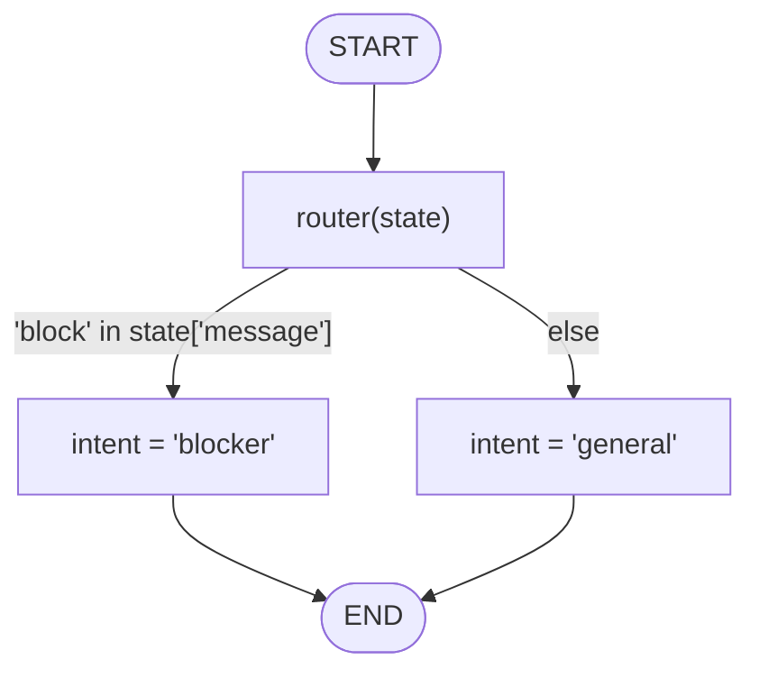
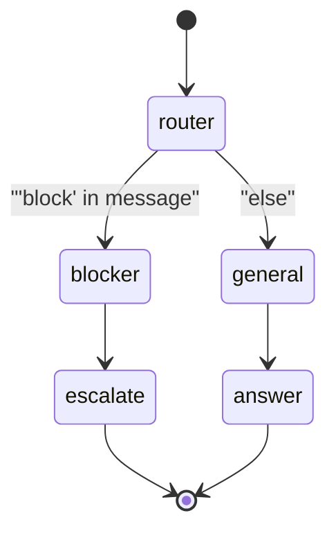

# 04 — Routing & Branching

## Learning Objectives

After this module you can:

- Explain why real agents need conditional flows instead of straight-line
  pipelines.
- Write a router function that inspects state and returns a decision.
- Read a flowchart with labeled conditional edges and map each label back to
  the code that produced it.
- Anticipate how this router function would plug into
  `add_conditional_edges` in a full `StateGraph` (module 02's building block).

## Theory

So far, state has flowed through a fixed sequence of nodes (modules 01–03):
node A always runs, then node B, then C. Real agents need to make decisions:
"is this a blocker that needs escalation, or a general question?" **Routing**
is the pattern of inspecting the current state and choosing *which* node runs
next, rather than always running the same next node.

In LangGraph terms, a router is a function that returns a label (e.g.
`"blocker"` or `"general"`), and `add_conditional_edges(node, router, {label:
next_node, ...})` uses that label to decide which node to invoke next. This
module isolates the router function itself — the decision logic — before
wiring it into a full conditional graph.

## Mental Models

A router is like a **triage nurse**: given a single symptom description
(state), they don't treat the patient themselves — they just decide *which
department* (node) should see them next. The nurse's decision is fast and
based only on what's in front of them right now; the actual treatment happens
downstream, in whichever department they route to.

## Architecture

`router.py` defines a single function, `router(state)`, that checks whether
the substring `"block"` appears in `state["message"]`. If it does, it returns
`{"intent": "blocker"}`; otherwise it returns `{"intent": "general"}`. The
script calls it directly with `{"message": "we are blocked"}`.



Legend: the two labeled edges out of `router` are the only branch point in
this module — the condition is evaluated once per call, and exactly one
branch is taken.

Flow notes:
- **`'block' in state['message']` is true** → the router returns
  `{"intent": "blocker"}`. This is the path exercised by the runnable example
  (`"we are blocked"` contains `"block"`).
- **the condition is false (`else`)** → the router returns
  `{"intent": "general"}`. This path is not exercised by the default input but
  is the router's other possible outcome (see Challenge #1).
- There is no loop in this module — routing here is a single one-shot
  decision, not a retry cycle (retry/loop patterns appear in later modules).

### Wired into a full graph

This module isolates the *decision*; here is the graph it becomes once the
router label drives `add_conditional_edges` (the shape you build in
Challenge #3 and see fully in [module 11](../11_graph_branching/README.md)):



Legend: each transition label is the router's returned intent; the mapping
`{"blocker": "escalate", "general": "answer"}` is what turns a label into the
next node. Swap the router's body (keywords → LLM classifier) without changing
this wiring, as long as the returned intents stay the same.

## Runnable Example

From the repository root:

```bash
python src/04_routing_and_branches/router.py
```

### Expected output

```
{'intent': 'blocker'}
```

## Challenge

1. Call `router({"message": "just checking in"})` and confirm you get
   `{'intent': 'general'}` — this exercises the branch the default example
   does not.
2. Extend `router` with a third intent, `"question"`, triggered when the
   message ends with `"?"`, and update the flowchart above to add the new
   labeled edge.
3. Wire `router` into an actual `StateGraph` using
   `add_conditional_edges("router", router_fn, {"blocker": "escalate", "general": "answer"})`
   where `escalate` and `answer` are two new placeholder nodes that just print
   their name.

## Stretch Goals

- Replace the substring check with a small keyword list (`["block", "stuck",
  "blocked"]`) and make the match case-insensitive.
- Add a `confidence` field to help decide when the router itself is unsure
  (e.g. ambiguous input) and should route to a `"clarify"` intent instead of
  guessing.
- Once module 03's LLM node is available, replace the keyword-matching router
  with an LLM-classified intent, keeping the same `{"intent": ...}` output
  contract so downstream code does not need to change.

## Common Mistakes

- **Routing on substrings that are too broad.** `"block"` also matches words
  like `"blockchain"` — a real router needs more precise matching or an LLM
  classifier (see Stretch Goals).
- **Forgetting the `else` branch.** Every router must have a default outcome;
  an unmatched case that falls through with no return value would break
  anything expecting an `"intent"` key.
- **Conflating the router function with the conditional edge.** In LangGraph,
  the function passed to `add_conditional_edges` returns a *label*, and a
  separate mapping (`{label: node_name}`) decides which node that label routes
  to — the router itself does not know node names.

## Best Practices

- Keep router functions pure and fast — they run on every state transition and
  should not have side effects or perform expensive work (save that for the
  nodes they route to).
- Make the set of possible intents explicit (e.g. a `Literal["blocker",
  "general"]` return type) so callers and tests can enumerate all branches.
- Always test both (or all) branches of a router explicitly — a router with
  only its happy path tested can silently misroute the untested case in
  production.

## Suggested Improvements

- Add a `Literal["blocker", "general"]` return type annotation to
  `router`'s output for static-analysis safety.
- Add a unit test that asserts on the `"general"` branch, not only the
  `"blocker"` branch the smoke test currently exercises.
- Log the routing decision via `get_logger(__name__)` so branch distribution
  is observable in production.

## References

- [LangGraph `add_conditional_edges` reference](https://langchain-ai.github.io/langgraph/)
- [src/02_langgraph_basics/README.md](../02_langgraph_basics/README.md) — the
  `StateGraph` primitives this router will plug into.
- [docs/overview.md](../../docs/overview.md) — conceptual overview of agent
  patterns, including routing.

## What Comes Next

[Module 05 — Tools](../05_tools/README.md) introduces external side effects
(sending a Slack message, calling an API) — the kind of action a router's
`"blocker"` branch would typically trigger in a real agent.

## Automated test

Covered by `pytest` — `test_routing_runs` in `tests/test_smoke.py`.
