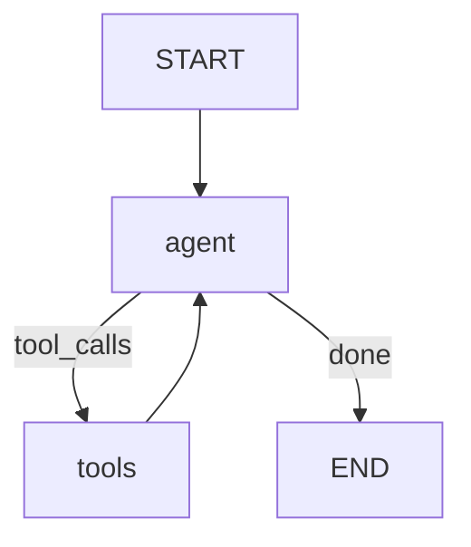

# 05 — Tools

## Learning Objectives

After this module you can:

- Run a manual **agent ↔ ToolNode** loop (the pattern behind ReAct).
- Bind `send_slack` from `DEMO_TOOLS` and observe `ToolMessage` observations.
- Route with a conditional edge while `tool_calls` remain on the last `AIMessage`.
- Finish with a final text answer when the model stops calling tools.

## Theory

Tools are functions the model can invoke. `ToolNode` executes them; the graph loops
`agent → tools → agent` until the model returns plain text.

## Architecture



## Runnable Example

```bash
python src/05_tools/main.py
```

## Expected output

```
Slack sent: hello
final='Posted the update to the team channel.'
=== MODULE 05: TOOLS COMPLETE ===
```

## Challenge

1. Add a second tool (`create_task`) and require both in one run.
2. Cap `max_tool_calls` at 1 and observe early termination.
3. Compare with module `17_function_calling` and `21_react_agent`.

## References

- [`src/shared/tools.py`](../../shared/tools.py) — `DEMO_TOOLS`.
- Module [`17_function_calling`](../17_function_calling/README.md).

## Automated test

`test_tools_runs` in `tests/test_smoke.py`.
