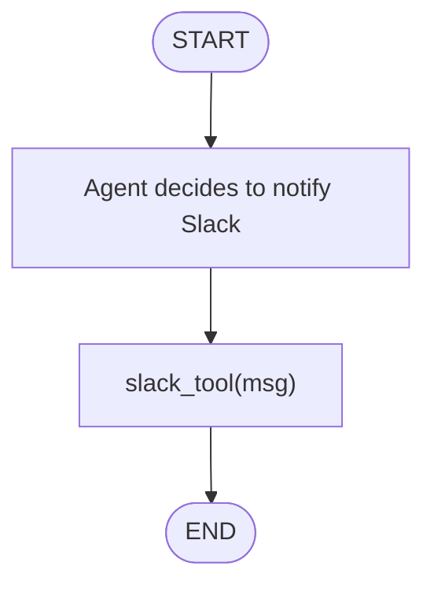
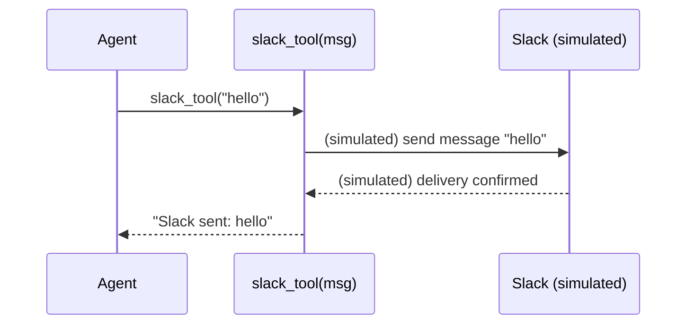

# 05 — Tools

## Learning Objectives

After this module you can:

- Explain why agents need tools: to act on the world, not just reason about it.
- Describe the shape of a tool: a function with a name, an input, and a
  side-effecting (or externally observable) return value.
- Trace the call sequence from an agent's decision to invoke a tool through to
  the tool's confirmation.
- Anticipate how a mocked tool like `slack_tool` would be replaced by a real
  integration (Slack API, GitHub API, etc.) without changing the calling code.

## Theory

An LLM can reason and produce text, but it cannot, by itself, send a Slack
message, open a GitHub issue, or query a database. A **tool** is a function
the agent can call to perform such an action. In LangGraph, tools are
typically plain Python functions (optionally decorated with `@tool`) that a
graph invokes through a `ToolNode`, based on what the LLM decided to call.

This module strips that down to the simplest possible version: `slack_tool`,
a function that *simulates* sending a Slack message by returning a formatted
string instead of making a real network call. This isolates the concept —
"an action with inputs and a confirmable result" — before real tool-calling
loops (LLM decides → graph executes → LLM observes) are introduced in later
modules.

## Mental Models

A tool is like a **hotel concierge**: you (the agent) don't personally book
the restaurant table — you ask the concierge (the tool) to do it, they perform
the action in the outside world, and they hand you back a confirmation
("Table booked for 8pm"). You don't need to know how the concierge made the
call — you only need their name (the tool's identifier) and what they hand
back.

## Architecture

`mock_tool.py` defines a single function, `slack_tool(msg)`, that returns the
string `f"Slack sent: {msg}"` — a stand-in confirmation for what would, in a
real integration, be a call to the Slack API. The script calls it directly
with `"hello"`.



Legend: a single, unconditional call — there is no branch here; the "decision"
to call the tool is implicit in the script (it always calls `slack_tool`),
while in a full agent that decision would come from an LLM or a router
(module 04).



Flow notes:
- There is exactly one path through this module: the agent calls the tool,
  the tool formats and returns a confirmation string. No error path, retry, or
  branch exists yet at this stage.
- The "Slack" participant in the sequence diagram is **simulated inside the
  function** — `slack_tool` never makes a network call; this keeps the
  exercise offline-first and deterministic, per `docs/STANDARDS.md`.

## Runnable Example

From the repository root:

```bash
python src/05_tools/mock_tool.py
```

### Expected output

```
Slack sent: hello
```

## Challenge

1. Add a second mock tool, `github_tool(issue_title)`, that returns
   `f"GitHub issue created: {issue_title}"`, and call both tools from the
   script.
2. Give `slack_tool` a second parameter, `channel: str = "#general"`, and
   include it in the confirmation string.
3. Wrap the call to `slack_tool` in a router (module 04's pattern): only call
   it when `state["intent"] == "blocker"`, otherwise skip it.

## Stretch Goals

- Turn `slack_tool` into a real LangChain `@tool`-decorated function with a
  docstring and typed arguments, and bind it to a `ToolNode` in a small
  `StateGraph` (`add_conditional_edges` on whether the LLM emitted a tool
  call — this is the pattern later modules build on).
- Add a `DEMO_TOOLS` list in `src/shared/` (if not already present) so this
  and later modules can share the same mock tool definitions instead of
  duplicating them.
- Simulate a tool failure (e.g. raise an exception when `msg` is empty) and
  handle it gracefully with a fallback message, logged via
  `get_logger(__name__)`.

## Common Mistakes

- **Treating a mock tool as "not real work."** Even a simulated tool should
  have a clear, testable contract (inputs, outputs) — that contract is what
  gets swapped for a real integration later, so it needs to be right from the
  start.
- **Hardcoding side effects with no confirmation.** A tool that performs an
  action but returns nothing gives the agent no way to know whether it
  succeeded — always return an observable result, as `slack_tool` does here.
- **Skipping the "decision to call" step.** In this module the call to
  `slack_tool` is hardcoded; forgetting that a real agent needs a router or an
  LLM tool-call decision before invoking a tool is a common oversight when
  moving to production graphs.

## Best Practices

- Keep tool functions small, single-purpose, and side-effect-obvious from
  their name (`slack_tool`, not `do_thing`).
- Always return a confirmable result from a tool — the caller (agent or
  graph) needs to know what happened.
- Never let a tool call silently swallow an error; if a real integration is
  added, catch and log failures explicitly (see `docs/STANDARDS.md`).

## Suggested Improvements

- Add type hints (`def slack_tool(msg: str) -> str:`) for clarity and IDE
  support.
- Add a unit test that asserts on the exact return value of `slack_tool`
  independent of the smoke test that runs the whole script.
- Document the eventual real-Slack integration path (webhook URL, secrets
  handling) in `docs/SECURITY.md` once a real tool is added.

## References

- [LangChain tool-calling guide](https://python.langchain.com/docs/concepts/tool_calling/)
- [src/04_routing_and_branches/README.md](../04_routing_and_branches/README.md) —
  the routing pattern that decides *when* a tool like this one should be
  called.
- [docs/overview.md](../../docs/overview.md) — conceptual overview of agent
  patterns, including tool use.

## What Comes Next

[Module 06 — Memory Basics](../06_memory_basics/README.md) introduces
persisting information across steps — the next building block after actions
(tools), so an agent can remember what it has already done.

## Automated test

Covered by `pytest` — `test_tools_runs` in `tests/test_smoke.py`.
