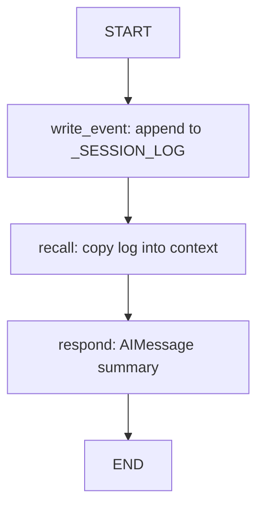

# 06 — Memory Basics

## Learning Objectives

After this module you can:

- Persist **episodic events** in a session log inside a LangGraph.
- Write structured events (`login`, `user_message`) from the latest human turn.
- Recall the full log into state before synthesizing a response.
- Contrast flat recall with vector retrieval (module `07`) and graph traversal (`08`).

## Theory

Episodic memory is an append-only event log. This module wires `write_event → recall → respond`
so memory is not a side-channel global — it flows through graph state (`context.memory`).

## Architecture



## Runnable Example

```bash
python src/06_memory_basics/main.py
```

## Expected output

```
memory_entries=1 events=[login]
stored=[{'event': 'login', 'user': 'demo-user'}]
=== MODULE 06: MEMORY BASICS COMPLETE ===
```

## Challenge

1. Run two invocations and prove the log accumulates across calls.
2. Add a `filter` node that returns only `login` events.
3. Store the log on `AgentState.context` instead of a module global.

## References

- Module [`29_conversation_memory`](../29_conversation_memory/README.md) — buffer/window/summary.
- Module [`07_qdrant_integration`](../07_qdrant_integration/README.md) — semantic retrieval.

## Automated test

`test_memory_basics_runs` in `tests/test_smoke.py`.
