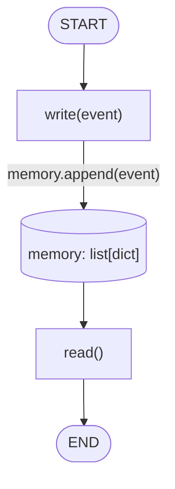

# 06 — Memory Basics

## Learning Objectives

After this module you can:

- Explain why an agent needs memory: state produced during `invoke` disappears
  once the call returns, unless something persists it.
- Distinguish the simplest possible memory shape (an append-only list) from
  the richer memory types (conversation, episodic, semantic, procedural)
  introduced later in the curriculum.
- Trace a `write` / `read` round trip through a shared, mutable store.
- Explain why this module deliberately does **not** use a `StateGraph` — and
  what problem that omission sets up for module `07`.

## Theory

Every module up to `05` treats a graph run as stateless: `invoke(state)` goes
in, a final state comes out, and nothing survives between calls. Real agents
need to remember things *across* calls — what a user said last week, what
action was already taken, what fact was learned. That's **memory**: storage
that outlives a single graph invocation.

The simplest possible memory is an **event log**: an ordered, append-only
list of whatever the agent wants to remember. Two operations are enough to
reason about any memory system, no matter how sophisticated it later becomes:

- `write(event)` — append a new fact/event to the store.
- `read()` — return everything currently stored.

This module implements exactly those two operations, in-process, with a
plain Python list. There is no persistence (it disappears when the process
exits), no querying by similarity or time, and no forgetting — those
capabilities are exactly what later Track 4 modules (semantic memory via
Qdrant in `07`, graph memory via Neo4j in `08`) add on top of this baseline.

## Mental Models

Think of this module as a **diary with only two actions**: you can add a new
entry (`write`), or read the whole diary back (`read`). There's no search,
no "entries from last Tuesday," no summarizing — just a growing list in the
order things happened. Every fancier memory system in this lab (vector
search, graph traversal, conversation windows) is this same diary with a
smarter `read`.

## Architecture

There is no LangGraph `StateGraph` here — `write` and `read` are plain
functions operating on a module-level list. The flow is still worth
diagramming because every later memory module (`07`, `08`, and the
conversation/episodic/semantic/procedural modules in Track 4) follows the
same write-then-read shape.



Legend: the cylinder is the mutable store; the single edge label is the only
"decision" in this module — appending is unconditional, there is no
filtering or forgetting yet.

Flow notes:

- `write(event)` always appends — there is no condition, capacity limit, or
  deduplication (a trade-off this module accepts for simplicity).
- `read()` always returns the *entire* log — there is no filtering by time,
  similarity, or type; that arrives with semantic memory (`31`) and episodic
  memory (`30`).
- The store (`memory`) is a plain Python list at module scope, so it is only
  visible within the running process and resets on every run — this is what
  "in-memory, non-persistent" means concretely.

Because there is only one write followed by one read with no branching or
concurrent actors, a sequence diagram would just restate the flowchart —
it is intentionally omitted here.

## Runnable Example

From the repository root:

```bash
python src/06_memory_basics/memory.py
```

## Expected output

```
[{'event': 'login'}]
```

## What happens

1. An in-memory list acts as event storage
2. `write({"event": "login"})` appends an event
3. `read()` returns the full event log

## Challenge

1. Add a second call, `write({"event": "logout"})`, before the final
   `print(read())`, and confirm the output now shows both events in order.
2. Add a `read_last(n)` helper that returns only the most recent `n` events,
   and print the result for `n=1` after writing three events.
3. Add a guard so `write` raises `ValueError` if `event` is not a `dict` —
   and prove it with a call that passes a plain string.

## Stretch Goals

- Replace the list with a `dict[str, list]` keyed by `event["type"]`, so
  reads can filter by event kind without scanning the whole log.
- Wrap `write`/`read` in a small class (`EventLog`) with `__len__` and
  `__iter__`, and rewrite `memory.py` to use an instance instead of module
  globals — this is the shape production memory backends actually take.
- Compare this module's log to `src/shared/`'s richer state types (see
  `src/shared/README.md`) and note which fields a production event log would
  need that this one lacks (timestamps, source, id).

## Common Mistakes

- **Treating the module-level list as thread-safe.** It is not — concurrent
  writers would race. Production memory backends (Qdrant, Neo4j, a database)
  handle this; this teaching module does not.
- **Assuming memory persists across runs.** Re-running `memory.py` always
  starts from an empty list — nothing is written to disk.
- **Confusing this with conversation memory.** This is a generic event log,
  not the message-history buffer LLM chat nodes use (that pattern arrives in
  Track 4's conversation memory module).

## Best Practices

- Keep the read/write interface narrow (`write`, `read`) so the storage
  implementation can be swapped later without touching callers — this is
  exactly how `src/shared/` backends (in-memory vs. real) are designed to be
  interchangeable.
- Log memory writes (`get_logger`) in production so what an agent "remembers"
  is auditable.
- Treat "what to remember" as a deliberate decision, not everything that
  happens — unbounded logs become expensive to search and outdated to trust.

## Suggested Improvements

- Add a `clear()` function and demonstrate the difference between "empty
  memory" and "no memory system at all."
- Add a timestamp to each event (`{"event": "login", "ts": ...}`) as a first
  step toward episodic memory (module `30`).

## References

- [`docs/memory.md`](../../docs/memory.md) — deep-dive into the four memory
  types this baseline generalizes into.
- Module [`07_qdrant_integration`](../07_qdrant_integration/README.md) —
  the next memory module, adding semantic (similarity) search.
- Module [`08_graph_memory_neo4j`](../08_graph_memory_neo4j/README.md) —
  relationship-based memory.
- LangGraph persistence overview: https://docs.langchain.com/oss/python/langgraph/persistence

## What Comes Next

[`07_qdrant_integration`](../07_qdrant_integration/README.md) replaces "store
everything, read everything" with **semantic memory**: storing events as
vectors and retrieving by meaning instead of by full scan.

## Automated test

Covered by `pytest` — `test_memory_basics_runs` in `tests/test_smoke.py`.
