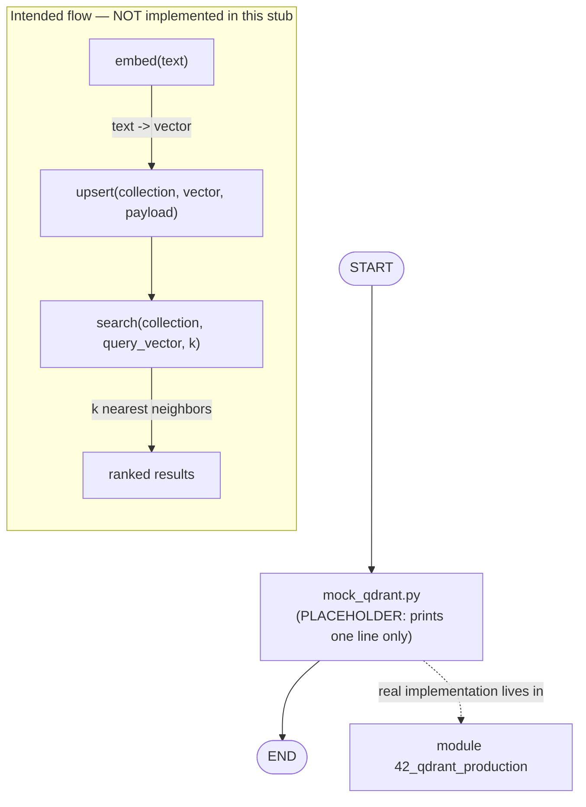

# 07 — Qdrant Integration

## Learning Objectives

After this module you can:

- Explain what a vector database adds over the flat event log from module
  `06`: retrieval by **meaning** (semantic similarity) instead of a full
  scan.
- Describe the shape of a real integration — embed, upsert, similarity
  search — even though this module only prints a placeholder line.
- Recognize this script as an intentional **stub**, and know exactly which
  real, runnable module replaces it.
- Locate the module (`42_qdrant_production`) where this concept becomes a
  working, offline-first exercise.

## Theory

Module `06` gave every agent a memory, but only one way to read it: return
everything. That doesn't scale, and it can't answer "what do we already
know that's *relevant* to this new message?" — the question **semantic
memory** answers.

A **vector database** (Qdrant is one implementation) answers that question
by:

1. **Embedding** — converting text into a fixed-length numeric vector such
   that semantically similar text produces nearby vectors.
2. **Upserting** — storing each vector alongside its original text and
   metadata (a "payload") in a **collection**.
3. **Similarity search** — given a new query vector, finding the `k` nearest
   stored vectors (by cosine similarity or another metric), i.e. "find what
   we already know that means something like this."

This module is a **placeholder**: `mock_qdrant.py` does none of the above —
it only prints a line to mark where the real exercise will live. It exists
so the module numbering and the learning path stay intact while the real
implementation is deferred to a later, fully worked module.

## Mental Models

Think of module `06`'s memory as a shoebox of receipts you can only dump out
and read one by one. A vector database is a librarian who has *read* every
receipt, filed it by topic, and can hand you the five most relevant ones the
instant you describe what you're looking for — even if your words don't
match the receipt's words exactly.

## Architecture

This script has no graph, no branching, and no real vector logic yet — it is
a **placeholder for the intended concept**. The diagram below shows what the
*real* flow will look like (embed → upsert → search), clearly marked as not
yet implemented here, and points to the module where it actually runs.



Legend: the solid `START -> PLACEHOLDER -> END` path is what this stub
actually executes; the dashed edge and the `FUTURE` subgraph describe the
concept this module is teaching but does not run.

Flow notes:

- `PLACEHOLDER` is unconditional — the script does exactly one thing (print
  a fixed string) and exits; there is no branching to label.
- The `FUTURE` subgraph is conceptual: `embed` converts text to a vector,
  `upsert` stores it under a collection with metadata, and `search` returns
  the nearest neighbors to a query vector — none of this code exists in
  `mock_qdrant.py`.
- The dashed arrow to `module 42_qdrant_production` is the actual, runnable
  exercise that implements the `FUTURE` subgraph offline-first (falling back
  to an in-memory store when no real Qdrant server is configured).

## Runnable Example

From the repository root:

```bash
python src/07_qdrant_integration/mock_qdrant.py
```

## Expected output

```
Qdrant placeholder
```

## Challenge

1. Read `src/42_qdrant_production/qdrant_production.py` and write down, in
   your own words, which function corresponds to each box in the `FUTURE`
   subgraph above (`embed`, `upsert`, `search`).
2. Sketch (on paper or in a scratch file — do not edit this module) what a
   `payload` dict might contain for a support-ticket use case (e.g.
   `{"text": ..., "category": ..., "created_at": ...}`).
3. Without running any real Qdrant server, explain how `src/shared`'s
   `InMemoryVectorStore` lets module `42` stay offline-first while still
   demonstrating the same embed/upsert/search shape.

## Stretch Goals

- Read [`docs/qdrant.md`](../../docs/qdrant.md) end to end and list the three
  concepts (collections, payloads, filtered search) it says carry over
  between the in-memory fallback and a real deployment.
- Compare this stub's "memory" (none) to module `06`'s event log, and to
  module `31_semantic_memory`'s vector-backed memory — order them from least
  to most retrieval power.
- Once comfortable with module `42`, come back and describe (in a comment in
  your own scratch notes, not in this file) how you would replace this
  stub's single `print` with a real call into `src.shared`'s vector store
  factory.

## Common Mistakes

- **Mistaking this stub for a working vector search.** It prints one line
  and does nothing else; don't build on top of `mock_qdrant.py` expecting
  embedding or search behavior.
- **Skipping straight to a real Qdrant server.** The whole point of the
  offline-first pattern (see module `42`) is that the exercise runs without
  any external service by default.
- **Forgetting that "similar" is a metric choice.** Cosine similarity,
  dot product, and Euclidean distance rank neighbors differently — module
  `42` and `docs/qdrant.md` cover this trade-off.

## Best Practices

- Keep placeholder modules honest: a clear "Status: Placeholder" note (as
  this README has) prevents learners from assuming more than the code does.
- When a real dependency (Qdrant, in this case) is optional, gate its import
  behind a configuration check, as module `42` does — never require it at
  module import time.
- Number placeholders and their real successors clearly (`07` here, `42` for
  the real exercise) so the learning path stays traceable.

## Suggested Improvements

- Replace the placeholder with a minimal call into `src.shared`'s embeddings
  and vector-store factories, deferring the full production patterns
  (filters, collections) to module `42`.
- Add an inline comment in `mock_qdrant.py` pointing directly to
  `src/42_qdrant_production/README.md` for learners who land here first.

## References

- [`docs/qdrant.md`](../../docs/qdrant.md) — the full deep-dive on moving
  from a prototype vector store to Qdrant.
- Module [`42_qdrant_production`](../42_qdrant_production/README.md) — the
  real, runnable exercise this stub anticipates.
- Module [`06_memory_basics`](../06_memory_basics/README.md) — the flat
  event-log baseline this module's *concept* extends with similarity search.
- Qdrant docs: https://qdrant.tech/documentation/

## What Comes Next

[`08_graph_memory_neo4j`](../08_graph_memory_neo4j/README.md) is the next
placeholder, introducing the concept of **relationship-based** memory —
answering "how are these facts connected?" instead of "which facts are
similar?".

## Automated test

Covered by `pytest` — `test_qdrant_placeholder_runs` in `tests/test_smoke.py`.
