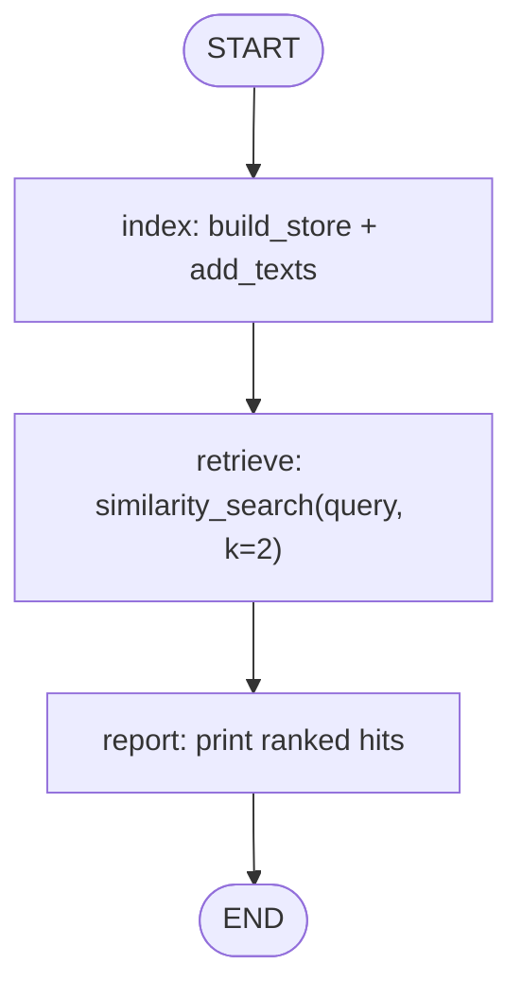

# 07 — Qdrant Integration

## Learning Objectives

After this module you can:

- Explain what a vector database adds over the flat event log from module `06`:
  retrieval by **meaning** (semantic similarity) instead of a full scan.
- Wire **embed → index → retrieve** as LangGraph nodes sharing one state object.
- Run fully offline via `InMemoryVectorStore` and upgrade to real Qdrant when
  `QDRANT_URL` is set (lazy `qdrant-client` import).
- Compare this on-ramp exercise with module `42` (production patterns: payloads,
  filtered search, collection management).

## Theory

Module `06` stores events in order; module `07` stores **embedded documents** so
a query can retrieve the top-*k* nearest neighbors by cosine similarity.

1. **Embed** — text → fixed-length vector (`get_embeddings()`).
2. **Index** — upsert vectors with metadata payloads into a collection/store.
3. **Retrieve** — embed the query, search for nearest neighbors, return ranked hits.

`build_store()` gates the backend: offline uses `InMemoryVectorStore`; with
`QDRANT_URL` the same node functions talk to a real Qdrant server.

## Mental Models

Module `06` is a chronological diary. Module `07` is a librarian who files every
page by topic and can hand you the five most relevant pages for a new question —
even when your words do not match the original text exactly.

## Architecture



Legend: linear three-node graph; `index` chooses backend from `get_settings()`.

Flow notes:

- `index_docs` calls `build_store()`, upserts three policy/runbook documents, and
  records `backend`, `indexed`, and the live `store` handle in state.
- `retrieve` runs `similarity_search` for a fixed query about production deploys.
- `report` prints `id`, `score`, and `text` for each hit.

## Runnable Example

```bash
python src/07_qdrant_integration/main.py
```

Optional real Qdrant (after `docker compose -f docker-compose.yml up -d`):

```bash
export QDRANT_URL=http://localhost:6333
python src/07_qdrant_integration/main.py
```

## Expected output

```
id=doc-deploy score=0.XXXX text='Production deploys require two approvals ...'
...
backend=InMemoryVectorStore indexed=3 query='Who approves production deploys?'
=== MODULE 07: QDRANT INTEGRATION COMPLETE ===
```

Scores differ between offline hashing embeddings and OpenAI embeddings; structure
is stable.

## Challenge

1. Add a fourth document and confirm retrieval rank changes for the same query.
2. Extend `report` to print each hit's `category` metadata payload.
3. Read module `42` and list three production concerns it adds beyond this graph.

## Stretch Goals

- Add a conditional branch: if the top score is below a threshold, route to a
  `"no_match"` node instead of `report`.
- Run against real Qdrant and compare latency vs. in-memory for the same corpus.

## Common Mistakes

- **Importing `qdrant_client` at module top level** — breaks offline runs when
  the package is not installed; keep imports inside `_build_qdrant_store`.
- **Expecting keyword match** — retrieval is by vector similarity, not substring search.
- **Forgetting metadata** — payloads travel with vectors and enable filtered search in module `42`.

## Best Practices

- Gate real backends behind `get_settings().has_qdrant()`.
- Keep embed/index/search as separate graph nodes so each step is testable.
- Log which backend was selected (`backend=InMemoryVectorStore` vs. adapter name).

## References

- [`docs/qdrant.md`](../../docs/qdrant.md) — production vector-store patterns.
- Module [`42_qdrant_production`](../42_qdrant_production/README.md) — filtered search, collections.
- Module [`06_memory_basics`](../06_memory_basics/README.md) — episodic baseline.
- Module [`37_embeddings`](../37_embeddings/README.md) — embedding mechanics.

## What Comes Next

[`08_graph_memory_neo4j`](../08_graph_memory_neo4j/README.md) — relationship-based
memory: "who reports to whom?" instead of "what text is similar?"

## Automated test

Covered by `pytest` — `test_qdrant_integration_runs` in `tests/test_smoke.py`.
