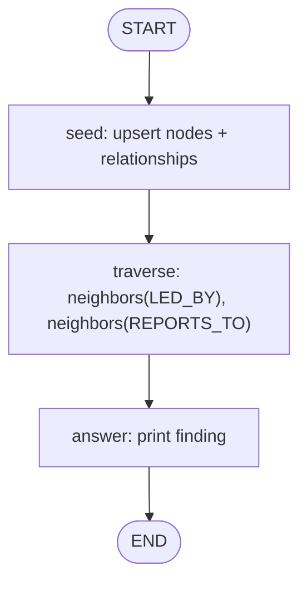

# 08 — Graph Memory (Neo4j)

## Learning Objectives

After this module you can:

- Explain what a graph database adds over vector search (module `07`): answering
  "how are these facts **connected**?" instead of "which facts are **similar**?"
- Model nodes, labels, typed relationships, and properties in a LangGraph pipeline.
- Run offline via `InMemoryGraphStore` and connect to Neo4j when `NEO4J_URI` is set.
- Traverse relationships (`LED_BY`, `REPORTS_TO`) to synthesize an org answer.

## Theory

Vector search finds similar text. Graph memory answers **traversal** questions:
who leads a department, who reports to whom, what depends on what.

The **property graph** model:

- **Nodes** — entities with a label (`Person`, `Department`) and properties.
- **Relationships** — typed, directed edges (`LED_BY`, `REPORTS_TO`).

This module seeds a tiny org chart, walks two hops, and prints a leadership finding.
Module `43` deepens Cypher, modeling, and production gating patterns.

## Mental Models

Module `07` is a librarian matching topics. Module `08` is an org-chart on the
wall — you follow arrows to answer "who is connected to whom?"

## Architecture



Legend: three-node linear graph; `seed` picks backend from `get_settings()`.

Flow notes:

- `seed_graph` creates Alice, Bob, Engineering and wires `alice -REPORTS_TO-> bob`
  and `engineering -LED_BY-> bob`.
- `traverse` calls `neighbors` on both backends (in-memory or Cypher-backed Neo4j).
- `answer` prints `backend=... finding='Engineering led by Bob; Alice reports to Bob'`.

## Runnable Example

```bash
python src/08_graph_memory_neo4j/main.py
```

Optional real Neo4j (after `docker compose -f docker-compose.yml up -d`):

```bash
export NEO4J_URI=bolt://localhost:7687
export NEO4J_PASSWORD=please-change-me
python src/08_graph_memory_neo4j/main.py
```

## Expected output

```
backend=InMemoryGraphStore finding='Engineering led by Bob; Alice reports to Bob'
=== MODULE 08: GRAPH MEMORY NEO4J COMPLETE ===
```

## Challenge

1. Add a `Person` Carol that Bob reports to; extend `traverse` to include her.
2. Add a conditional edge: if `engineering` has no `LED_BY` neighbor, route to an
   `"unknown"` handler node.
3. Sketch a three-service `DEPENDS_ON` graph and explain which module (`45`) analyzes it.

## Stretch Goals

- Replace `neighbors` with a parameterized Cypher query on the Neo4j path.
- Compare this org graph to the graph specialist in module `10` / `63`.

## Common Mistakes

- **Confusing LangGraph with property graphs** — `StateGraph` is execution flow;
  Neo4j/in-memory graph store is **knowledge**.
- **Importing `neo4j` at module top level** — keep the driver import inside the
  configured branch only.
- **Expecting vector similarity** — use module `07` for that; graphs answer paths.

## Best Practices

- Share the same `upsert_node` / `add_relationship` / `neighbors` surface across
  offline and real backends so graph nodes stay backend-agnostic.
- Seed deterministic data so smoke tests assert an exact `finding` string.
- Log the selected backend at seed time.

## References

- [`docs/neo4j.md`](../../docs/neo4j.md) — graph algorithms and modeling.
- Module [`43_neo4j_basics`](../43_neo4j_basics/README.md) — production gating + Cypher.
- Module [`07_qdrant_integration`](../07_qdrant_integration/README.md) — similarity memory.
- Neo4j docs: https://neo4j.com/docs/

## What Comes Next

[`09_multi_agent_systems`](../09_multi_agent_systems/README.md) — planner, executor,
and critic roles cooperating in one graph.

## Automated test

Covered by `pytest` — `test_graph_memory_neo4j_runs` in `tests/test_smoke.py`.
