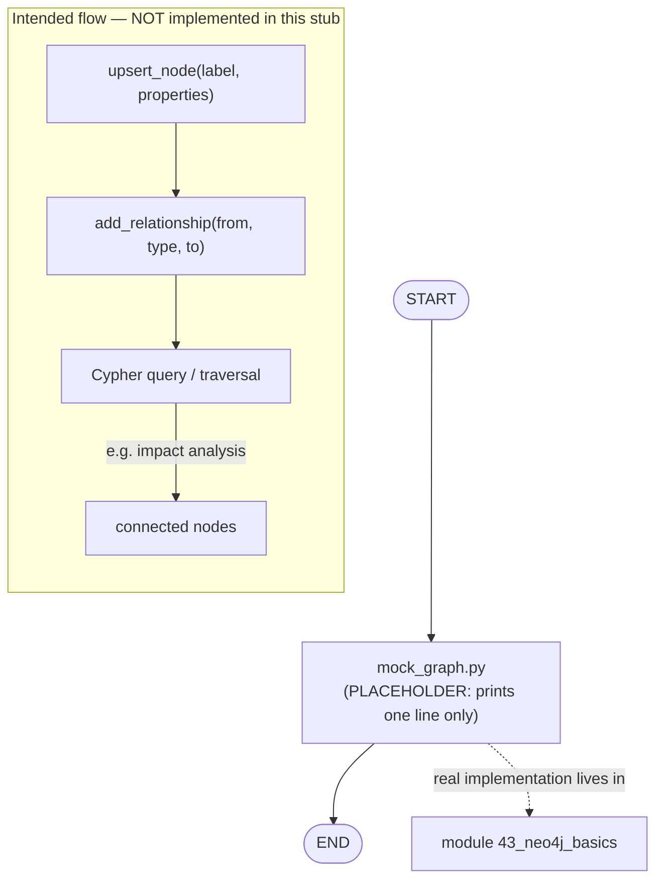

# 08 — Graph Memory (Neo4j)

## Learning Objectives

After this module you can:

- Explain what a graph database adds over vector search (module `07`):
  answering "how are these facts *connected*?" instead of "which facts are
  *similar*?"
- Describe the property-graph vocabulary — nodes, labels, typed directed
  relationships, properties — even though this module only prints a
  placeholder line.
- Recognize this script as an intentional **stub**, and know exactly which
  real, runnable module replaces it.
- Locate the module (`43_neo4j_basics`) where this concept becomes a working,
  offline-first exercise.

## Theory

Vector search (module `07`) is excellent at "find things like this," but bad
at "what depends on this?", "who owns this?", or "if this breaks, what else
breaks?" Those are **relationship** questions, and a graph database
(Neo4j is one implementation) is built to answer them directly.

The **property graph** model underlying Neo4j has two kinds of citizens:

- **Nodes** — entities, each with a **label** (its type, e.g. `Service`,
  `Person`) and arbitrary key/value **properties**.
- **Relationships** — typed, **directed** edges between two nodes (e.g.
  `(:Service)-[:DEPENDS_ON]->(:Service)`), which can also carry properties.

Typical use cases this unlocks: dependency graphs ("what does this service
depend on?"), ownership ("who owns this component?"), and impact analysis
("if I change X, what breaks?") — all traversal questions a flat vector or
list store cannot answer efficiently.

This module is a **placeholder**: `mock_graph.py` does none of the above —
it only prints a line to mark where the real exercise will live, exactly
like module `07` does for vector search.

## Mental Models

Think of module `07`'s vector search as a librarian who can find books about
similar topics. A graph database is a different librarian who has drawn a
map of *how every book cites every other book* — so instead of "find
something like this," you can ask "if I stop shelving this book, which
other books lose their references?" That's traversal, not similarity.

## Architecture

This script has no graph, no branching, and no real graph-database logic
yet — it is a **placeholder for the intended concept**. The diagram below
shows what the *real* flow will look like (create nodes → create
relationships → query), clearly marked as not yet implemented here, and
points to the module where it actually runs.



Legend: the solid `START -> PLACEHOLDER -> END` path is what this stub
actually executes; the dashed edge and the `FUTURE` subgraph describe the
concept this module is teaching but does not run.

Flow notes:

- `PLACEHOLDER` is unconditional — the script does exactly one thing (print
  a fixed string) and exits; there is no branching to label.
- The `FUTURE` subgraph is conceptual: `upsert_node` creates or updates a
  labelled node, `add_relationship` connects two nodes with a typed edge,
  and a query/traversal (Cypher in real Neo4j) answers questions like impact
  analysis — none of this code exists in `mock_graph.py`.
- The dashed arrow to `module 43_neo4j_basics` is the actual, runnable
  exercise that implements the `FUTURE` subgraph offline-first (falling back
  to `InMemoryGraphStore` when no real Neo4j server is configured).

## Runnable Example

From the repository root:

```bash
python src/08_graph_memory_neo4j/mock_graph.py
```

## Expected output

```
Neo4j placeholder
```

## Challenge

1. Read `src/43_neo4j_basics/neo4j_basics.py` and write down, in your own
   words, which function corresponds to each box in the `FUTURE` subgraph
   above (`upsert_node`, `add_relationship`, query/traversal).
2. Sketch (on paper or in a scratch file — do not edit this module) a small
   dependency graph for three fictional services, using the
   `(:Service)-[:DEPENDS_ON]->(:Service)` shape from the Theory section.
3. Without running any real Neo4j server, explain how `src/shared`'s
   `InMemoryGraphStore` lets module `43` stay offline-first while still
   demonstrating the same node/relationship/query shape.

## Stretch Goals

- Read [`docs/neo4j.md`](../../docs/neo4j.md) end to end and list the graph
  algorithms (pattern matching, traversal, cycle detection, root-cause
  ranking, multi-hop queries) that Track 6 (`43`–`47`) builds on this
  baseline.
- Compare this stub's "memory" (none) to module `06`'s flat event log and to
  module `07`'s vector-search concept — explain which questions each one can
  and cannot answer.
- Once comfortable with module `43`, describe (in your own scratch notes,
  not in this file) how you would replace this stub's single `print` with a
  real call into `src.shared`'s graph-store factory.

## Common Mistakes

- **Mistaking this stub for a working graph store.** It prints one line and
  does nothing else; don't build on top of `mock_graph.py` expecting node or
  relationship behavior.
- **Skipping straight to a real Neo4j server.** The whole point of the
  offline-first pattern (see module `43`) is that the exercise runs without
  any external service by default.
- **Confusing "graph database" with "LangGraph."** A `StateGraph` models
  *execution flow*; a property graph here models *stored knowledge*. They
  are unrelated concepts that happen to share the word "graph."

## Best Practices

- Keep placeholder modules honest: a clear "Status: Placeholder" note (as
  this README has) prevents learners from assuming more than the code does.
- When a real dependency (Neo4j, in this case) is optional, gate its import
  behind a configuration check, as module `43` does — never require it at
  module import time.
- Number placeholders and their real successors clearly (`08` here, `43` for
  the real exercise) so the learning path stays traceable.

## Suggested Improvements

- Replace the placeholder with a minimal call into `src.shared`'s
  `InMemoryGraphStore`, deferring Cypher-specific patterns to module `43`.
- Add an inline comment in `mock_graph.py` pointing directly to
  `src/43_neo4j_basics/README.md` for learners who land here first.

## References

- [`docs/neo4j.md`](../../docs/neo4j.md) — the full deep-dive on the
  property-graph model and graph algorithms.
- Module [`43_neo4j_basics`](../43_neo4j_basics/README.md) — the real,
  runnable exercise this stub anticipates.
- Module [`07_qdrant_integration`](../07_qdrant_integration/README.md) — the
  sibling placeholder for similarity-based memory this module contrasts
  with.
- Neo4j docs: https://neo4j.com/docs/

## What Comes Next

[`09_multi_agent_systems`](../09_multi_agent_systems/README.md) shifts from
"what does the agent remember" to "how do multiple agents cooperate,"
introducing a planner/executor hand-off.

## Automated test

Covered by `pytest` — `test_neo4j_placeholder_runs` in `tests/test_smoke.py`.
