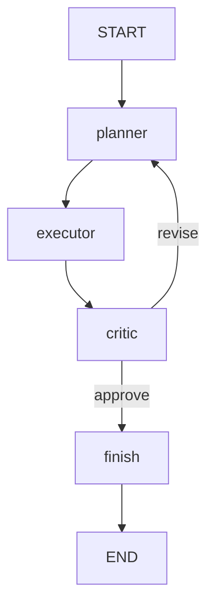

# 09 — Multi-Agent Systems

## Learning Objectives

After this module you can:

- Model **planner → executor → critic** as separate graph nodes sharing `TeamState`.
- Loop back to `planner` when the critic returns `verdict=revise`.
- Finish with `verdict=approve` and a `result` containing `done: executed [...]`.
- Contrast this hand-off with module `28_supervisor` (worker pool pattern).

## Theory

Multi-agent does not require separate processes — it requires **separate roles** in one
graph. The planner proposes steps; the executor runs them; the critic checks quality
and may force a replan with an expanded plan.

## Architecture



## Runnable Example

```bash
python src/09_multi_agent_systems/main.py
```

## Expected output

```
result='done: executed [gather_logs, identify_root_cause, draft_fix, add_tests]' verdict=approve attempts=2
=== MODULE 09: MULTI-AGENT SYSTEMS COMPLETE ===
```

## Challenge

1. Add a `max_attempts` guard on the replan loop.
2. Let the critic reject plans missing a `rollback` step for production changes.
3. Read module `22_planner_agent` and `23_executor_agent` — how do they split this logic?

## References

- Module [`22_planner_agent`](../22_planner_agent/README.md), [`23_executor_agent`](../23_executor_agent/README.md).
- Module [`10_full_brain_simulation`](../10_full_brain_simulation/README.md) — integrates roles into a brain.

## Automated test

`test_multi_agent_runs` in `tests/test_smoke.py`.
