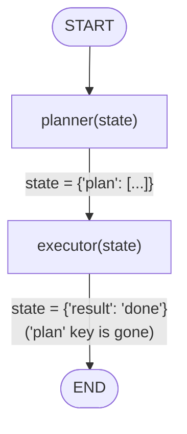
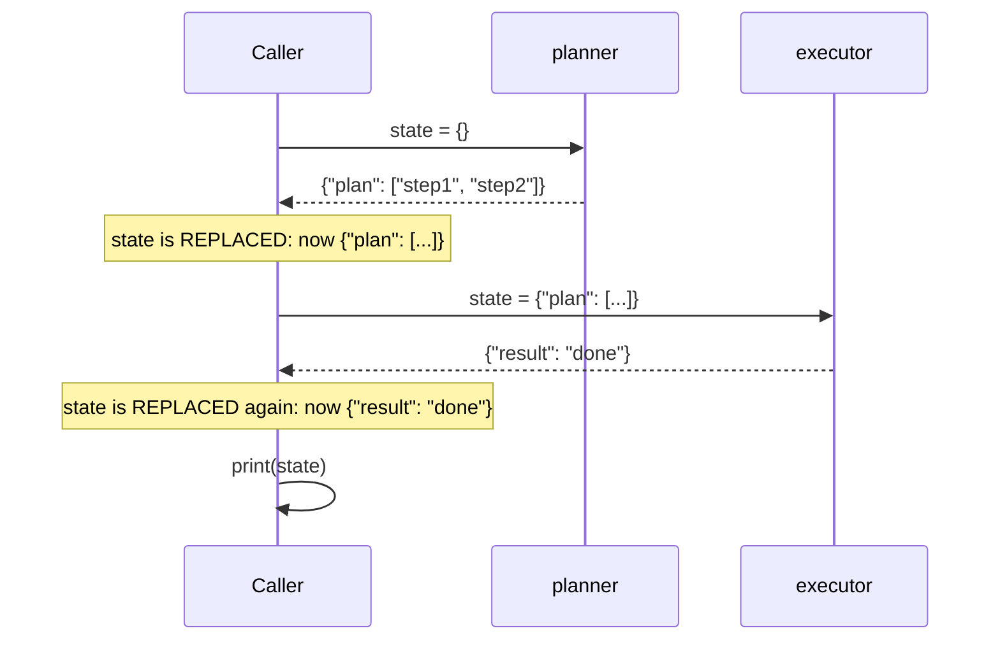

# 09 — Multi-Agent Systems

## Learning Objectives

After this module you can:

- Explain the **planner/executor** pattern: one agent decides *what* to do,
  another agent (or step) does it.
- Trace how two separate functions can each return partial state, and why
  plain `state = fn(state)` **replaces** state rather than merging it.
- Identify why this toy example loses the `plan` key once `executor` runs,
  and what a real reducer-based merge would look like instead.
- Locate the modules that turn this two-line demo into a real, branching
  multi-agent graph.

## Theory

Every module up to `08` has one agent doing one job end to end. Many
real-world problems split more naturally into roles: a **planner** decides
the steps needed to satisfy a request, and an **executor** carries them out.
This module demonstrates the smallest possible version of that split:

- `planner(state)` — reads the (empty) state and returns a plan:
  `{"plan": ["step1", "step2"]}`.
- `executor(state)` — reads state and returns a result:
  `{"result": "done"}`.

The two calls are chained by hand (`state = planner(state)`, then
`state = executor(state)`), not by a `StateGraph` — this keeps the two-role
concept visible without the machinery of nodes, edges, and conditional
routing (introduced in modules `02` and `04`). Because each call is a plain
**assignment**, not a merge, `state` is fully **replaced** by whatever the
next function returns: after `planner`, `state` is `{"plan": [...]}`; after
`executor`, `state` becomes `{"result": "done"}` and the `plan` key is gone.
This is the opposite of a LangGraph node, whose return value is *merged*
into shared state via a reducer (module `02` onward) — this module
intentionally uses the simpler, lossier pattern to keep the two-role
concept visible without that machinery.

Real multi-agent systems (see Track 7, modules `48`–`52`) add: reflection
(a critic checks the executor's work), replanning (the planner adapts based
on execution results), and proper LangGraph reducers so multiple agents can
safely write to shared state.

## Mental Models

Think of `planner` as a project manager who writes a to-do list and hands it
off, and `executor` as the engineer who does the work and reports back.
Neither one needs to know how the other operates — the manager doesn't
execute steps, and the engineer doesn't decide priorities. The only thing
that passes between them is the shared clipboard (`state`).

## Architecture

There is no `StateGraph` in this module — `planner` and `executor` are
plain functions called in sequence. The flowchart below shows that
hand-off; the sequence diagram makes the temporal request/response shape
explicit, since planner → executor is exactly the kind of multi-actor
hand-off this diagram type is for.



Legend: both edges are unconditional (no branching yet in this toy demo);
each label shows that `state` is **replaced**, not merged, by the callee's
return value.



Flow notes:

- `planner` always runs first and always returns a `plan` — there is no
  condition on whether planning is needed; this module always plans.
- `executor` always runs second, ignoring the plan's contents (it is a
  stub) and always returning `{"result": "done"}` — there is no retry or
  failure branch yet.
- Each step **replaces** `state` with the callee's return value
  (`state = planner(state)`, then `state = executor(state)`) rather than
  merging it — this is why the final printed state only contains `result`,
  and the `plan` key added by `planner` is silently lost by the time
  `executor` finishes.

## Runnable Example

From the repository root:

```bash
python src/09_multi_agent_systems/agents.py
```

## Expected output

```
{'result': 'done'}
```

## What happens

1. `planner` adds `{"plan": ["step1", "step2"]}` to state
2. `executor` adds `{"result": "done"}` to state
3. Final merged state is printed (executor overwrites plan key in this simple demo)

## Challenge

1. Print `state` after the `planner` call and again after the `executor`
   call, and confirm the `plan` key disappears once `executor` runs —
   because `state = executor(state)` replaces, rather than merges, `state`.
2. Fix that by changing the two hand-off lines to `state = {**state,
   **planner(state)}` and `state = {**state, **executor(state)}`, then
   confirm both `plan` and `result` now survive in the final dict.
3. Make `executor` consume `state["plan"]` (e.g. return
   `{"result": f"completed {len(state['plan'])} steps"}`) — note `executor`
   already *receives* `state["plan"]` as its argument (that part isn't
   lost); only its *return value* drops the key unless you also apply the
   merge fix from step 2.

## Stretch Goals

- Rebuild this as a real `StateGraph` with `planner` and `executor` as
  nodes connected by `add_edge`, using `src.shared`'s `State` type — compare
  the amount of code to this two-function version.
- Add a conditional edge that routes back to `planner` if `critic` returns
  `approved: False` (a minimal reflection loop — foreshadows Track 7).
- Read [`docs/multi-agent.md`](../../docs/multi-agent.md) and identify which
  of the five coordination patterns (cooperation, negotiation,
  decomposition, blackboard, pub/sub) this module's simple hand-off most
  resembles.

## Common Mistakes

- **Assuming this uses LangGraph.** It doesn't — `planner` and `executor`
  are plain functions called directly; the `StateGraph` version is a stretch
  goal, not what ships here.
- **Trusting the plan's contents.** `executor` in this demo never reads
  `state["plan"]` — it always returns the same fixed result regardless of
  what was planned. Don't assume the plan drives execution yet.
- **Assuming state accumulates.** Each hand-off (`state = planner(state)`,
  `state = executor(state)`) *replaces* `state` with the callee's return
  value; it does not merge dicts. The `plan` key is gone by the time the
  final `print(state)` runs — this is the module's namesake "overwrite,"
  and it happens even though `plan` and `result` are different keys.

## Best Practices

- Keep planner and executor as separate functions with a single
  responsibility each, even in a toy demo — it's what makes the pattern
  extend cleanly to a real graph later.
- Name the keys each role contributes distinctly (`plan`, `result`) so
  merged state stays legible and debuggable.
- When you do graduate to a real `StateGraph`, use reducers (`add_messages`
  or a custom one) for any key more than one agent might write — plain dict
  overwrite silently drops data once two agents share a key.

## Suggested Improvements

- Add a `context["confidence"]` field the planner sets, and have a router
  decide whether the executor runs directly or a human reviews first.
- Log each role's contribution (`get_logger`) so a multi-agent trace can be
  reconstructed from logs alone.

## References

- [`docs/multi-agent.md`](../../docs/multi-agent.md) — the coordination
  patterns (cooperation, negotiation, decomposition, blackboard, pub/sub)
  this baseline generalizes into.
- Module [`04_routing_and_branches`](../04_routing_and_branches/README.md) —
  where conditional routing (needed for a real replanning loop) is
  introduced.
- LangGraph multi-agent overview:
  https://docs.langchain.com/oss/python/langgraph/multi-agent

## What Comes Next

[`10_full_brain_simulation`](../10_full_brain_simulation/README.md) is the
capstone stub that combines memory, tools, graph reasoning, LLM nodes, and
this module's planner/executor roles into one system.

## Automated test

Covered by `pytest` — `test_multi_agent_runs` in `tests/test_smoke.py`.
