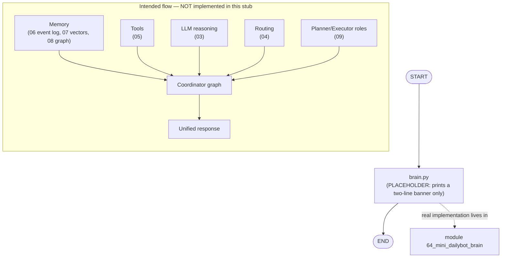

# 10 — Full Brain Simulation

## Learning Objectives

After this module you can:

- Describe the capstone goal of Track 1: combining memory (`06`-`08`), tools
  (`05`), LLM reasoning (`03`), routing (`04`), and multi-agent roles (`09`)
  into a single "mini AI operating system."
- Recognize this script as an intentional **stub** — a banner, not a working
  system — and explain why the module still deserves a number in the
  learning path.
- Locate the module (`64_mini_dailybot_brain`) where this concept becomes a
  working, offline-first, multi-subsystem capstone.
- Name the specific subsystem each earlier module (`01`-`09`) contributes to
  the eventual "brain."

## Theory

Every module so far has taught **one** capability in isolation: state
(`01`), graph execution (`02`), LLM calls (`03`), routing (`04`), tools
(`05`), and three flavors of memory (`06`-`08`), plus a first taste of
multi-agent cooperation (`09`). A real agent needs **all of these at once**,
wired into a single graph: it must route a request, recall relevant memory,
call an LLM, invoke a tool if needed, and possibly hand off to another
agent — in one coherent run.

This module is that idea's placeholder: a **stub** that prints a banner
naming the systems to combine, without yet building the graph that combines
them. It exists so the learning path has a clear "this is where it all comes
together" waypoint, even before the real implementation is worked out.

## Mental Models

Think of modules `01`-`09` as separate rooms in a house — the kitchen
(tools), the library (memory), the switchboard (routing), the thinking chair
(LLM reasoning), the meeting room (multi-agent hand-off). This module is the
architect's sketch of the *whole house* with all rooms connected by
hallways — before a single wall is actually built. The real construction
happens in module `64`.

## Architecture

This script has no graph and no real logic yet — it prints two fixed lines.
The diagram below shows the **intended** concept (all prior subsystems
feeding into one coordinating graph), clearly marked as not yet implemented
here, and points to the module where it actually runs.



Legend: the solid `START -> PLACEHOLDER -> END` path is what this stub
actually executes; the dashed edge and the `FUTURE` subgraph describe the
capstone concept this module names but does not build.

Flow notes:

- `PLACEHOLDER` is unconditional — the script prints two fixed lines and
  exits; there is no branching, memory access, or LLM call to label.
- The `FUTURE` subgraph is conceptual: it names which earlier module
  contributes each capability (memory, tools, LLM reasoning, routing,
  multi-agent roles) to a single coordinating graph — none of these
  connections exist in `brain.py`.
- The dashed arrow to `module 64_mini_dailybot_brain` is the actual,
  runnable capstone that implements the `FUTURE` subgraph: a coordinator
  routing to cooperating specialists with a conditional tool-calling loop,
  all offline-first.

## Runnable Example

From the repository root:

```bash
python src/10_full_brain_simulation/brain.py
```

## Expected output

```
Full Brain Simulation
This will combine all systems together
```

## Challenge

1. List, in your own words, which earlier module (`01`-`09`) would supply
   each box in the `FUTURE` subgraph above, and why (e.g. "routing comes
   from `04` because...").
2. Read `src/64_mini_dailybot_brain/README.md`'s Learning Objectives and
   match each one to a box in this module's `FUTURE` subgraph.
3. Without editing this stub, sketch (in a scratch file) what a single
   `State` TypedDict combining messages, memory references, and a plan
   might look like, drawing on `src/shared/state.py`.

## Stretch Goals

- Trace one full request through `src/64_mini_dailybot_brain/mini_dailybot_brain.py`
  and diagram it yourself (on paper or a scratch file) before comparing it
  to the README there.
- Compare the "observability summary" module `64` logs
  (`subsystems=[...] tool_calls=N`) to what this stub prints, and explain
  why a real capstone needs structured, parseable output instead of a fixed
  banner.
- Identify which Track (2 routing, 3 tools, 4 memory, 5 RAG, 6 graph, 7
  multi-agent) each subsystem box belongs to, using
  [`docs/ARCHITECTURE.md`](../../docs/ARCHITECTURE.md) as a map.

## Common Mistakes

- **Mistaking this stub for a working system.** It prints two lines and
  does nothing else; don't build on top of `brain.py` expecting memory,
  routing, or tool behavior.
- **Assuming the capstone requires all nine prior modules mastered
  perfectly.** Module `64` is designed to be readable once you understand
  the *patterns* from `01`-`09`, not every line of every prior script.
- **Confusing "Full Brain Simulation" with a literal neuroscience model.**
  The name is a metaphor for "combine every subsystem," not a claim about
  biological accuracy.

## Best Practices

- Keep capstone stubs honest: a clear "Status: Stub" note (as this README
  has) prevents learners from assuming more than two `print` calls exist.
- When you do build the real system, keep each subsystem's module boundary
  visible (memory, tools, routing, LLM, multi-agent) so the capstone reads
  as a composition, not a monolith — this is exactly how module `64`
  documents its integration points.
- Log a structured summary at the end of a capstone run (subsystem list,
  tool-call count) so a complex multi-subsystem run stays debuggable —
  module `64` follows this practice.

## Suggested Improvements

- Replace the two-line banner with a minimal call into `src.shared`'s
  `State` type and a one-node graph that just echoes it back, as a first
  step before wiring in real subsystems.
- Add an inline comment in `brain.py` pointing directly to
  `src/64_mini_dailybot_brain/README.md` for learners who land here first.

## References

- Module [`64_mini_dailybot_brain`](../64_mini_dailybot_brain/README.md) —
  the real, runnable capstone this stub anticipates.
- [`docs/ARCHITECTURE.md`](../../docs/ARCHITECTURE.md) — the module layout
  and learning path this capstone sits at the end of.
- Modules [`06_memory_basics`](../06_memory_basics/README.md),
  [`07_qdrant_integration`](../07_qdrant_integration/README.md),
  [`08_graph_memory_neo4j`](../08_graph_memory_neo4j/README.md),
  [`09_multi_agent_systems`](../09_multi_agent_systems/README.md) — the
  subsystems this module names.
- LangGraph multi-agent and memory overview:
  https://docs.langchain.com/oss/python/langgraph/multi-agent

## What Comes Next

This is the last module in Track 1's numbered 01-10 sequence. From here, the
curriculum continues into the deeper Tracks (routing, tools, memory, RAG,
graph intelligence, multi-agent, and the real capstone in
[`64_mini_dailybot_brain`](../64_mini_dailybot_brain/README.md)) — see
[`docs/ARCHITECTURE.md`](../../docs/ARCHITECTURE.md) for the full map.

## Automated test

Covered by `pytest` — `test_brain_simulation_runs` in `tests/test_smoke.py`.
