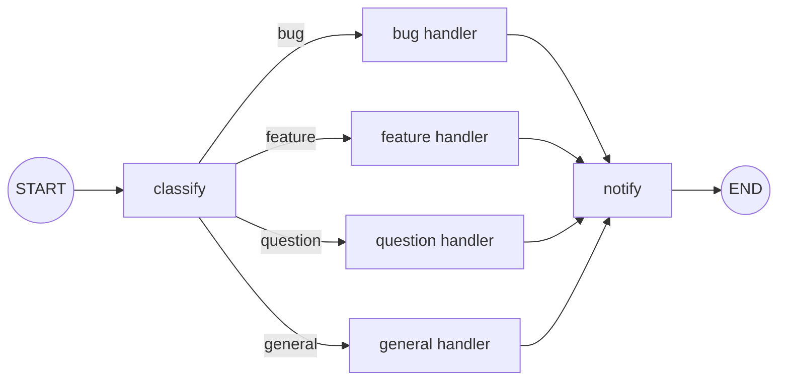
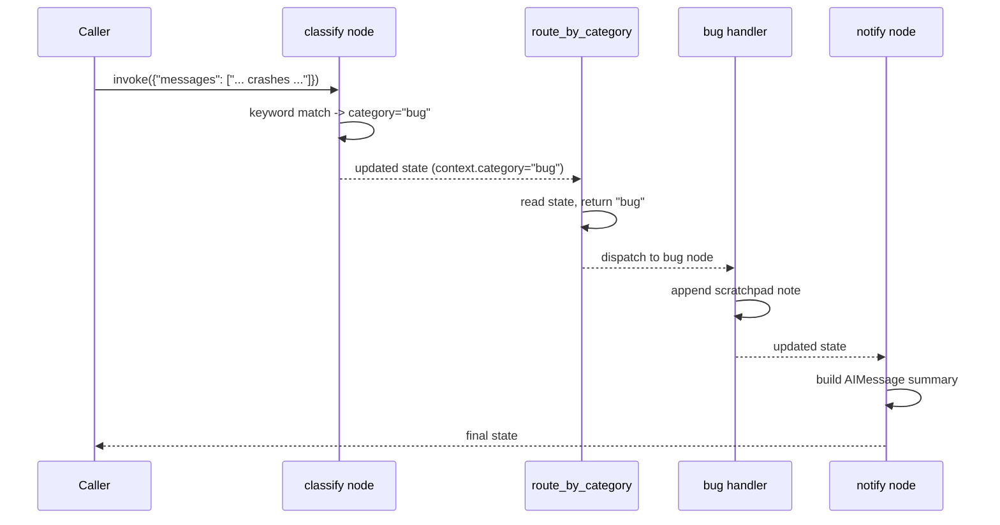

# 11 — Graph Branching

## Learning Objectives

After this module you can:

- Build multi-way conditional branches with `add_conditional_edges` instead of
  a single linear path.
- Write a routing function that reads state and returns the name of the next
  node (or a mapping key that resolves to one).
- Converge multiple branches back into a single downstream node.
- Explain why routing logic belongs in a dedicated function, not inline in a
  node body.

## Theory

A LangGraph `StateGraph` is linear by default: `add_edge(a, b)` always sends
execution from `a` to `b`. Real agents need to make decisions — "is this a
bug report, a feature request, or a question?" — and only then pick a path.

`add_conditional_edges(source, router, mapping)` adds that decision point:

- `source` — the node whose output triggers the decision.
- `router` — a plain function `(state) -> str` (or `list[str]` for
  fan-out — see module 12) that returns a **key**.
- `mapping` — `dict[key, target_node]` resolving that key to the next node.

The router function itself does no work — it only classifies. Classification
and side effects are kept in separate nodes (`classify` vs. the branch
handlers) so each node has one job and the graph stays legible.

**Convergence** means multiple branches lead to the same downstream node
(`notify` here). This models the common "different paths, same wrap-up" shape
— logging, notifying a user, or persisting a result — without duplicating that
logic across branches.

## Mental Models

Think of `classify` as airport security triage: everyone goes through the same
entry, a single decision point looks at your boarding pass (state), and routes
you to one of several gates (branch nodes). All gates eventually lead to the
same tarmac (`notify`) — the branch changes *how* you get there, not *where*
you end up.

## Architecture



Sequence of a single branch decision (the "bug" path):



## Runnable Example

```bash
python src/11_graph_branching/branching.py
```

Expected output (truncated, deterministic):

```
ticket='The app crashes when I click save, this is a bug.' category=bug reply="Routed as 'bug'. Action taken: [bug] filed to engineering backlog"
ticket='Feature request: dark mode please.' category=feature reply="Routed as 'feature'. Action taken: [feature] added to product roadmap"
ticket='How do I reset my password?' category=question reply="Routed as 'question'. Action taken: [question] answered from knowledge base"
ticket='Just wanted to say thanks for the great support.' category=general reply="Routed as 'general'. Action taken: [general] forwarded to support queue"
=== TRACK1 MODULE 11: GRAPH BRANCHING COMPLETE ===
```

## Challenge

1. Add a fifth category (`billing`) with its own keyword list and handler.
2. Make `route_by_category` fall back to `"general"` when the category is
   missing from the mapping, and prove it with a ticket that matches nothing.
3. Change `notify` to also count how many tickets of each category were seen
   across the whole run (hint: you'll need state that survives across
   `invoke` calls, or a single graph run over a batch — see module 12 for the
   batch pattern).

## Stretch Goals

- Replace the keyword-based `classify` with `get_chat_model(responses=[...])`
  from `src.shared` so classification is LLM-driven yet still offline and
  deterministic.
- Add a second conditional edge inside the `bug` branch that further routes
  "critical" vs. "minor" bugs (nested branching).
- Persist the ticket queue with a `MemorySaver` checkpointer (see
  `docs/langgraph.md`) so a crashed run can resume mid-triage.

## Common Mistakes

- **Routing function does side effects.** Keep `router` pure — it should only
  read state and return a key. Side effects belong in nodes.
- **Forgetting the mapping.** `add_conditional_edges(source, router)` without
  a mapping requires the router's return value to be a literal node name;
  passing an explicit `mapping` is clearer and catches typos early.
- **Branches that don't converge.** If two branches both need cleanup logic,
  duplicate it once per branch or funnel through one shared node
  (`notify`) — don't do both.

## Best Practices

- Keep classification and action separate: one node decides, others act.
- Name mapping keys the same as the target node when possible — it keeps the
  graph readable in traces and diagrams.
- Log the routing decision (`get_logger`) so triage decisions are auditable in
  production.

## Suggested Improvements

- Add a `context["confidence"]` score to `classify` and route low-confidence
  tickets to a `human_review` branch.
- Expose the keyword table as a config file so non-engineers can tune routing.

## References

- LangGraph conditional edges:
  https://docs.langchain.com/oss/python/langgraph/graph-api#conditional-edges
- Module [`02_langgraph_basics`](../02_langgraph_basics/README.md) — baseline
  linear graph this module extends.
- Module [`04_routing_and_branches`](../04_routing_and_branches/README.md) —
  the original single-branch router this module generalizes.
- [`docs/langgraph.md`](../../docs/langgraph.md) — execution model overview.

## What Comes Next

[`12_parallel_execution`](../12_parallel_execution/README.md) introduces
**fan-out** branching, where a routing function returns *multiple* targets at
once (via `Send`) instead of picking exactly one.
