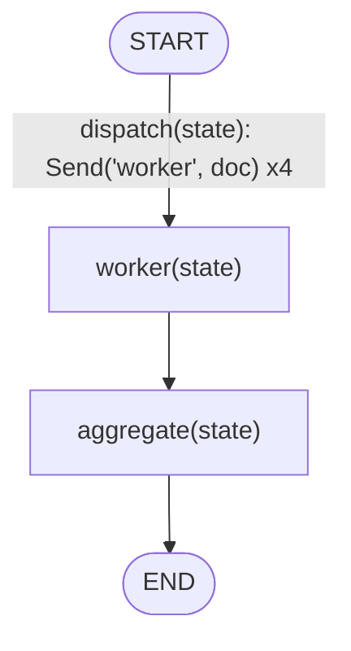
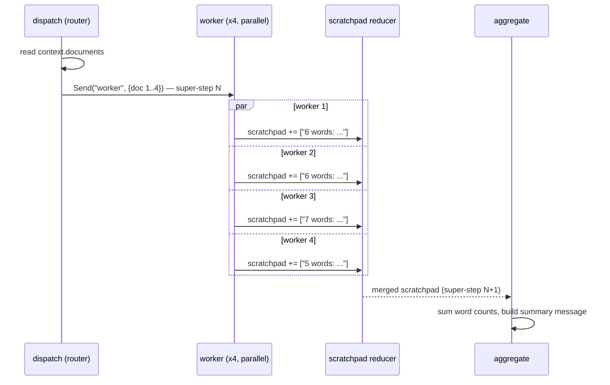

# 12 — Parallel Execution

## Learning Objectives

After this module you can:

- Fan a list of items out to parallel node invocations using `Send`.
- Explain why parallel writes to shared state require a **reducer** and what
  happens without one.
- Fan results back in with an aggregate node that reduces parallel output
  into one value.
- Relate LangGraph's execution model ("super-steps") to why fan-out/fan-in
  works the way it does.

## Theory

LangGraph executes a graph in discrete **super-steps**: within one super-step,
every node scheduled to run does so, and only after all of them finish does
the graph advance to the next super-step. Normally each super-step schedules
one node per edge. `Send(node, arg)` changes that: a routing function can
return a *list* of `Send` objects, scheduling the *same* node multiple times
in one super-step, each with its own input (`arg`).

This is the fan-out. Each `Send`-spawned task is independent — it does not see
the others' state — which is exactly what makes it safe to run in parallel.

The problem: if every parallel worker returns `{"scratchpad": [...]}`, and the
state schema doesn't say how to combine those writes, LangGraph would have to
pick one arbitrarily (last write wins) and silently drop the rest. A
**reducer** fixes this. `AgentState.scratchpad` is annotated
`Annotated[list[str], operator.add]`: every worker's returned list is
concatenated instead of overwriting. `AgentState.messages` uses the built-in
`add_messages` reducer the same way (append + de-dupe by id).

The fan-in is just a normal node (`aggregate`) that reads the fully-merged
`scratchpad` — by the time it runs, every worker's super-step has completed
and the reducer has already combined all their writes.

## Mental Models

Think of `dispatch` as a foreman handing out identical work orders to a crew:
each worker gets one document and has no idea how many coworkers exist or
what they're doing. The reducer is the foreman's clipboard — every worker
pins their result to the *same* clipboard instead of overwriting each other's
notes, so nothing is lost. `aggregate` is the foreman reading the whole
clipboard once everyone has clocked out.

## Architecture



Legend: the graph only ever `add_node`s one `worker`; the edge label shows
that `dispatch` fans it out into 4 independent scheduled invocations (one
`Send` per document) within a single super-step — see the sequence diagram
below for what that fan-out looks like unrolled over time.

Flow notes:

- `dispatch` is the conditional-edge router attached to `START`; instead of
  returning one target-node key, it returns a **list of `Send` objects**,
  each carrying its own document as that invocation's entire input.
- Every `Send("worker", {...})` runs the same `worker` node body once per
  document, independently — no worker can see another worker's input or
  output.
- `worker` computes a word count and appends one note to `scratchpad`; this
  is safe only because `scratchpad` is `Annotated[list[str], operator.add]` —
  the reducer concatenates all 4 parallel writes instead of one clobbering
  the rest.
- `aggregate` is the ordinary fan-in node: LangGraph only runs it after every
  `worker` `Send` task from the super-step has completed and the reducer has
  merged their writes, so it always sees all 4 results.

Fan-out/fan-in over time (one super-step per row):



## Runnable Example

```bash
python src/12_parallel_execution/main.py
```

Expected output (deterministic):

```
worker result: 6 words: 'LangGraph models agents as state machines.'
worker result: 6 words: 'Reducers merge concurrent partial updates safely.'
worker result: 7 words: 'Send fans work out across a super-step.'
worker result: 5 words: 'Fan-in aggregation reduces parallel results.'
total_words=24
summary: Processed 4 documents, total_words=24
=== TRACK1 MODULE 12: PARALLEL EXECUTION COMPLETE ===
```

## Challenge

1. Add a fifth document and confirm `total_words` updates without touching
   `aggregate`'s logic.
2. Remove the `operator.add` reducer (define a local state class with a plain
   `list[str]` field, no `Annotated`) and observe how the merged result
   changes — LangGraph will raise or silently keep only one worker's write,
   depending on version. Document what you see.
3. Change `worker` to also emit a `messages` update (`AIMessage` per
   document) and confirm `add_messages` merges all four without collisions.

## Stretch Goals

- Fan out over a nested structure (list of lists) using two levels of `Send`.
- Add a per-worker simulated failure and combine this module with
  `14_error_handling`'s retry pattern inside a single worker.
- Benchmark true wall-clock parallelism by making `worker` `async def` with
  `asyncio.sleep` and invoking via `ainvoke` (see `13_async_nodes`) — Send
  fan-out is not free parallel *concurrency* on its own; combine it with
  async nodes for I/O-bound speedups.

## Common Mistakes

- **Assuming `Send` implies real concurrency.** By itself, `Send` fans a node
  out into multiple scheduled tasks within a super-step; whether they execute
  concurrently in wall-clock time depends on whether the nodes are async and
  the graph is invoked with `ainvoke`/a concurrent executor.
- **Forgetting the reducer.** Any state field written by more than one
  parallel task needs an explicit reducer (`operator.add`, `add_messages`, or
  a custom one) — plain fields silently keep only one write.
- **Mutating the input list in `dispatch`.** Each `Send` should carry its own
  copy of the data it needs; don't have workers reach back into shared
  mutable state.

## Best Practices

- Keep worker nodes side-effect-free and independent — that's what makes fan-
  out safe.
- Always pair `Send` fan-out with an explicit reducer on every field a worker
  writes.
- Put the aggregation/reduction logic in one clearly named node
  (`aggregate`, `reduce`, `combine`) so the fan-in point is obvious in traces.

## Suggested Improvements

- Add a `max_concurrency` guard by chunking `dispatch`'s `Send` list.
- Emit per-worker timing into `scratchpad` to visualize skew across workers.

## References

- LangGraph `Send` API:
  https://docs.langchain.com/oss/python/langgraph/graph-api#send
- LangGraph reducers and channels:
  https://docs.langchain.com/oss/python/langgraph/graph-api#reducers
- Module [`11_graph_branching`](../11_graph_branching/README.md) — single-target
  conditional routing this module generalizes into multi-target fan-out.
- [`docs/langgraph.md`](../../docs/langgraph.md) — super-steps and reducers
  explained end to end.

## What Comes Next

[`13_async_nodes`](../13_async_nodes/README.md) shows how to make fanned-out
work *actually* run concurrently in wall-clock time using `async def` nodes
and `asyncio.gather`.
