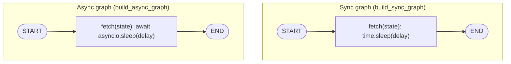
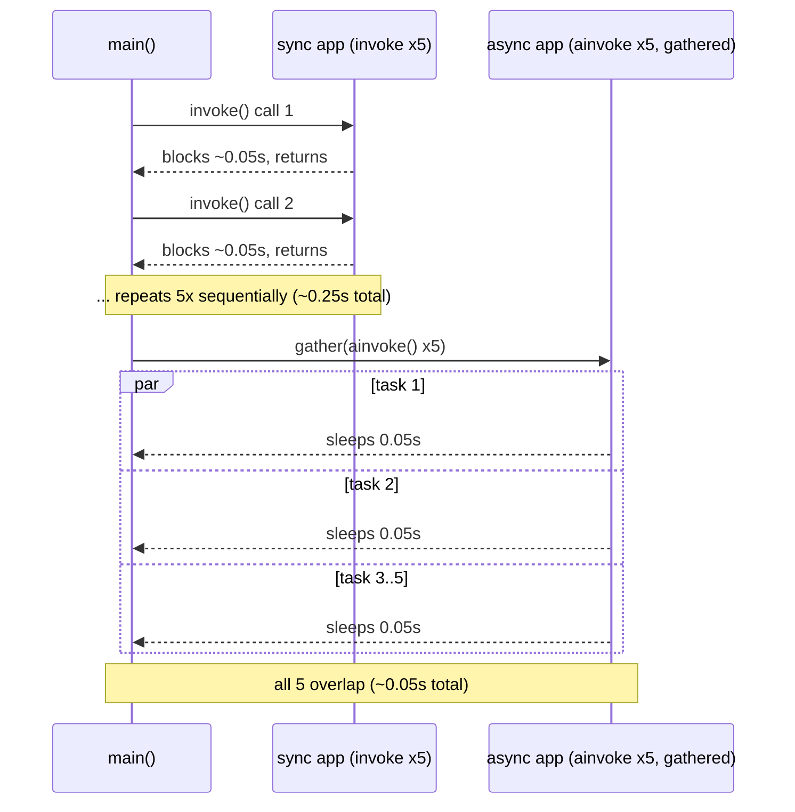

# 13 — Async Nodes

## Learning Objectives

After this module you can:

- Write `async def` LangGraph nodes and invoke them with `await app.ainvoke(...)`.
- Explain why async nodes let I/O-bound work run concurrently while sync
  nodes invoked in a loop cannot.
- Use `asyncio.gather` to run multiple graph invocations concurrently.
- Measure and reason about the wall-clock difference between sequential sync
  calls and concurrent async calls.

## Theory

A LangGraph node can be either a plain function or an `async def` coroutine
function. Sync graphs are invoked with `.invoke(...)`; graphs containing (or
mixing in) async nodes must be invoked with `await app.ainvoke(...)` — a
compiled graph with a pure `async def` node raises `TypeError` if you call
`.invoke()` on it, because there is no synchronous function to run.

The payoff for going async is concurrency for I/O-bound work. A sync node
that calls `time.sleep(delay)` blocks the entire process for `delay` seconds
— nothing else can happen. An async node that `await`s `asyncio.sleep(delay)`
yields control back to the event loop for that duration, so other coroutines
(other graph invocations, other I/O) can make progress at the same time.

`asyncio.gather(*(app.ainvoke(...) for _ in range(N)))` schedules `N`
independent graph runs on the same event loop. If each run's dominant cost is
waiting on I/O (an HTTP call, a DB query, an LLM API round-trip in real
agents), the *total* wall-clock time approaches the time of the *slowest
single* run instead of the *sum* of all runs.

## Mental Models

A sync node is a cashier who locks the register and refuses to serve anyone
else while waiting for a card to authorize. An async node is a cashier who
starts your transaction, and while waiting on the card network, serves the
next three customers — coming back to hand you your receipt the moment the
authorization lands. Nobody's transaction finishes faster individually, but
the *line* moves much faster overall.

## Architecture



Legend: both graphs have the identical one-node shape (`START -> fetch ->
END`); the only difference is whether `fetch` blocks (`time.sleep`) or yields
(`await asyncio.sleep`) — the sequence diagram below shows why that single
difference changes wall-clock behavior under `gather`.

Flow notes:

- `build_sync_graph` wires a single `fetch` node (`sync_fetch`) that calls
  `time.sleep(delay)` — this blocks the entire process for `delay` seconds.
- `build_async_graph` wires the same shape with `async_fetch`, an `async def`
  node that `await`s `asyncio.sleep(delay)` — control returns to the event
  loop for that duration instead of blocking it.
- `run_sequential` calls `sync_app.invoke(...)` `TASK_COUNT` times back to
  back; each call fully blocks before the next one starts, so elapsed time
  grows linearly with `TASK_COUNT`.
- `run_concurrent` calls `asyncio.gather` over `TASK_COUNT` concurrent
  `async_app.ainvoke(...)` coroutines; because each spends its time
  `await`-ing rather than blocking, they interleave on one event loop and
  elapsed time stays close to a single `delay`.

Sequential `invoke()` vs. concurrent `ainvoke()` over time:



## Runnable Example

```bash
python src/13_async_nodes/main.py
```

Expected output shape (exact timings vary slightly by machine, but async is
always faster than sync for this workload):

```
tasks=5 delay_per_task=0.05s
sync sequential elapsed: 0.2XXs
async concurrent elapsed: 0.0XXs
speedup: async was faster than sync = True
=== TRACK1 MODULE 13: ASYNC NODES COMPLETE ===
```

## Challenge

1. Increase `TASK_COUNT` to 20 and confirm the sync elapsed time scales
   linearly while the async elapsed time stays roughly flat.
2. Add a second async node (`transform`) after `fetch` and confirm
   `ainvoke` still runs the whole chain per task concurrently with other
   tasks.
3. Mix a sync node into the async graph (one node `async def`, another plain
   `def`) and confirm LangGraph allows the combination as long as you invoke
   with `ainvoke`.

## Stretch Goals

- Add a semaphore (`asyncio.Semaphore`) around the gathered `ainvoke` calls to
  cap concurrency and observe the wall-clock time increase predictably.
- Combine this module with `12_parallel_execution`: make the `worker` node
  from the `Send` fan-out `async def` and invoke the whole graph with
  `ainvoke` for real concurrent fan-out.
- Add real (but still offline) I/O: read several files with
  `asyncio.to_thread` inside an async node and compare against sequential
  reads.

## Common Mistakes

- **Calling `.invoke()` on a graph with an async-only node.** This raises
  `TypeError: No synchronous function provided`. Either provide a sync node
  or call `.ainvoke()`.
- **Expecting async to speed up CPU-bound work.** `asyncio` gives concurrency
  for I/O waits, not parallelism for CPU-heavy computation — that needs
  multiprocessing or threads, not `async`/`await`.
- **Forgetting `await` on `gather`.** `asyncio.gather(...)` returns a
  coroutine/future — it must itself be awaited (or passed to
  `asyncio.run`).

## Best Practices

- Prefer async nodes for anything that talks to a network resource (LLM
  APIs, vector stores, external tools) so the agent runtime can serve many
  requests concurrently.
- Keep sync and async node styles from mixing arbitrarily across a codebase —
  pick one per graph unless you have a specific reason (like this contrast
  demo) to mix.
- Always measure before assuming async helps — it only pays off when the
  bottleneck is I/O wait, not computation.

## Suggested Improvements

- Add `asyncio.wait_for` with a timeout to demonstrate cancelling a stuck
  async node gracefully.
- Log per-task start/finish timestamps to visualize the overlap in a Gantt-
  style printout.

## References

- LangGraph async execution:
  https://docs.langchain.com/oss/python/langgraph/graph-api#async
- Python `asyncio.gather`:
  https://docs.python.org/3/library/asyncio-task.html#asyncio.gather
- Module [`12_parallel_execution`](../12_parallel_execution/README.md) —
  `Send`-based fan-out this module makes truly concurrent.
- [`docs/langgraph.md`](../../docs/langgraph.md) — execution model and async
  section.

## What Comes Next

[`14_error_handling`](../14_error_handling/README.md) adds resilience —
retries, backoff, and circuit breakers — for when concurrent I/O calls start
failing intermittently.
