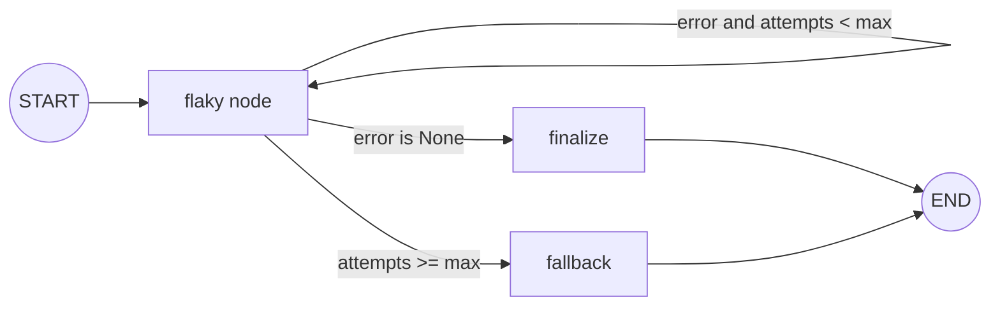
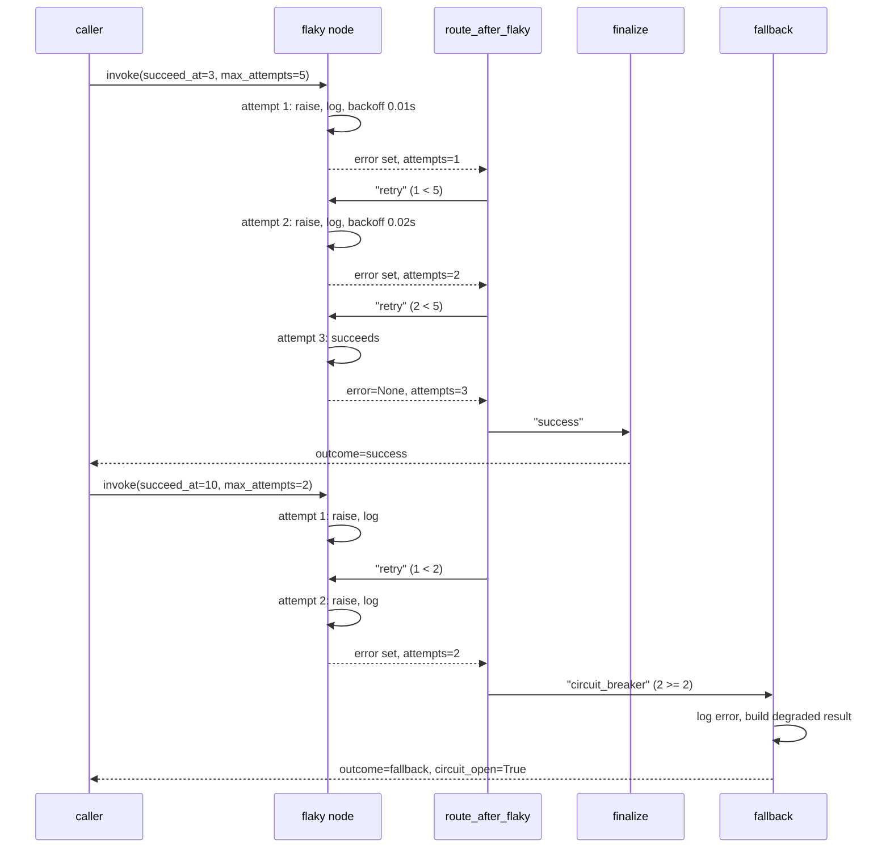

# 14 — Error Handling

## Learning Objectives

After this module you can:

- Implement a retry loop inside a LangGraph graph using a conditional edge
  that routes a node back to itself.
- Add exponential backoff between retries without blocking the whole graph
  forever.
- Trip a **circuit breaker** once a retry budget is exhausted and fall back
  to a degraded path instead of raising.
- Explain why exceptions should be caught, logged, and converted into
  routable state — never swallowed silently.

## Theory

Production agents call flaky things: rate-limited APIs, occasionally-down
services, slow databases. Three patterns keep a graph resilient:

1. **Retry with backoff.** A node that can fail transiently records the
   failure in state (`context["error"]`) instead of letting the exception
   propagate uncaught. A conditional edge inspects that state: if the error
   is set and the attempt budget remains, route back to the *same* node
   (`"retry": "flaky"`). Backoff (`BACKOFF_BASE_SECONDS * 2 ** attempt`)
   spaces out retries so the graph doesn't hammer a struggling dependency.
2. **Circuit breaker.** Once `attempts >= max_attempts`, retrying further is
   wasteful or harmful (the upstream might need time to recover). The router
   trips the breaker by routing to a `fallback` node instead of `flaky`
   again — the graph *always* terminates, it never retries unboundedly.
3. **Fallback / graceful degradation.** The `fallback` node returns a safe,
   clearly-labeled degraded result (`outcome="fallback"`) rather than
   crashing the whole run. Callers can inspect `context["circuit_open"]` to
   know the result is degraded.

Critically: the `try/except` inside `flaky_node` **logs** the exception
(`logger.warning`) before converting it into state. Catching an exception and
doing nothing (`except Exception: pass`) hides real failures; catching it,
logging it, and encoding it as routable state is how you build resilience
without hiding problems from operators.

## Mental Models

Think of a phone call that keeps dropping. You (`flaky_node`) redial with a
little more wait each time (backoff) — polite persistence, not spam. After a
few failed redials, you give up calling and text instead (`fallback`) — a
different, more reliable channel that gets *a* message through, even if it's
not the original plan. You never just stop responding to the person waiting
on you.

## Architecture



Sequence for both scenarios exercised by the example:



## Runnable Example

```bash
python src/14_error_handling/error_handling.py
```

Expected output (deterministic; log lines precede the two result lines):

```
scenario=recovers outcome=success attempts=3 message='succeeded after 3 attempt(s)'
scenario=circuit_breaker outcome=fallback attempts=2 message='circuit_open after 2 attempt(s), used fallback'
=== TRACK1 MODULE 14: ERROR HANDLING COMPLETE ===
```

## Challenge

1. Change `max_attempts` in the second scenario to `10` and confirm it now
   recovers instead of tripping the breaker.
2. Add a `total_backoff` counter to `context` that sums every backoff delay
   incurred, and print it alongside the outcome.
3. Add a third scenario where `succeed_at` equals `max_attempts` exactly —
   trace through `route_after_flaky` to confirm it resolves to `"success"`
   and not `"circuit_breaker"`.

## Stretch Goals

- Add a real circuit-breaker *cooldown*: once tripped, remember the failure
  in module-level state and refuse new attempts for a simulated time window
  even across separate `invoke` calls.
- Combine with `13_async_nodes`: make `flaky_node` async, use
  `asyncio.wait_for` to add a per-attempt timeout in addition to the retry
  budget.
- Combine with `12_parallel_execution`: fan out several flaky calls via
  `Send` and aggregate how many succeeded vs. fell back.

## Common Mistakes

- **Swallowing the exception.** `except TransientError: pass` (no logging,
  no state update) hides real production failures — always log and encode
  the failure in state.
- **Unbounded retries.** A retry edge without a budget check
  (`attempts >= max_attempts`) can loop forever against a truly broken
  dependency — always pair retry with a circuit breaker or max-attempts
  guard.
- **No backoff.** Retrying immediately in a tight loop can amplify load on an
  already-struggling dependency; even a small exponential backoff helps.

## Best Practices

- Always log at the point of failure (`logger.warning`/`logger.error`) with
  enough context (attempt number, error message) to debug in production.
- Keep the retry budget and backoff schedule configurable via state/config,
  not hardcoded magic numbers scattered through the codebase.
- Make the fallback result clearly distinguishable (`outcome="fallback"`,
  `circuit_open=True`) so downstream consumers can treat it differently from
  a genuine success.

## Suggested Improvements

- Add jitter to the backoff calculation to avoid retry storms across many
  concurrent callers.
- Emit structured (JSON) log records instead of plain strings for easier
  production log aggregation.

## References

- LangGraph conditional edges (self-loops for retry):
  https://docs.langchain.com/oss/python/langgraph/graph-api#conditional-edges
- Circuit breaker pattern:
  https://learn.microsoft.com/en-us/azure/architecture/patterns/circuit-breaker
- Module [`11_graph_branching`](../11_graph_branching/README.md) — the
  conditional-edge mechanics this module reuses for retry routing.
- [`docs/langgraph.md`](../../docs/langgraph.md) — error handling and
  checkpoints section.

## What Comes Next

This closes Track 1 (Foundations). The control-flow primitives here —
branching, parallel fan-out/fan-in, async concurrency, and resilient
retries — underpin every later module, including the tool-using and
multi-agent systems in `05_tools`, `09_multi_agent_systems`, and the
checkpoint/persistence patterns previewed in `docs/langgraph.md`.
