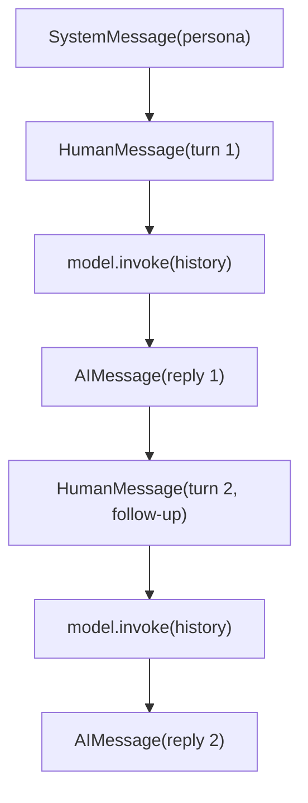
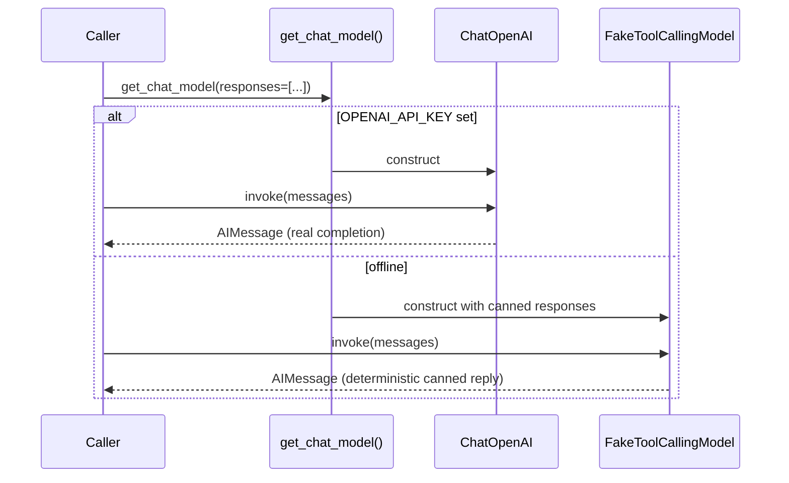

# 15 — Chat Models

## Learning Objectives

After this module you can:

- Name and use the four core message types: `SystemMessage`, `HumanMessage`,
  `AIMessage`, `ToolMessage`.
- Explain why `get_chat_model` is the single seam between "real provider" and
  "offline deterministic fake" — and why exercise code never imports
  `ChatOpenAI` directly.
- Build a growing conversation transcript turn by turn, the same shape
  LangGraph's `add_messages` reducer maintains inside a graph.
- Correlate a `ToolMessage` back to the `AIMessage` tool call it answers via
  `tool_call_id`.

## Theory

Every LangChain chat model speaks the same typed message protocol,
regardless of provider:

- **`SystemMessage`** — instructions/persona, usually first in the list.
- **`HumanMessage`** — what the user said.
- **`AIMessage`** — what the model said, including any `tool_calls` it made.
- **`ToolMessage`** — the result of executing one of those tool calls, tagged
  with the originating `tool_call_id` so multi-tool turns don't get confused.

A chat model's `.invoke(messages)` takes the whole list (not just the latest
message) and returns a single new `AIMessage`. Statelessness is the point:
the model has no memory of its own — the caller is responsible for building
and re-sending the transcript every turn. This is why "long-running memory"
(module 19) and "context budgeting" are separate concerns from the model
itself.

`get_chat_model()` (`src/shared/llm.py`) is the provider bridge used across
every module from here on: with `OPENAI_API_KEY` set it returns a real
`ChatOpenAI`; otherwise it returns `FakeToolCallingModel`, a deterministic
stand-in that still supports `bind_tools` and `with_structured_output`. The
call site never changes — only the environment does.

## Mental Models

Think of a chat model as a function with total amnesia: `reply =
model.invoke(transcript)`. It never remembers anything you didn't just hand
it in `transcript`. Every "conversation" is really the caller re-sending the
entire chat history, one message longer each turn — like re-reading an
entire email thread from the top before writing your next reply.

## Architecture

This is a growing message transcript, not a compiled LangGraph — there is no
`StateGraph` in this module, so the diagram shows the timeline of messages
instead of nodes/edges:



Legend: each arrow is "appended to the transcript, then re-sent whole" — the
model itself holds no memory between arrows; only the caller-held `history`
list grows.

Flow notes:

- `build_first_turn` seeds the transcript with `SystemMessage` (persona) +
  the first `HumanMessage`.
- `model.invoke(history)` is called with the **entire** list each time and
  returns exactly one new `AIMessage`.
- `append_reply` grows `history` with that reply before the next turn starts
  — the same append shape LangGraph's `add_messages` reducer maintains
  inside a graph (module 03).
- Turn 2 replays turn 1 in full plus the new follow-up `HumanMessage`;
  nothing is remembered by the model across `invoke` calls.
- A separate `build_tool_observation_turn` (not pictured above) shows the
  `ToolMessage` shape used once tool calls are involved — see the tool loop
  in module 17.

Sequence of a single chat turn, including the offline/online fork inside
`get_chat_model`:



## Runnable Example

```bash
python src/15_chat_models/chat_turn.py
```

Expected output (deterministic):

```
turn=1 roles=['SystemMessage', 'HumanMessage', 'AIMessage']
turn=1 reply='The on-call rotation is posted in #oncall.'
turn=2 roles=['SystemMessage', 'HumanMessage', 'AIMessage', 'HumanMessage', 'AIMessage']
turn=2 reply='Deploys require two approvals before shipping.'
tool_history roles=['SystemMessage', 'HumanMessage', 'ToolMessage']
=== TRACK2 MODULE 15: CHAT MODELS COMPLETE ===
```

## Challenge

1. Add a third turn that asks a question unrelated to the two canned
   responses and observe how `FakeToolCallingModel` cycles through
   `responses` by human-turn count (read `_final_text` in `src/shared/llm.py`).
2. Write a helper `last_ai_message(history) -> AIMessage | None` and use it to
   print only the model's most recent reply after each turn.
3. Set `OPENAI_API_KEY` and rerun — same code, real completions. Compare the
   fake's canned text with a real model's answer to the same transcript.

## Stretch Goals

- Add a `MessagesPlaceholder` (via `ChatPromptTemplate`, see module 18) that
  injects the running `history` list into a templated turn.
- Build a small REPL loop that reads from stdin, appends a `HumanMessage`
  each iteration, and prints the growing transcript length.

## Common Mistakes

- **Treating the model as stateful.** Forgetting to re-pass prior messages
  means the model answers with zero context — every `invoke` call is
  independent.
- **Losing `tool_call_id` correlation.** A `ToolMessage` without the matching
  id breaks multi-tool turns (see module 17) — most providers reject it.
- **Importing `ChatOpenAI` directly** in exercise code instead of
  `get_chat_model` — this breaks the offline-first guarantee for anyone
  without a key.

## Best Practices

- Always route model construction through one factory (`get_chat_model`) so
  swapping providers/models is a config change, not a code change.
- Keep `SystemMessage` content stable and versioned — it's effectively part
  of your application's behavior contract.
- Log the reply (`get_logger`), not just print it, so production transcripts
  are traceable.

## Suggested Improvements

- Add a `Settings.default_system_prompt` to `src/shared/config.py` so every
  module shares one persona definition (would require a shared-library
  change — file an issue rather than duplicating it per module).
- Extend `FakeToolCallingModel` responses to support per-turn overrides
  keyed by message content, for richer offline demos.

## References

- LangChain messages: https://docs.langchain.com/oss/python/langchain/messages
- `src/shared/llm.py` — `get_chat_model`, `FakeToolCallingModel`.
- Module [`03_llm_nodes`](../03_llm_nodes/README.md) — the original single-shot
  LLM node this module deepens.
- [`docs/langchain.md`](../../docs/langchain.md) — messages, prompts, and the
  runnable interface overview.
- [`docs/openai.md`](../../docs/openai.md) — when the real key activates vs.
  the offline fake.

## What Comes Next

[`16_structured_outputs`](../16_structured_outputs/README.md) constrains the
model's reply to a typed Pydantic schema instead of free text.
