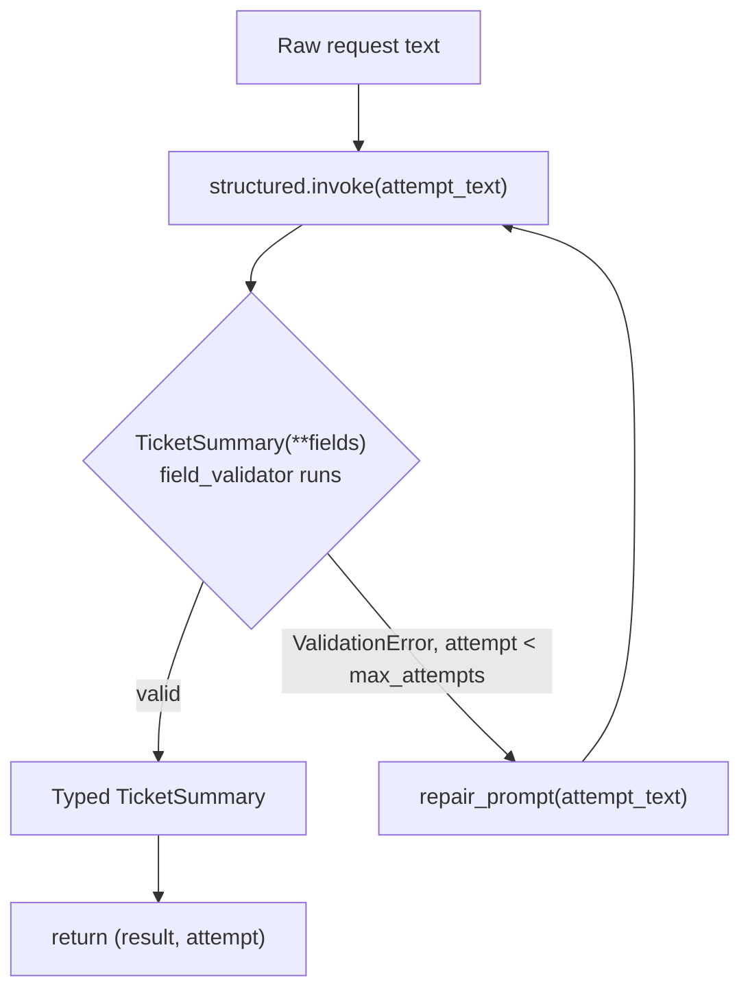
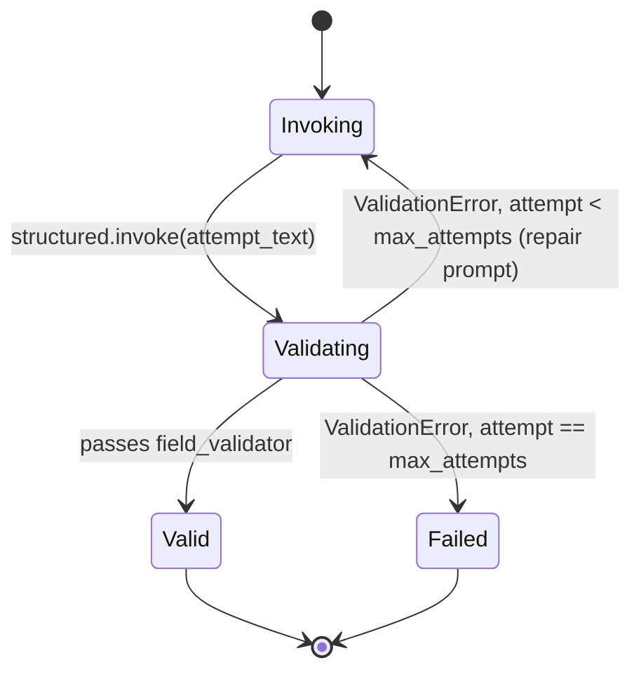

# 16 — Structured Outputs

## Learning Objectives

After this module you can:

- Define a Pydantic v2 schema that constrains a model's reply to a typed
  object instead of free text.
- Call `model.with_structured_output(Schema)` and explain what the returned
  runnable does.
- Catch `pydantic.ValidationError` and retry with a repaired prompt instead
  of crashing or silently accepting bad data.
- Explain why "the model returned JSON" is not the same guarantee as "the
  model returned a value that satisfies your business rules."

## Theory

`with_structured_output(Schema)` wraps a chat model so that instead of
returning an `AIMessage` with free-text content, invoking it returns an
instance of `Schema` (a Pydantic `BaseModel` subclass) with fields already
populated and type-validated. Under the hood, real providers do this via
tool-calling or JSON-mode plus parsing; the mechanism differs by provider but
the contract is the same: you get back a typed object, or an exception.

Schema validation is necessary but not sufficient. A field can be
syntactically valid (`category: str`) yet semantically wrong (`category =
"potato"` when only `"bug" | "feature" | "question"` make sense downstream).
Pydantic's `@field_validator` lets you encode that business rule directly on
the schema, so `Schema(**data)` raises `ValidationError` for both syntactic
and semantic violations — and callers only need one `except` clause.

Because models are non-deterministic, a validation failure is not always a
final failure — a **bounded retry loop** that repairs the prompt (e.g., by
restating the allowed values, or, as here, normalizing the input) and asks
again is standard production practice. The loop must be bounded: retrying
forever on a systematically bad prompt just burns tokens.

## Mental Models

Think of `with_structured_output` as a strict form at a government office: you
can hand in whatever text you want, but the clerk (the schema) only accepts a
completed form with the right fields, right types, and values from the
approved list. If your form is rejected, you get the reason back and get
one more (bounded) attempt to fix it — you don't get to argue your way
around the form.

## Architecture

This is a plain retry loop (`parse_with_retry`), not a compiled LangGraph —
the diagram below shows the call/validate/repair cycle:



Legend: the diamond is the schema/business-rule validation decision; the
loop back from `repair_prompt` to `structured.invoke` is the bounded
retry path — capped by `max_attempts`, after which the loop raises
`RuntimeError` instead of looping forever (see the state diagram below).

Flow notes:

- `structured.invoke(attempt_text)` asks the model for fields and
  constructs `TicketSummary(**fields)`.
- The diamond is both **type** validation (Pydantic) and **business-rule**
  validation (`@field_validator category_must_be_known`) in one step.
- `"valid"` returns the typed instance plus the attempt number it took.
- `"ValidationError"` (while attempts remain) logs the rejection and calls
  `_repair_prompt` to normalize `attempt_text` before looping back.
- Exhausting `max_attempts` without a valid result raises `RuntimeError` —
  the loop is bounded, it never retries indefinitely.

Parse → validate → retry, as a sequence:

```mermaid
sequenceDiagram
    participant Caller
    participant Loop as parse_with_retry
    participant Model as with_structured_output runnable
    participant Schema as TicketSummary(validators)

    Caller->>Loop: parse_with_retry(raw_text)
    loop until valid or max_attempts
        Loop->>Model: invoke(attempt_text)
        Model->>Schema: TicketSummary(**sampled_fields)
        alt category not in allowed set
            Schema-->>Model: raise ValidationError
            Model-->>Loop: ValidationError
            Loop->>Loop: attempt_text = repair(attempt_text)
        else category valid
            Schema-->>Model: TicketSummary instance
            Model-->>Loop: TicketSummary instance
            Loop-->>Caller: (result, attempt)
        end
    end
```

The bounded validate/retry loop as a state machine:



Legend: `Invoking` is re-entered once per repaired prompt; every retry either
returns to `Invoking` a bounded number of times or leaves for good via
`Valid` (typed result) or `Failed` (`RuntimeError` — budget exhausted).

## Runnable Example

```bash
python src/16_structured_outputs/structured_output.py
```

Expected output (deterministic — attempt 1 is rejected, attempt 2 succeeds):

```
attempts=2
category='bug' priority=1 summary='bug'
parsed_type=TicketSummary
=== TRACK2 MODULE 16: STRUCTURED OUTPUTS COMPLETE ===
```

## Challenge

1. Add a `priority: int` validator requiring `1 <= priority <= 5` and craft
   an input that fails it, forcing a third retry attempt.
2. Add a `tags: list[str]` field to `TicketSummary` and confirm the offline
   fake fills it with `[]` (see `_sample_value` in `src/shared/llm.py`).
3. Change `MAX_ATTEMPTS` to `1` and observe the `RuntimeError` — this is the
   "bounded" part of "bounded retry loop" in action.

## Stretch Goals

- Replace the keyword-based `_repair_prompt` with a second call to
  `get_chat_model(responses=[...])` that "explains" the validation error back
  to a (still offline) repair model.
- Add a second schema (e.g., `Escalation`) and route between schemas based on
  a first-pass classification, composing this module with module 20's
  routing pattern.

## Common Mistakes

- **Catching `Exception` broadly** instead of `pydantic.ValidationError`
  specifically — you want a real bug (e.g., a `TypeError` in your own code)
  to surface immediately, not be silently retried.
- **Unbounded retries.** Always cap `max_attempts`; a systematically bad
  prompt should fail loudly, not loop forever.
- **Only validating types, not values.** `category: str` alone accepts any
  string — the `@field_validator` is what actually enforces business rules.

## Best Practices

- Put business-rule validation on the schema itself (`@field_validator`), not
  scattered in caller code — it travels with the type.
- Log every rejected attempt (`get_logger`) with the validation error so
  repeated failures are diagnosable in production.
- Keep the repaired prompt strategy simple and inspectable — a black-box
  "ask the model to fix it" retry can hide silent behavior drift.

## Suggested Improvements

- Support structured-output retries with exponential backoff, mirroring
  module 14's circuit-breaker pattern, for rate-limited real providers.
- Emit a metric (count of attempts before success) so schema drift is
  observable over time (see `docs/observability.md`).

## References

- LangChain structured output:
  https://docs.langchain.com/oss/python/langchain/structured-output
- Pydantic validators: https://docs.pydantic.dev/latest/concepts/validators/
- `src/shared/llm.py` — `FakeToolCallingModel.with_structured_output`.
- Module [`14_error_handling`](../14_error_handling/README.md) — the
  retry/circuit-breaker pattern this module's retry loop echoes.
- [`docs/langchain.md`](../../docs/langchain.md) — structured output section.

## What Comes Next

[`17_function_calling`](../17_function_calling/README.md) constrains model
output to a *tool call* instead of a schema, and builds the manual loop that
executes it.
