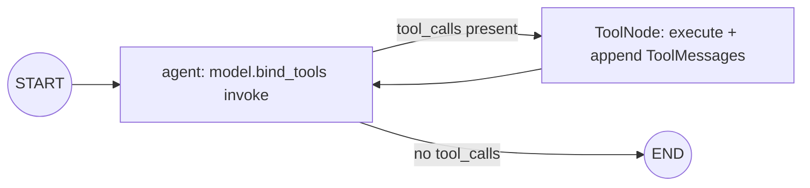
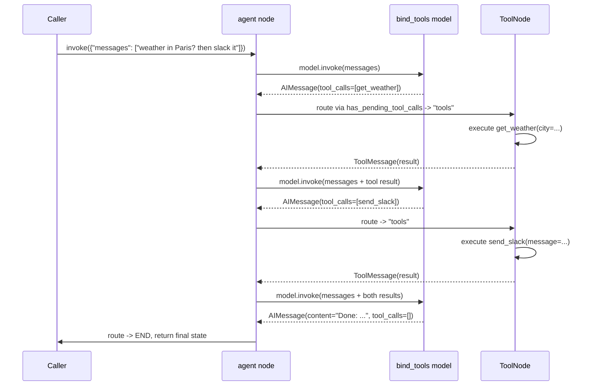

# 17 — Function Calling

## Learning Objectives

After this module you can:

- Bind tools to a model with `model.bind_tools(DEMO_TOOLS)` and read the
  `tool_calls` a resulting `AIMessage` carries.
- Build a **manual tool-call loop** with `ToolNode` and
  `add_conditional_edges` — the pattern that replaces the deprecated
  `create_react_agent`.
- Explain the termination condition of a tool loop: keep routing to `tools`
  while `tool_calls` is non-empty, stop once the model replies with plain
  text.
- Read a full agent tool-loop transcript and identify each tool call's
  request/response pair.

## Theory

`bind_tools` doesn't execute anything — it tells the model *what tools it may
request* (their names, argument schemas, and docstrings become part of the
prompt/API contract). The model's response is still just an `AIMessage`; the
only difference is it may carry a non-empty `.tool_calls` list instead of (or
alongside) text content. **Nothing runs until you run it.**

`ToolNode(DEMO_TOOLS)` is a LangGraph-provided node that reads the tool calls
off the latest `AIMessage` in state, executes the matching Python tool for
each one, and appends a `ToolMessage` per call (correlated by
`tool_call_id`). It is a *node*, not magic — you still wire it into the graph
yourself with `add_conditional_edges`.

`langgraph.prebuilt.create_react_agent` used to hide this whole loop behind
one function call. It is **deprecated and uninstalled** in this environment.
The manual loop below is not a workaround — it is the pattern production
agent frameworks actually build on top of, and understanding it is a
prerequisite for debugging any agent's tool-use behavior.

## Mental Models

Think of the loop as a phone call between a manager (`agent`) and an
assistant (`tools`): the manager can either give a final answer, or ask the
assistant to do something and report back. The assistant never speaks
directly to the customer — every result goes back through the manager, who
decides whether more work is needed or it's time to answer. The call ends
the moment the manager stops delegating.

## Architecture



Sequence of the sample run (weather lookup, then a Slack post):



## Runnable Example

```bash
python src/17_function_calling/tool_loop.py
```

Expected output (deterministic — `FakeToolCallingModel` has `max_tool_calls=2`):

```
tool_calls=['get_weather', 'send_slack']
messages_in_transcript=6
final_reply='Done: fetched the weather and posted it to Slack.'
=== TRACK2 MODULE 17: FUNCTION CALLING COMPLETE ===
```

## Challenge

1. Lower `MAX_TOOL_CALLS` to `1` and observe that only `get_weather` (or
   whichever tool the fake selects first) executes before the model answers.
2. Add `create_task` to a query that mentions "create a task to fix the
   bug" and confirm the fake routes to it.
3. Print each `ToolMessage.content` alongside its `tool_call_id` to see the
   request/response correlation explicitly.

## Stretch Goals

- Add a `max_iterations` safety counter in the conditional edge itself (not
  just relying on `FakeToolCallingModel.max_tool_calls`) so a real, chattier
  model can't loop indefinitely — mirrors the circuit breaker in module 14.
- Combine with module 16: have the final `agent` reply go through
  `with_structured_output` instead of free text, so the loop's conclusion is
  a typed object.
- Swap in a subset of `DEMO_TOOLS` per query (tool selection) instead of
  always binding the full set.

## Common Mistakes

- **Forgetting the loop-back edge.** `tools -> agent` is what makes it a
  loop; without it, only one tool call ever executes.
- **No termination guarantee.** A route that always returns `"tools"`
  produces an infinite loop — the conditional edge must have a path to
  `END`.
- **Using `create_react_agent`.** It's deprecated/uninstalled here — this
  module *is* the replacement pattern, not a stopgap.

## Best Practices

- Keep the routing function pure (`has_pending_tool_calls` only reads
  `state["messages"][-1]`) — no side effects in the router.
- Log every tool call decision (`get_logger`) — tool loops are the hardest
  part of an agent to debug without a trace.
- Cap the loop with an explicit iteration/cost budget in production, not
  just an implicit model behavior.

## Suggested Improvements

- Add per-tool timeout/error handling inside `ToolNode` via its
  `handle_tool_errors` parameter, and route failures to a fallback node.
- Emit an event per tool call for the observability pipeline
  (`docs/observability.md`).

## References

- LangGraph `ToolNode`:
  https://docs.langchain.com/oss/python/langgraph/graph-api#toolnode
- LangChain tool calling:
  https://docs.langchain.com/oss/python/langchain/tools
- `src/shared/tools.py` — `DEMO_TOOLS`.
- Module [`05_tools`](../05_tools/README.md) — the original single mock tool
  this module generalizes into a real loop.
- Module [`14_error_handling`](../14_error_handling/README.md) — retry/backoff
  patterns applicable to flaky tool calls.

## What Comes Next

[`18_prompt_engineering`](../18_prompt_engineering/README.md) shifts focus
from *what the model can call* to *how the prompt shapes what it says*.
