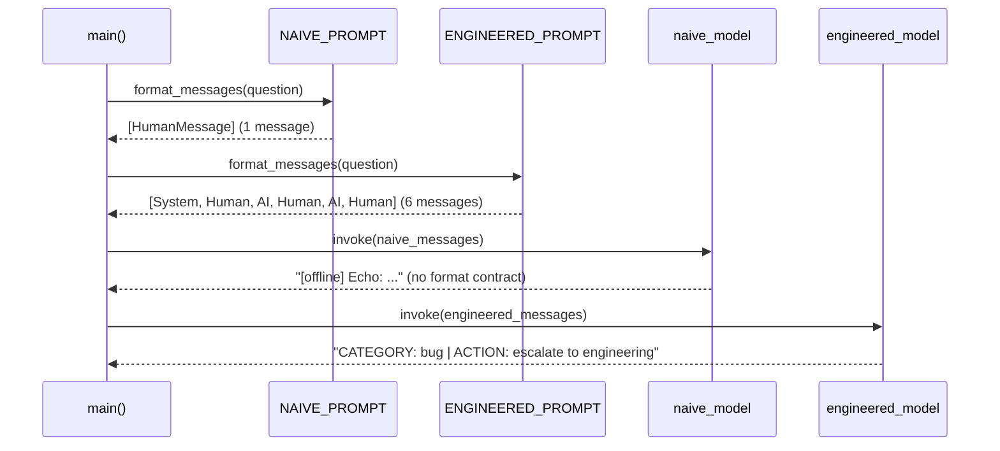

# 18 — Prompt Engineering

## Learning Objectives

After this module you can:

- Build prompts with `ChatPromptTemplate` instead of hand-assembled message
  lists.
- Add a system persona and few-shot examples to steer output format and
  content.
- Explain why prompt *structure* (roles, ordering, examples) is part of the
  interface contract with a model, not cosmetic wording.
- Compare a naive prompt against an engineered one by inspecting the actual
  rendered message list, not just the final text.

## Theory

`ChatPromptTemplate.from_messages([...])` turns a list of `(role, template)`
tuples into a reusable template with `{placeholder}` variables.
`.format_messages(**kwargs)` renders it into the same `list[BaseMessage]`
shape every chat model expects (module 15) — templates are a convenience
layer over message construction, not a different mechanism.

**Few-shot prompting** embeds example `(input, desired_output)` pairs
directly in the message list as alternating `human`/`ai` turns before the
real question. The model then has to complete a pattern rather than invent a
format from scratch — this is often more reliable than describing the format
in prose alone, especially for terse, structured outputs.

A **system prompt** sets the persona and hard constraints ("reply only in
this format") once, at the front of the transcript, rather than repeating
instructions in every human turn.

The core lesson: two prompts that "ask the same question" in English can
produce very different model behavior depending on structure — role
assignment, example count and order, and where the constraint is stated.
Prompt engineering is the practice of controlling that structure
deliberately instead of accidentally.

## Mental Models

Think of the naive prompt as walking up to a stranger and asking a question
with no context — you get whatever answer occurs to them, in whatever format
they choose. The engineered prompt is handing them a filled-out example form
first ("here's what a good answer to a similar question looked like") before
asking your real question — they complete the pattern instead of guessing.

## Architecture

```mermaid
flowchart TD
    subgraph Naive["Naive path"]
        Q1["question"] --> NP["NAIVE_PROMPT.format_messages(question)"]
        NP --> NM1["[HumanMessage(question)]"]
        NM1 --> NMOD["naive_model = get_chat_model()"]
        NMOD --> NR["naive_reply: generic echo (no canned response set)"]
    end
    subgraph Engineered["Engineered path"]
        SYS["system: terse ticket-triage persona"] --> FS1["few-shot 1: human/ai pair"]
        FS1 --> FS2["few-shot 2: human/ai pair"]
        FS2 --> Q2["question"]
        Q2 --> EP["ENGINEERED_PROMPT.format_messages(question)"]
        EP --> EM1["[System, Human, AI, Human, AI, Human]"]
        EM1 --> EMOD["engineered_model = get_chat_model(responses=[...])"]
        EMOD --> ER["engineered_reply: 'CATEGORY: bug | ACTION: escalate to engineering'"]
    end
```



*Legend: there are no conditional edges in this module — both paths are*
*straight-line pipelines; the "decision" is which `ChatPromptTemplate` you*
*build in the first place, not a runtime branch.*

Rendering order, side by side:



Flow notes:

- **Naive path** renders to a single `HumanMessage` — no persona, no
  examples — so the (offline) model has nothing to imitate and falls back to
  an echo.
- **Engineered path** prepends a `system` persona, then two `human`/`ai`
  few-shot pairs, before the real `question` — six rendered messages in
  total, in the exact order they were appended in `_engineered_messages`.
- Both templates render through the same `.format_messages(**kwargs)` call;
  the difference readers should notice is entirely in *what* was templated,
  not *how* it was rendered.

## Runnable Example

```bash
python src/18_prompt_engineering/prompt_engineering.py
```

Expected output (deterministic):

```
naive_message_count=1 roles=['HumanMessage']
engineered_message_count=6 roles=['SystemMessage', 'HumanMessage', 'AIMessage', 'HumanMessage', 'AIMessage', 'HumanMessage']
naive_reply='[offline] Echo: The app crashes when I hit save, this is a bug.'
engineered_reply='CATEGORY: bug | ACTION: escalate to engineering'
=== TRACK2 MODULE 18: PROMPT ENGINEERING COMPLETE ===
```

## Challenge

1. Add a third few-shot example for a `question`-category ticket and confirm
   `engineered_message_count` grows to 8.
2. Swap `FEW_SHOT_EXAMPLES` order and confirm the rendered message list order
   changes accordingly — prove the template preserves example order.
3. Write a `NAIVE_WITH_SYSTEM_PROMPT` that adds only a system persona (no
   few-shot) and compare its message count/roles against both existing
   prompts.

## Stretch Goals

- Replace the hand-built few-shot loop with
  `langchain_core.prompts.FewShotChatMessagePromptTemplate` and confirm the
  rendered output is equivalent.
- Add a `MessagesPlaceholder("history")` so the engineered prompt can also
  carry a running conversation (compose with module 15).
- Parametrize the persona/system prompt and run the same question through
  three personas, comparing the three (configured) canned replies.

## Common Mistakes

- **Confusing "more words" with "better prompt."** Structure (roles,
  examples, explicit format) matters more than prose length.
- **Few-shot examples that don't match the target format exactly.** If your
  examples are inconsistent with each other, the model has no consistent
  pattern to complete.
- **Testing prompts only by eyeballing output.** Assert on structure (roles,
  message count) as well as content, so prompt regressions are caught by
  tests, not just manual review.

## Best Practices

- Keep the system prompt and few-shot examples as named constants (as here),
  not inline strings scattered through code — they are configuration, not
  incidental text.
- Version prompt templates like code — a prompt change is a behavior change.
- Prefer few-shot examples drawn from real, representative cases over
  invented ones.

## Suggested Improvements

- Add a prompt registry in `src/shared/` so multiple modules can share a
  canonical few-shot example set (file as a shared-library change).
- A/B compare two prompt variants against a fixed evaluation set once
  module `54_evaluations` is available.

## References

- LangChain prompt templates:
  https://docs.langchain.com/oss/python/langchain/prompts
- Few-shot prompting:
  https://docs.langchain.com/oss/python/langchain/few-shot-prompting
- Module [`15_chat_models`](../15_chat_models/README.md) — the message types
  a rendered prompt produces.
- [`docs/langchain.md`](../../docs/langchain.md) — prompts and the runnable
  (`|` pipe) interface.

## What Comes Next

[`19_context_engineering`](../19_context_engineering/README.md) tackles what
happens when a well-engineered prompt's transcript grows too large for the
model's context window.
