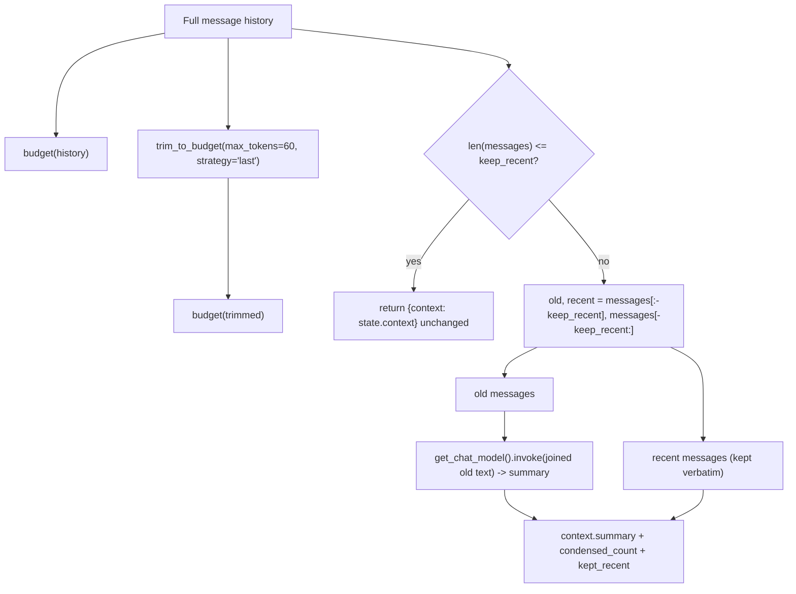
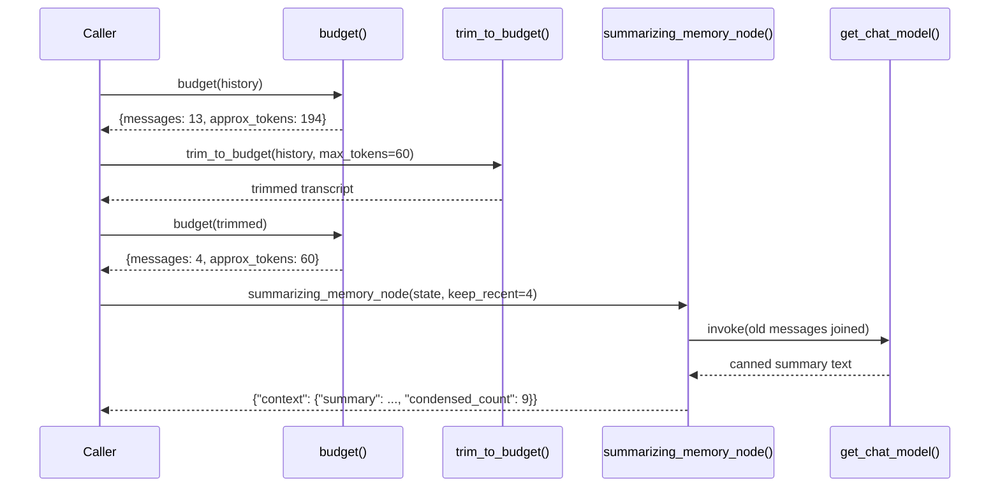
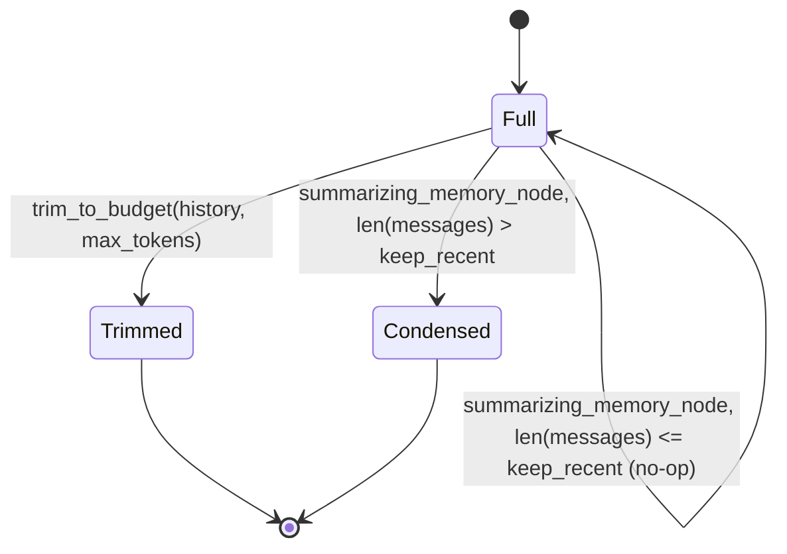

# 19 — Context Engineering

## Learning Objectives

After this module you can:

- Measure a conversation's approximate token/message budget with
  `count_tokens_approximately`.
- Trim a message list to a token budget with `trim_messages`, keeping the
  leading `SystemMessage` when it fits.
- Build a summarization memory node that condenses older turns into a
  summary string instead of dropping them outright.
- Explain the trade-off between trimming (cheap, lossy) and summarization
  (costs a model call, preserves gist).

## Theory

Every chat model has a finite context window. A long-running conversation
(or agent loop) eventually produces a transcript larger than that window, or
simply larger than you want to pay to re-send every turn. Two standard
techniques manage this:

**Trimming** (`langchain_core.messages.trim_messages`) keeps the transcript
under a token budget by dropping messages — `strategy="last"` keeps the most
recent ones, `include_system=True` preserves a leading `SystemMessage` if it
still fits. Trimming is cheap (no model call) but **lossy**: dropped
messages are gone.

**Running summarization** avoids the loss by periodically condensing older
messages into a single summary string (stored in `AgentState`'s free-form
`context` channel, not the `messages` list itself — no reducer conflict).
The most recent `keep_recent` messages stay verbatim; everything older is
folded into `context["summary"]`. This costs a model call but keeps the gist
of the full history available to future turns.

In production, these compose: summarize periodically to bound growth, then
trim the verbatim tail to the model's context window as an additional
safety net.

## Mental Models

Trimming is like only keeping the last few pages of a long meeting's
transcript — fast, but you've lost the earlier discussion entirely. Running
summarization is like appointing someone to jot down a one-paragraph recap
of everything before page 10, so you still know what was decided even
though you're not re-reading it verbatim.

## Architecture



*Legend: the diamond is the only conditional in this module — the*
*`summarizing_memory_node` guard — everything else (trimming) is an*
*unconditional transform applied to the same input history.*

Pipeline as a sequence:



The two strategies as context-state transitions:



Flow notes:

- **`trim_to_budget`** always runs and always drops the oldest messages once
  `max_tokens` is exceeded (`strategy="last"`, `include_system=True` keeps
  the leading `SystemMessage` only if it still fits) — it never calls a
  model and it never looks at `keep_recent`.
- **`summarizing_memory_node`'s guard** (`len(messages) <= keep_recent`)
  short-circuits to a no-op when there is nothing old enough to condense —
  this is the one real branch in the module; it protects against summarizing
  a transcript that is already short.
- When the guard doesn't fire, the node **always** calls the model once
  (`get_chat_model().invoke(...)`) to produce a fresh `context.summary`, and
  **always** keeps the most recent `keep_recent` messages verbatim
  alongside it — the two halves of the transcript are never both dropped.

## Runnable Example

```bash
python src/19_context_engineering/context_budget.py
```

Expected output (deterministic):

```
before_trim={'messages': 13, 'approx_tokens': 194}
after_trim={'messages': 4, 'approx_tokens': 60}
summary='Summary of 9 earlier turn(s) about support topics.'
condensed_count=9 kept_recent=['HumanMessage', 'AIMessage', 'HumanMessage', 'AIMessage']
=== TRACK2 MODULE 19: CONTEXT ENGINEERING COMPLETE ===
```

## Challenge

1. Raise `TRIM_MAX_TOKENS` until the leading `SystemMessage` survives
   trimming (`include_system=True` only keeps it if it fits) and print the
   resulting roles list to confirm.
2. Change `KEEP_RECENT` to `2` and `6` and observe how `condensed_count`
   changes accordingly.
3. Wire `summarizing_memory_node` into an actual `StateGraph` node (`
   graph.add_node("memory", summarizing_memory_node)`) ahead of an `agent`
   node, and confirm `state["context"]["summary"]` is visible to it.

## Stretch Goals

- Make summarization recursive: once `context["summary"]` exists, fold new
  old-message batches into it (summarize the summary + new old messages)
  instead of overwriting it.
- Swap `token_counter="approximate"` for a real tokenizer (e.g.
  `tiktoken`) when running against a real `ChatOpenAI`, and compare counts.
- Add a `context["condensed_count"]` running total across multiple
  `summarizing_memory_node` calls in a loop.

## Common Mistakes

- **Trimming the `messages` reducer field in-place inside a graph node.**
  `AgentState.messages` uses the `add_messages` reducer, which **appends**;
  returning a shorter list under `"messages"` from a node does not replace
  history the way you might expect. Prefer computing the trimmed/condensed
  view explicitly (as this module does) or use `RemoveMessage` sentinels if
  you need reducer-compatible deletion.
- **Summarizing every turn.** Recomputing a summary on every single message
  wastes a model call for no benefit — gate it on a size/count threshold.
- **Silently dropping information.** Pure trimming with no summarization
  loses earlier context permanently — acceptable for truly stale history,
  risky for anything a user might reference later ("what did I say
  earlier?").

## Best Practices

- Always keep the system prompt path explicit (`include_system=True`) — losing
  persona/constraint instructions mid-conversation causes silent behavior
  drift.
- Log condensation events (`get_logger`) with counts, so context loss is
  auditable, not invisible.
- Budget both message count and approximate tokens — a handful of very long
  messages can blow the token budget while looking "short" by count alone.

## Suggested Improvements

- Add a shared `ContextBudget` helper to `src/shared/` so trimming/summarizing
  logic isn't reimplemented per module (file as a shared-library change).
- Track real token usage from `AIMessage.usage_metadata` once running
  against a real model, and reconcile against the approximate counter.

## References

- `trim_messages`: https://docs.langchain.com/oss/python/langchain/messages#trim-messages
- `count_tokens_approximately`:
  https://docs.langchain.com/oss/python/langchain/messages#count-tokens
- `src/shared/state.py` — `AgentState` and its reducers.
- Module [`06_memory_basics`](../06_memory_basics/README.md) — the original
  in-memory event store this module's summarization builds on conceptually.
- [`docs/langchain.md`](../../docs/langchain.md) — the runnable interface and
  message utilities.

## What Comes Next

[`20_model_routing`](../20_model_routing/README.md) applies a similar
classify-then-branch shape to a different axis: choosing *which model* to
call based on request difficulty and cost.
