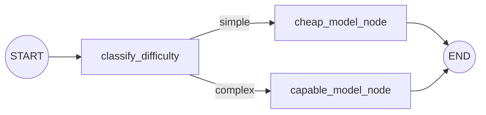
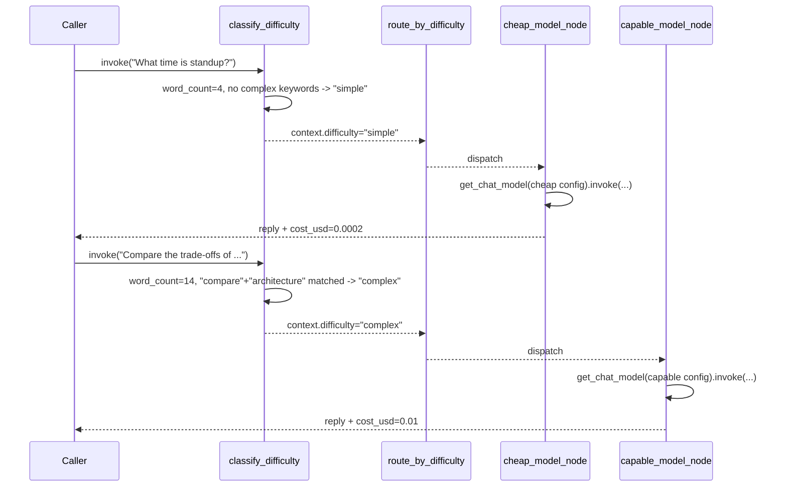

# 20 — Model Routing

## Learning Objectives

After this module you can:

- Classify a request's difficulty with a routing function and dispatch it to
  a different model configuration via `add_conditional_edges`.
- Explain the cost/quality trade-off behind routing "simple" requests to a
  cheap/fast model and "complex" ones to a capable/expensive model.
- Track a per-request cost estimate through `AgentState`'s `context` channel.
- Extend the pattern to route on other axes (latency budget, safety
  sensitivity, tenant tier).

## Theory

Not every request deserves the most capable (and most expensive) model.
"What time is standup?" and "compare the trade-offs of a microservices
architecture for our on-call rotation" have wildly different complexity —
routing both to the same model either overpays for the easy case or
underserves the hard one.

**Model routing** applies the same `add_conditional_edges` shape used for
topic triage (module 11) to a cost/quality decision instead: a
`classify_difficulty` node reads the request and assigns a tier; a router
function reads that tier and dispatches to a tier-specific node, each
configured with its own model (in production: a different model name/size;
offline: a different `get_chat_model(...)` configuration).

This is a foundational pattern for cost control in agent systems: the
naive default (always call the most capable model) is simple but expensive
at scale; a router adds one classification call up front in exchange for
routing the majority of (simple) traffic to a cheaper tier.

## Mental Models

Think of a hospital triage nurse: not every patient sees the most senior
specialist. A quick assessment (classify) routes minor cases to a general
practitioner (cheap tier) and reserves the specialist's time (capable tier,
higher cost) for cases that actually need it. The triage step itself is
cheap and fast precisely so the expensive resource is spent only where it
matters.

## Architecture



Sequence across two requests of different difficulty:



## Runnable Example

```bash
python src/20_model_routing/model_router.py
```

Expected output (deterministic):

```
request='What time is standup?' tier=cheap cost_usd=0.0002 reply='Quick answer from the cheap/fast model.'
request='Compare the trade-offs of a microservices architecture versus a monolith for our on-call rotation.' tier=capable cost_usd=0.01 reply='Detailed, carefully reasoned answer from the capable model.'
total_cost_usd=0.0102
=== TRACK2 MODULE 20: MODEL ROUTING COMPLETE ===
```

## Challenge

1. Add a third tier (`"medium"`) with its own keyword list, cost, and node,
   and route a request that should land there.
2. Change `WORD_COUNT_THRESHOLD` and observe how the routing decision for
   borderline requests flips.
3. Add a `context["escalated_from"]` field that a `capable` reply can set if
   it detects the cheap tier already tried and failed (compose with module
   14's retry/fallback pattern).

## Stretch Goals

- Track cumulative `total_cost_usd` across a whole session in `AgentState`
  and print a running budget alert once a threshold is crossed.
- Replace the keyword/word-count heuristic with a `with_structured_output`
  (module 16) classification call that returns a typed `Difficulty` enum.
- Add a real cost table sourced from `src/shared/config.py` (model pricing
  per token) instead of the flat per-request estimate here.

## Common Mistakes

- **Routing logic with side effects.** `classify_difficulty` should only
  read the request and write a classification — model calls belong in the
  tier nodes, not the router.
- **Static thresholds that never get revisited.** Difficulty heuristics
  (word count, keywords) drift as usage patterns change — revisit them with
  real traffic data, not just the two example requests here.
- **Ignoring the classification cost itself.** The `classify` step is not
  free in production (it may itself call a small model) — it must be cheap
  relative to the savings it produces.

## Best Practices

- Make tier configuration (model name, cost estimate, tool budget) explicit
  and centralized (`COST_PER_TIER` here) rather than scattered magic numbers.
- Log every routing decision (`get_logger`) with the classification reason,
  so cost attribution is auditable.
- Treat the classifier as a small, fast, cheap step by design — if
  classification itself needs a capable model, the routing has no savings
  left to offer.

## Suggested Improvements

- Add a `docs/observability.md`-style dashboard hook that aggregates
  `estimated_cost_usd` and `model_tier` across many requests.
- Support per-tenant tier overrides (some tenants always get the capable
  tier) once multi-tenancy concerns land (`57_cost_and_multitenancy`).

## References

- LangGraph conditional edges:
  https://docs.langchain.com/oss/python/langgraph/graph-api#conditional-edges
- `src/shared/llm.py` — `get_chat_model` configuration surface.
- Module [`11_graph_branching`](../11_graph_branching/README.md) — the
  topic-routing pattern this module repurposes for cost/quality routing.
- Module [`16_structured_outputs`](../16_structured_outputs/README.md) — a
  natural upgrade path for the classifier itself.
- [`docs/openai.md`](../../docs/openai.md) — chat model cost and tier
  considerations.

## What Comes Next

Track 2 is complete. Track 3 (`21_*` onward, Agent Engineering) builds full
agent loops — planning, execution, and reflection — on top of the chat
model, structured output, tool-calling, prompting, and context/routing
primitives from this track.
