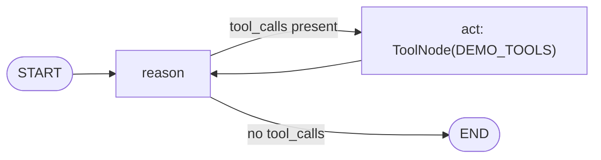
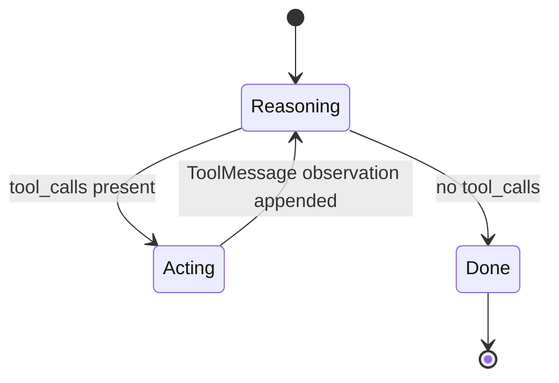
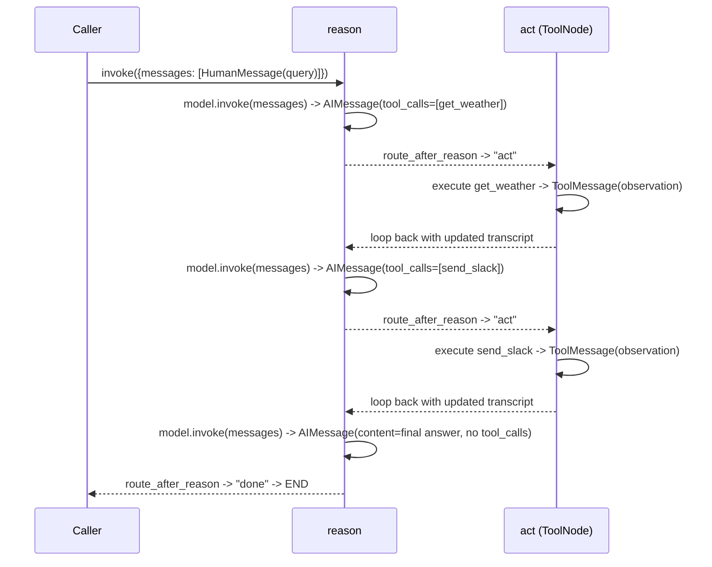

# 21 — ReAct Agent

## Learning Objectives

After this module you can:

- Explain the ReAct pattern (**Re**ason, **Act**, Observe) as a loop, not a
  single LLM call.
- Build the loop manually with a `reason` node, a `ToolNode` `act` node, and a
  conditional edge — the pattern `create_react_agent` used to hide.
- Read a transcript of interleaved `AIMessage` (with `tool_calls`) and
  `ToolMessage` (observations) and explain what each step contributed.
- Explain why the loop terminates: the model stops emitting tool calls once
  it has "enough" information (or a budget is exhausted).

## Theory

ReAct (Yao et al., 2022) interleaves **reasoning** ("what should I do next?")
with **acting** ("call this tool") and **observing** ("here's what the tool
returned"), repeating until the model can answer directly. Concretely, on
each turn the model sees the full transcript so far — including every prior
tool call and its result — and decides whether it has enough information to
answer or needs another tool call.

In LangGraph this is not a special primitive: it is exactly the manual tool
loop from module 05/17, given the ReAct names. `reason` calls the model with
tools bound (`model.bind_tools(DEMO_TOOLS)`); if the reply carries
`tool_calls`, a conditional edge sends state to `act` (a `ToolNode`), whose
output (`ToolMessage`s) is appended to the transcript and fed straight back
into `reason`. The loop ends the moment the model replies with plain content
and no tool calls.

## Mental Models

Think of a detective working a case: **reason** ("what do I still not know?"),
**act** ("check the security footage" — a concrete, bounded action),
**observe** ("the footage shows X"), then back to reasoning with that new
fact in hand. The detective doesn't plan the whole investigation up front —
each observation informs the next question. `AgentState.messages` is the case
file: every reasoning step and observation is appended, never lost.

## Architecture



*Legend: node ids match `add_node("reason", ...)` / `add_node("act", ...)`;*
*the edge label is the exact condition `route_after_reason` checks*
*(`getattr(last, "tool_calls", None)`); `act --> reason` is the*
*observe-then-reason-again loop.*

The loop as a state machine (independent of how many tool calls it takes):



Sequence of one full loop (two tool calls, then a final answer):



Flow notes:

- **`tool_calls present`** — the model's reply carries one or more
  `tool_calls`; `route_after_reason` sends state to `act`, which executes
  every proposed call via `ToolNode(DEMO_TOOLS)` and appends the resulting
  `ToolMessage`(s).
- **`no tool_calls`** — the model replied with plain content only; the loop
  ends and `route_after_reason` returns `"done"`, mapped to `END`.
- **`act --> reason`** is unconditional: every tool execution feeds straight
  back into another `reason` call with the updated transcript — this is the
  "observe" step, folded into the edge rather than a separate node.
- The loop's only hard bound is `get_chat_model(max_tool_calls=2)` in this
  offline configuration; production code should also cap total turns
  independent of tool-call count (see Common Mistakes below).

## Runnable Example

```bash
python src/21_react_agent/react_agent.py
```

Expected output (deterministic, offline):

```
reason(input)="What's the weather in Paris? Then send a slack message to the team."
act(propose)=['get_weather']
observe='...'
act(propose)=['send_slack']
observe='...'
reason(final)='[offline] Completed using tools. Observations: ...'
=== TRACK3 MODULE 21: REACT AGENT COMPLETE ===
```

## Challenge

1. Add a third tool call to the loop by extending the query (e.g. also ask
   to create a task) and watch `route_after_reason` keep looping.
2. Print a running "step number" alongside each `reason`/`act` line so the
   transcript reads like a numbered trace.
3. Cap the loop at a fixed number of reasoning turns independent of
   `max_tool_calls`, and prove the graph still terminates cleanly if the cap
   is hit mid-loop.

## Stretch Goals

- Swap `get_chat_model(max_tool_calls=2)` for `max_tool_calls=0` and observe
  the model skip straight to a final answer — no tools, no loop.
- Add a `scratchpad` entry per iteration summarizing what was learned, so the
  final answer can cite it explicitly instead of relying on raw
  `ToolMessage` content.
- Replace the keyword-based fake tool selection with a real
  `OPENAI_API_KEY` and compare how a real model orders its tool calls.

## Common Mistakes

- **Treating ReAct as a single call.** It is a loop with state carried across
  turns — the "re" in ReAct is reasoning *again* after every observation.
- **Forgetting the conditional edge back to `act`.** Without
  `graph.add_edge("act", "reason")` the loop can't continue after the first
  tool call.
- **Not bounding the loop.** A real model (or a misconfigured fake) could
  loop forever; `get_chat_model(max_tool_calls=...)` is the guard here — in
  production, also cap total steps regardless of tool-call count (see module
  26).

## Best Practices

- Log every reasoning decision (`get_logger`) — tool calls proposed and the
  final answer — so the loop is auditable in production traces.
- Keep `act` side-effect-aware: `ToolNode` runs tools exactly as the model
  requested, so tool safety (validation, side-effect boundaries) belongs in
  the tools themselves — see [`docs/tools.md`](../../docs/tools.md).
- Always give the loop a hard exit condition that doesn't depend solely on
  the model's own judgment (a max-turns guard), even if the model usually
  behaves.

## Suggested Improvements

- Track cumulative token/tool-call cost in `context` and route to a fallback
  "answer with what we have" node once a budget is exceeded.
- Add a `reason` variant that first checks a cache of past observations
  before calling a tool again for the same query.

## References

- Yao et al., *ReAct: Synergizing Reasoning and Acting in Language Models*
  (2022): https://arxiv.org/abs/2210.03629
- LangGraph `ToolNode`:
  https://docs.langchain.com/oss/python/langgraph/graph-api
- Module [`05_tools`](../05_tools/README.md) — the tool-invocation baseline.
- Module [`17_function_calling`](../17_function_calling/README.md) — the
  manual `bind_tools` + `ToolNode` loop this module names "ReAct".
- [`docs/tools.md`](../../docs/tools.md) — tool design, schemas, and safety.

## What Comes Next

[`22_planner_agent`](../22_planner_agent/README.md) steps back from
per-turn reasoning to generate a whole plan **up front**, before any tool
runs.
