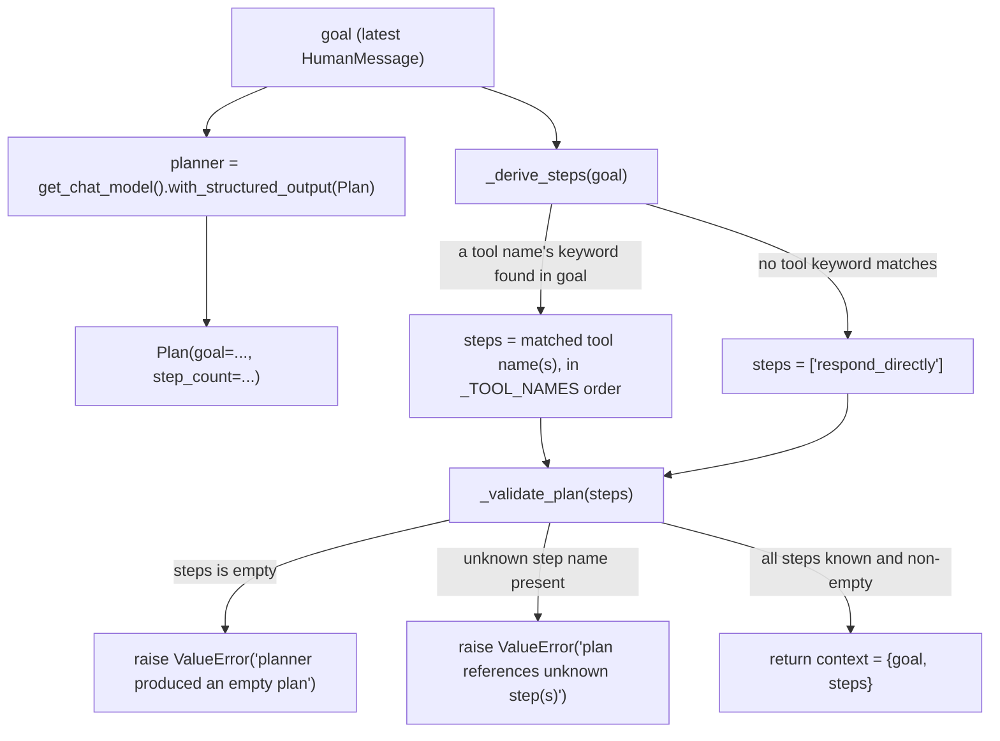
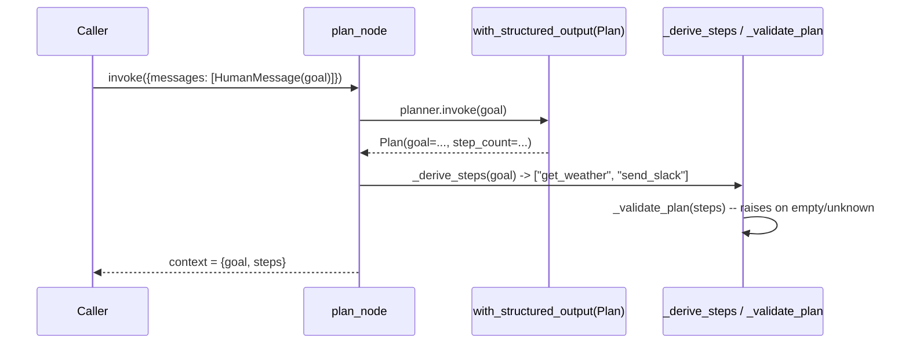

# 22 — Planner Agent

## Learning Objectives

After this module you can:

- Generate a **structured, validated plan** from a goal using
  `with_structured_output`, instead of parsing free-text.
- Explain why validating a plan's *shape* (non-empty, every step
  recognized) belongs in code, not trust in the model's output.
- Distinguish planning ("what steps, in what order") from execution
  ("actually run them") — the seam module 23 picks up.
- Read a Pydantic schema and explain what each field constrains.

## Theory

Planning separates **what to do** from **doing it**. A planner takes a goal
and produces an ordered, inspectable plan — a list of steps — that a
different component (module 23's executor) later runs. This separation
matters because a plan can be validated, logged, approved (module 27), or
revised (module 26) *before* anything with side effects happens.

`with_structured_output(Schema)` is how a modern chat model returns typed,
validated data instead of a string to parse: bind a Pydantic model, and the
runnable returns an instance of it (or raises if the model's output doesn't
fit). Agent Lab's offline fake implements this too — `_build_model` samples
a value for every field from the input text — so the same call signature
works with zero credentials.

The offline fake cannot truly reason about task decomposition, so this
module pairs the structured-output call (which normalizes/echoes the goal
through a validated schema) with a small deterministic decomposer that
matches goal keywords to tool names — the same matching style module 21
uses to pick a tool. The result is still explicitly **validated**: an empty
plan, or one referencing an unknown step, raises rather than being handed to
an executor silently.

## Mental Models

A trip itinerary: you don't buy plane tickets while still deciding whether
you're going to the mountains or the beach. You *first* write "day 1: fly
in, day 2: hike, day 3: fly out" — a plan you can hand to someone else (a
travel agent, or module 23's executor) to actually book. If the itinerary
has a day with no activity or references a city you never decided on, you
catch that on paper, before money changes hands.

## Architecture

The compiled graph has a single node — the interesting logic lives inside it:


*Legend: node id matches `add_node("plan", plan_node)`; there is only one*
*node and no conditional edges at the graph level — every branch below*
*happens **inside** `plan_node`, not between LangGraph nodes.*

`plan_node`'s internal decision logic (`_derive_steps` / `_validate_plan`):





Flow notes:

- **`with_structured_output(Plan)`** guarantees the *shape* of the model's
  reply (a `Plan` instance with `goal`/`step_count` fields) — it says
  nothing about whether the plan is semantically correct.
- **`_derive_steps` keyword match** — a step is included whenever one of its
  name's underscore-split tokens (e.g. `get`/`weather`) appears in the
  lowercased goal text; order follows `_TOOL_NAMES`, not the goal's word
  order.
- **`_derive_steps` fallback** — if no tool keyword matches at all, the plan
  is `["respond_directly"]` rather than empty, so there is always at least
  one step to validate.
- **`_validate_plan` empty-plan guard** — raises if `steps` is falsy (should
  be unreachable given the fallback above, but guards against a future
  change to `_derive_steps`).
- **`_validate_plan` unknown-step guard** — raises if any step name is not
  in `_TOOL_NAMES` or the fallback name — a plan is never handed to an
  executor with a step it can't run.

## Runnable Example

```bash
python src/22_planner_agent/planner_agent.py
```

Expected output (deterministic, offline):

```
goal='Check the weather in Paris and send a slack summary to the team.' steps=['get_weather', 'send_slack']
goal='Just say hello.' steps=['respond_directly']
=== TRACK3 MODULE 22: PLANNER AGENT COMPLETE ===
```

## Challenge

1. Add a `priority: int` field to `Plan` and print it alongside the steps.
2. Change `_derive_steps` to detect a goal with **no** matching tool and
   route to `respond_directly` (already implemented) — then add a case for a
   goal matching *every* tool, and confirm the plan lists all five in a
   stable order.
3. Make `_validate_plan` also reject plans longer than a `MAX_STEPS`
   constant, raising a clear error.

## Stretch Goals

- Add a second structured field, `rationale: str`, and print it as an
  explanation line under each plan.
- Feed the generated plan directly into module 23's `execute_step` logic in
  a combined script (without cross-importing — copy the small executor loop
  in) to see planner + executor compose end to end.
- Swap in a real `OPENAI_API_KEY` and compare how a real model's
  `with_structured_output` call orders steps versus the keyword heuristic.

## Common Mistakes

- **Trusting the plan's shape blindly.** Always validate: non-empty,
  every step recognized. A malformed plan should fail loudly here, not
  crash the executor three steps in.
- **Conflating planning and execution.** `plan_node` never calls a tool —
  it only decides *what* to call. Keeping that boundary is what makes plans
  inspectable and approvable (see module 27).
- **Assuming `with_structured_output` guarantees semantic correctness.** It
  guarantees *shape* (the right fields, the right types) — not that the
  content is meaningful. That's why this module validates further.

## Best Practices

- Keep the plan schema minimal and typed; add fields deliberately, not
  speculatively.
- Log the derived plan (`get_logger`) before executing anything — plans are
  cheap to audit, side effects are not.
- Treat plan validation as a hard gate: raise, don't silently coerce, on an
  invalid shape.

## Suggested Improvements

- Persist generated plans keyed by goal so repeated goals reuse a cached,
  already-validated plan.
- Add a `Plan.confidence` field and route low-confidence plans to a
  human-in-the-loop approval step (module 27) before execution.

## References

- LangChain `with_structured_output`:
  https://docs.langchain.com/oss/python/langchain/structured-output
- Pydantic models: https://docs.pydantic.dev/latest/concepts/models/
- Module [`21_react_agent`](../21_react_agent/README.md) — per-turn
  reasoning this module front-loads into a single plan.
- Module [`23_executor_agent`](../23_executor_agent/README.md) — consumes
  exactly the `{"steps": [...]}` shape this module produces.
- [`docs/tools.md`](../../docs/tools.md) — the tool registry these steps
  reference by name.

## What Comes Next

[`23_executor_agent`](../23_executor_agent/README.md) takes the ordered
step list this module produces and actually runs it against `DEMO_TOOLS`.
