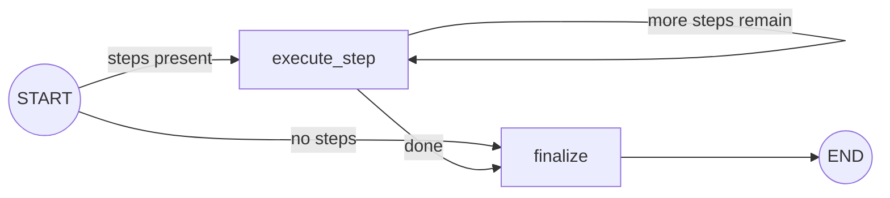
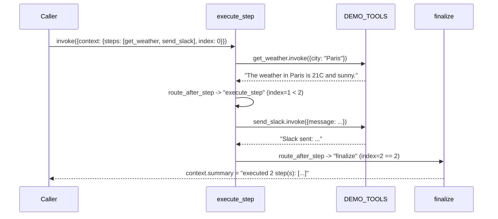

# 23 — Executor Agent

## Learning Objectives

After this module you can:

- Execute an ordered plan (a list of step names) against a tool registry,
  one step at a time, collecting a result per step.
- Handle a step that has no matching tool, or whose tool call raises,
  **without** crashing the whole run.
- Handle an **empty plan** gracefully — the loop should short-circuit to a
  clear "nothing to do" result, not error out.
- Explain the plan -> step loop -> results shape and why it generalizes to
  any ordered list of named actions.

## Theory

An executor is the "do it" half of the plan/execute split introduced in
module 22: given `{"steps": [...]}`, run each step's matching tool in order
and accumulate results. The interesting design question isn't the happy
path — it's what happens when a step *can't* run: an unknown step name (the
plan referenced a tool that doesn't exist), or a tool that raises at
runtime. Both must be caught, logged, and turned into a **degraded result**
recorded in state — never a silent skip and never an uncaught crash.

The loop itself is the same conditional-edge pattern as every bounded loop
in this curriculum: a node does one unit of work and increments an index; a
router checks whether more work remains; `START` itself is routed
conditionally so an empty plan skips the loop node entirely and goes
straight to `finalize`.

## Mental Models

A kitchen ticket rail: each ticket (`step`) gets cooked (`execute_step`) in
order. If a ticket asks for a dish the kitchen doesn't make, the line cook
doesn't throw the ticket away or set the kitchen on fire — they mark it
"unavailable" and move to the next ticket. If there are no tickets on the
rail at all, service simply reports "no orders" instead of standing around
waiting for a ticket that will never come.

## Architecture





## Runnable Example

```bash
python src/23_executor_agent/executor_agent.py
```

Expected output (deterministic, offline):

```
steps=['get_weather', 'send_slack'] summary=executed 2 step(s): ['The weather in Paris is 21C and sunny.', 'Slack sent: Plan executed successfully.']
steps=['respond_directly'] summary=executed 1 step(s): ["skipped: no tool for step 'respond_directly'"]
steps=[] summary=no steps to execute
=== TRACK3 MODULE 23: EXECUTOR AGENT COMPLETE ===
```

## Challenge

1. Add a step whose tool call deliberately raises (e.g. call `add_numbers`
   with a non-numeric arg) and confirm `execute_step`'s `except` branch
   records `"failed: ..."` instead of crashing the run.
2. Add a `context["failures"]` counter incremented on every skipped/failed
   step, and print it in `finalize`'s summary.
3. Make `route_after_step` stop early (skip remaining steps) once a
   configurable number of failures has been hit — a simple circuit breaker
   (compare with module 14).

## Stretch Goals

- Replace `_STEP_ARGS`'s canned arguments with values drawn from
  `state["context"]` so the same step name can run with different arguments
  on different invocations.
- Run the executor against the exact `Plan` object module 22 produces (copy
  its `_derive_steps` output in) to see planner + executor compose.
- Parallelize independent steps with `Send` (module 12) instead of running
  them strictly in order, and reconcile results with a reducer.

## Common Mistakes

- **Letting a missing tool crash the graph.** `_TOOLS_BY_NAME.get(step)`
  returns `None` for an unregistered step; check for that explicitly rather
  than indexing and raising a `KeyError` deep in the loop.
- **Swallowing the exception instead of routing it.** The `except` clause
  here **always** logs (`logger.error`) and records the failure in state —
  it never just `pass`es.
- **Not handling the empty-plan case at all.** Without the `route_initial`
  conditional edge from `START`, an empty `steps` list would index
  `steps[0]` inside `execute_step` and raise `IndexError` immediately.

## Best Practices

- Keep the per-step failure format consistent (`"skipped: ..."` /
  `"failed: ..."`) so downstream code (or a human reading logs) can grep for
  degraded results.
- Log every step's outcome, success or failure — executors are exactly
  where production incidents get diagnosed after the fact.
- Prefer returning a partial `context` update (`{**context, ...}`) over
  mutating and returning the whole state — it keeps the node's contract
  explicit.

## References

- LangChain tool invocation:
  https://docs.langchain.com/oss/python/langchain/tools
- Module [`22_planner_agent`](../22_planner_agent/README.md) — produces the
  `{"steps": [...]}` shape this module consumes.
- Module [`14_error_handling`](../14_error_handling/README.md) — the
  retry/circuit-breaker patterns this module's failure handling builds on.
- [`docs/tools.md`](../../docs/tools.md) — tool safety and the
  never-trust-blindly principle this module's validation follows.

## What Comes Next

[`24_reflection`](../24_reflection/README.md) turns the same "loop with a
router deciding whether to continue" shape toward **quality**: generate,
critique, and revise an answer instead of executing a fixed plan.
