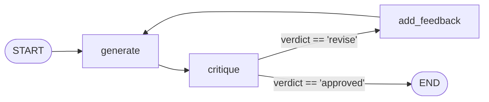
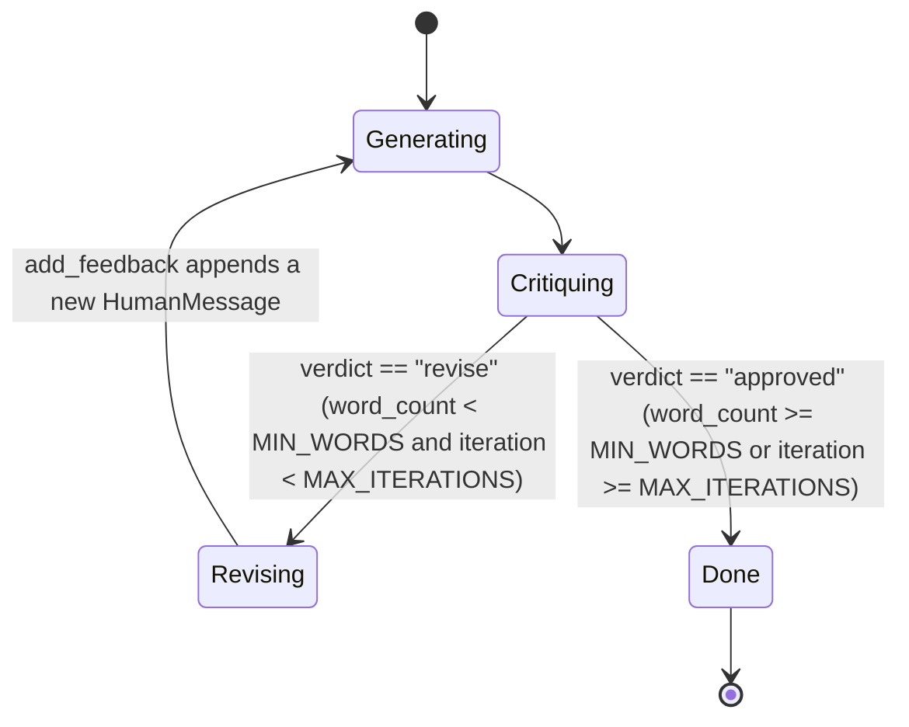
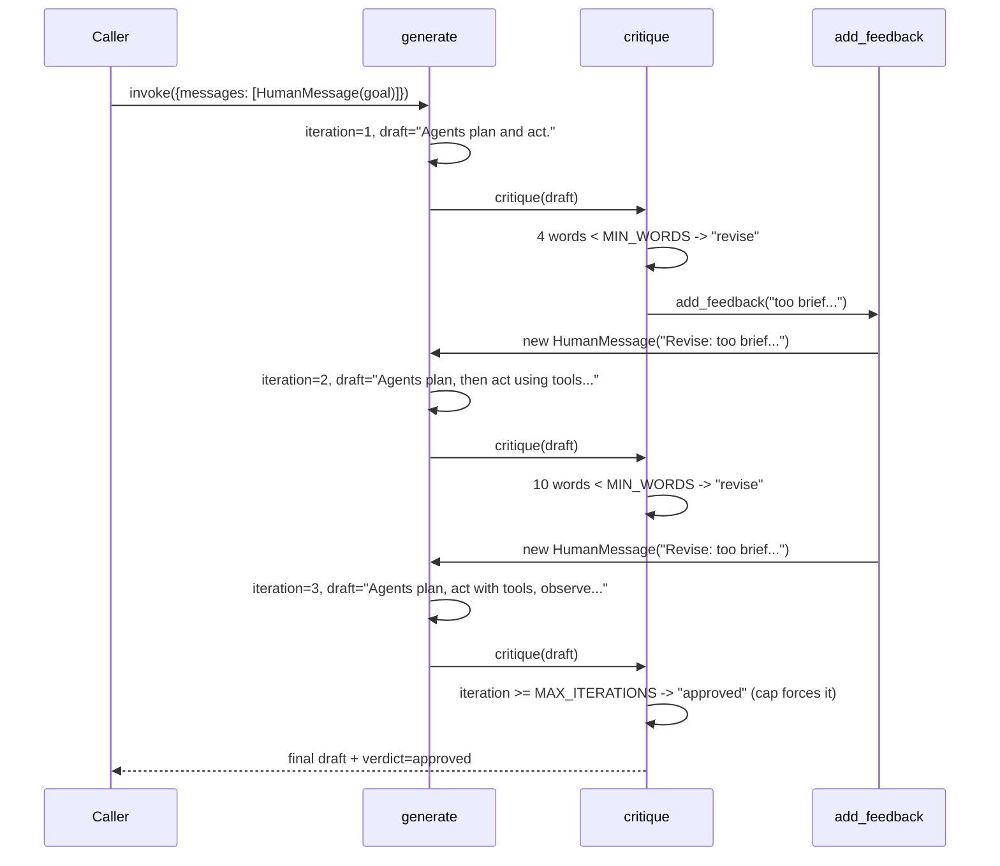

# 24 — Reflection

## Learning Objectives

After this module you can:

- Build a **generate -> critique -> revise** loop and explain each node's
  single responsibility.
- Bound a self-improvement loop with a hard `MAX_ITERATIONS` guard so it
  always terminates, even if the quality bar is never met.
- Show — with a concrete transcript — an answer improving across revisions,
  not just claim it does.
- Explain why critique must be a **separate** step from generation, not part
  of the same call.

## Theory

Reflection (self-critique) is a loop where an agent generates output,
evaluates its own output against some bar, and — if it falls short — revises
and tries again. This is distinct from ReAct (module 21): ReAct loops on
*information* (call a tool, observe, decide if you know enough); reflection
loops on *quality* (draft an answer, judge it, decide if it's good enough).

The loop here has three roles:

- **generate** — produce (or revise) a draft, given the transcript so far.
- **critique** — judge the latest draft against a bar (here: a word-count
  proxy for "detailed enough") and produce feedback.
- **revise** — feed the critique back in as a new turn, so the next
  `generate` call sees exactly what to fix.

Termination is not left to the model's judgment alone: `MAX_ITERATIONS`
forces approval once the cap is hit, guaranteeing the loop ends. In this
module the offline fake model happens to converge before the cap (its canned
drafts get longer each turn), but the cap is what makes the loop *safe*
regardless of what the model does.

## Mental Models

A writer and an editor sharing one desk: the writer (`generate`) drafts a
paragraph, the editor (`critique`) reads it and says "too short, add detail"
or "good, ship it." If the editor keeps rejecting drafts, the writer doesn't
revise forever — after three rounds, the deadline (`MAX_ITERATIONS`) forces
publication with whatever's on the page.

## Architecture



*Legend: node ids match `add_node("generate"|"critique"|"add_feedback", ...)`;*
*edge labels are the `context["verdict"]` value `route_after_critique` reads*
*(it returns `"revise"`/`"done"`, mapped here to the `add_feedback`/`END`*
*edges); `add_feedback --> generate` is the revision loop.*

The loop as a state machine:





Flow notes:

- **`verdict == "revise"`** — fires when the draft is under `MIN_WORDS`
  **and** the iteration cap hasn't been hit yet; `add_feedback` appends a
  new `HumanMessage("Revise: ...")` and the loop returns to `generate`.
- **`verdict == "approved"`** — fires either because the draft finally
  meets `MIN_WORDS`, **or** because `iteration >= MAX_ITERATIONS` — the cap
  forces approval even on a draft that never got long enough, guaranteeing
  termination regardless of model behavior.
- **`add_feedback`** only appends; it never edits or removes the prior
  draft, so `generate`'s next call sees the full history including exactly
  what was critiqued.
- **`generate --> critique`** is unconditional — every draft, including the
  first, is judged before any decision about revising is made.

## Runnable Example

```bash
python src/24_reflection/reflection.py
```

Expected output (deterministic, offline):

```
revision 1: 'Agents plan and act.'
revision 2: 'Agents plan, then act using tools, then observe the results.'
revision 3: 'Agents plan, act with tools, observe results, and reflect to revise their answer before responding to the user.'
iterations=3 verdict=approved
=== TRACK3 MODULE 24: REFLECTION COMPLETE ===
```

## Challenge

1. Lower `MIN_WORDS` until the loop approves on iteration 1, and confirm
   only one `revision` line prints.
2. Raise `MAX_ITERATIONS` to 5 but keep the canned responses list at length
   3 — trace through `_final_text`'s modulo indexing to predict what
   `generate` returns on iteration 4 and 5, then run it to check.
3. Add a second critique criterion (e.g. "must not be a single sentence")
   and combine it with the word-count check.

## Stretch Goals

- Replace the word-count heuristic with a structured critique via
  `with_structured_output` (module 22's pattern) returning
  `{verdict: str, feedback: str}` directly from the model.
- Track every `(draft, verdict, feedback)` triple in `context["history"]`
  and print a full audit trail, not just the final verdict.
- Compose reflection with module 21: reflect on the *ReAct loop's* final
  answer instead of a plain generated draft.

## Common Mistakes

- **Critiquing inside the same call as generation.** Keep them separate
  nodes — otherwise the model conflates "write this" with "judge what you
  just wrote," and the judgment carries no independent signal.
- **No iteration cap.** A quality bar that's impossible to meet (or a model
  that never improves) would loop forever without `MAX_ITERATIONS`.
- **Overwriting the transcript instead of appending feedback as a new
  turn.** `add_feedback` appends a new `HumanMessage`; it does not edit or
  remove the previous draft — the model needs the full history to know what
  it already tried.

## Best Practices

- Make the critique's bar explicit and checkable in code (word count here;
  a schema, a regex, or a scoring rubric in production) rather than "ask the
  model if it's good" with no further check.
- Log every iteration's draft and verdict (`get_logger`) — reflection loops
  are exactly where "why did it take 3 tries" questions come up later.
- Always pair a quality loop with a hard iteration cap, independent of how
  reliable the critique step seems.

## References

- Shinn et al., *Reflexion: Language Agents with Verbal Reinforcement
  Learning* (2023): https://arxiv.org/abs/2303.11366
- Module [`21_react_agent`](../21_react_agent/README.md) — loops on
  information; this module loops on quality.
- Module [`22_planner_agent`](../22_planner_agent/README.md) — the
  `with_structured_output` pattern the stretch goal reuses for critique.
- [`docs/tools.md`](../../docs/tools.md) — background on the shared
  `get_chat_model` fake this loop depends on.

## What Comes Next

[`25_router_agent`](../25_router_agent/README.md) shifts from a single
loop to **dispatch**: classify intent once, then hand off to a dedicated
sub-graph per intent.
