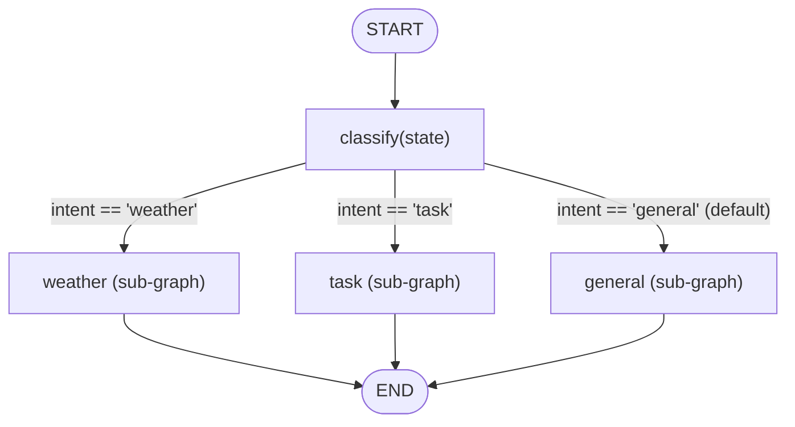
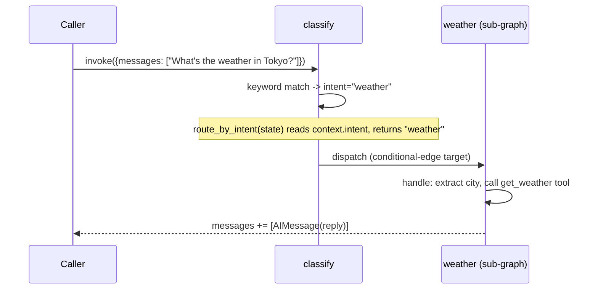

# 25 — Router Agent

## Learning Objectives

After this module you can:

- Classify intent from a message and route to a **fully independent
  sub-graph** per intent, not just a handler function.
- Explain why a compiled `StateGraph` can itself be used as a node in
  another `StateGraph` (as long as the state schema is compatible).
- Compare this design to module 04/11's single-level routing and explain
  when the extra sub-graph boundary earns its complexity.
- Add a new intent (sub-graph + keyword list + wiring) without touching the
  existing ones.

## Theory

Module 11 routed to **handler functions** — plain nodes, all sharing one
graph. This module routes to **sub-graphs**: each intent gets its own fully
compiled `StateGraph` (its own nodes, its own internal edges, its own
`END`). The parent graph's `classify` node still makes one decision via
`add_conditional_edges`, but the mapping now points at compiled graphs
instead of single functions.

Why bother with the extra boundary? A sub-graph can grow arbitrarily complex
internally (its own loops, its own tool calls, its own sub-routing) without
the parent graph's wiring changing at all — the parent only ever sees "the
weather intent produces an `AIMessage`." This is the same encapsulation
principle as a function call, one level up: the parent doesn't need to know
*how* the `weather` sub-graph answers, only that it does.

## Mental Models

A hospital triage desk: the intake nurse (`classify`) doesn't treat you —
they send you to a *department* (cardiology, radiology, general practice),
and each department is its own fully staffed unit with its own internal
process. The front desk's job is exactly one decision; everything after
that is the department's (sub-graph's) business.

## Architecture



*Legend: edge labels are the `intent` value `route_by_intent` reads from
`context["intent"]`; each target is an independently compiled `StateGraph`
(a sub-graph), not a plain handler function.*

**Flow notes**

- `classify` lowercases the latest human message and keyword-matches it
  against `_KEYWORDS`; the first match wins, and anything unmatched falls
  back to `"general"`.
- `route_by_intent` performs no classification itself — it only reads
  `context["intent"]` back and returns it as the conditional-edge key.
- The `weather` sub-graph extracts a city from the message and calls the
  `get_weather` tool.
- The `task` sub-graph calls `create_task` with the raw message as the title.
- The `general` sub-graph has no tool call — it just acknowledges the
  message verbatim.



## Runnable Example

```bash
python src/25_router_agent/router_agent.py
```

Expected output (deterministic, offline):

```
message="What's the weather in Tokyo?" intent=weather reply='The weather in Tokyo is 21C and sunny.'
message='Create a task to update the roadmap.' intent=task reply="Created task 'TASK-378': Create a task to update the roadmap."
message='Thanks for all your help today!' intent=general reply='Acknowledged: Thanks for all your help today!'
=== TRACK3 MODULE 25: ROUTER AGENT COMPLETE ===
```

## Challenge

1. Add a fourth intent (`billing`) with its own sub-graph and keyword list,
   without modifying the other three sub-graphs.
2. Give the `weather` sub-graph a second internal node (e.g. a follow-up
   step that also checks the knowledge base for travel advisories) and wire
   it internally — the parent graph's edges shouldn't need to change.
3. Make `route_by_intent` fall back to `"general"` for any key missing from
   the mapping, and prove it by classifying an intent your mapping doesn't
   cover.

## Stretch Goals

- Replace the keyword-based `classify` with `get_chat_model(responses=...)`
  so classification is (offline, deterministic) LLM-driven.
- Give each sub-graph its own `context` namespace
  (`context["weather"] = {...}`) so sub-graphs don't collide on shared keys
  if you later run them concurrently.
- Nest another level: make the `task` sub-graph itself route between
  "create" and "update" sub-sub-graphs.

## Common Mistakes

- **Forgetting sub-graphs need a compatible state schema.** A sub-graph
  built on a different `TypedDict` than the parent's will fail to compose —
  keep every sub-graph on `AgentState` here.
- **Putting side effects in the router.** `route_by_intent` only reads
  `context["intent"]` and returns a key — exactly like module 11's rule.
- **Duplicating logic across sub-graphs instead of extracting a shared
  helper** (e.g. a `_extract_city` regex) when two sub-graphs need the same
  small utility — acceptable at this scale, but watch for real duplication.

## Best Practices

- Keep each sub-graph's `handle` node focused on one job — the sub-graph
  boundary should map to a real ownership boundary (one team owns
  `weather`, another owns `task`), not an arbitrary split.
- Log the classification decision (`get_logger`) at the parent level so
  routing is auditable independent of what each sub-graph does internally.
- Compile each sub-graph once at module load (as this script does) rather
  than recompiling per request.

## References

- LangGraph subgraphs:
  https://docs.langchain.com/oss/python/langgraph/use-subgraphs
- Module [`04_routing_and_branches`](../04_routing_and_branches/README.md) —
  the single-branch router this module generalizes to sub-graphs.
- Module [`11_graph_branching`](../11_graph_branching/README.md) —
  multi-way routing to handler functions (not sub-graphs).
- [`docs/tools.md`](../../docs/tools.md) — the `DEMO_TOOLS` each sub-graph
  calls into.

## What Comes Next

[`26_planning_loops`](../26_planning_loops/README.md) returns to a single
graph, but adds a **replan** phase: the plan itself changes based on what
execution observes, not just which branch was picked once.
